### Chapter 1: GEOGRAPHICAL AND CULTURAL ORIENTATION

1. What is the primary aim of Chapter 1, "Geographical and Cultural Orientation"?
A. To teach pilots advanced navigation techniques
B. To direct pilots' attention to the cultural and geographical diversity they will encounter internationally
C. To provide a detailed atlas of the world
D. To focus solely on local flying experiences
E. To explain the physics of flight
ans: B

2. According to the introduction, why must pilots be flexible?
A. To handle unexpected weather changes
B. To manage aircraft technical issues
C. To react appropriately to different languages, cultures, and beliefs encountered internationally
D. To pass simulator checks easily
E. To adjust flight plans due to air traffic
ans: C

3. What is one key objective of this chapter for pilots?
A. To memorize the capital cities of all countries
B. To build their Geographical & Cultural awareness
C. To learn multiple foreign languages fluently
D. To understand the political history of each region
E. To become experts in cartography
ans: B

4. What might appear "irrational and strange" to pilots according to the text?
A. Complex air traffic control instructions
B. Different traditions and beliefs compared to their own culture
C. Advanced aircraft automation systems
D. The effects of jet lag
E. Variations in international aviation regulations
ans: B

5. Besides cultural orientation, what other difference does this chapter give examples of?
A. Differences between aircraft types
B. Differences between airline business models
C. Differences between political borders and flight information region (FIR) borders
D. Differences between weather forecasting methods
E. Differences between pilot licensing requirements
ans: C

6. The word "GEOGRAPHY" is derived from which language and meaning?
A. Latin, meaning "Map Drawing"
B. Greek, meaning "Earth Description"
C. Egyptian, meaning "Sky Path"
D. Belgian, meaning "World Atlas"
E. English, meaning "Study of Land"
ans: B

7. Who was Gerardus Mercator?
A. An ancient Greek philosopher who studied geography
B. A 16th-century Belgian geographer and leader in map-making
C. The first pilot to fly internationally
D. The founder of EgyptAir
E. An expert on Flight Information Regions (FIRs)
ans: B

8. What significant contribution did Mercator make in 1569?
A. He discovered the spherical nature of the Earth
B. He created the first map translating the spherical earth into a two-dimensional plane
C. He invented the compass
D. He published the first detailed statistics on world population
E. He defined the concept of Flight Information Regions (FIRs)
ans: B

9. What image did Mercator use for the cover of his collection of maps (Atlas)?
A. A globe showing all the continents
B. A portrait of himself
C. The Titan supporting the celestial sphere
D. A detailed map of Europe
E. An illustration of an early aircraft
ans: C

10. What is an Atlas defined as in the text?
A. A collection of aviation-specific charts only
B. A book of maps or charts, potentially including statistics on various subjects
C. A digital navigation database for aircraft
D. A historical document detailing Mercator's life
E. A guide to international airports
ans: B

11. Besides maps, what kind of related statistics can be found in an Atlas?
A. Aircraft performance data
B. Pilot duty time limitations
C. Agriculture, precipitation, climate zones, population density, temperature
D. Airline financial reports
E. International flight schedules
ans: C

12. Why is an Atlas considered a useful reference for pilots, according to the text?
A. It replaces the official Jeppesen charts for navigation
B. It helps pilots understand the different geographical features and structures they fly over
C. It provides real-time weather updates
D. It details the cultural etiquette for interacting with air traffic controllers
E. It lists all restricted airspace globally
ans: B

13. What is the approximate total area of the Earth mentioned in the text?
A. 148,940,000 sq. km
B. 510,072,000 sq. km
C. 7.054 billion sq. km
D. 29% sq. km
E. 195 sq. km
ans: B

14. What percentage of the Earth is land area?
A. 10%
B. 29%
C. 50%
D. 71%
E. 100%
ans: B

15. How many independent political states was the world organized into according to the 2012 data?
A. 50
B. 100
C. 195
D. 510
E. 1000
ans: C

16. What is the expected world population range by the year 2050?
A. 1-2 billion
B. 5-7 billion
C. 7.5-10.5 billion
D. 12-15 billion
E. Over 20 billion
ans: C

17. Are pilots authorized to use an Atlas for primary navigation in the cockpit?
A. Yes, it is the preferred reference
B. Yes, but only for international flights
C. No, they must use official and updated Jeppesen charts
D. No, atlases are not allowed in the cockpit
E. Only if the Jeppesen charts are unavailable
ans: C

18. Why might an Atlas be a helpful *unofficial* reference in the cockpit?
A. To calculate fuel consumption
B. To show background knowledge about the area being flown over
C. To communicate with local air traffic control
D. To perform emergency procedures
E. To check aircraft systems
ans: B

19. Which type of question from a passenger might a pilot find the answer to in an Atlas?
A. "What is the cruising altitude?"
B. "What is the estimated time of arrival?"
C. "What is the population of the country we are overflying?"
D. "Can I use my electronic device now?"
E. "What type of aircraft is this?"
ans: C

20. What is a key difference between aviation charts and atlas charts regarding their users?
A. Aviation charts are for pilots; atlas charts are only for geographers.
B. Aviation charts are specifically tailored for aviators; atlas charts are for general use.
C. Aviation charts use multiple languages; atlas charts use only English.
D. Aviation charts are free; atlas charts are expensive.
E. Aviation charts show culture; atlas charts show airways.
ans: B

21. What language is typically used in international aviation charts?
A. The local language of the region
B. French
C. Spanish
D. English
E. A mix of languages depending on the country
ans: D

22. How do aviation charts and atlas charts differ in terms of scale changes?
A. Aviation charts have more flexible scales than atlas charts.
B. Atlas charts generally use a wider range of scales than aviation charts.
C. Both use fixed scales that never change.
D. Atlas charts are limited to one scale; aviation charts have multiple scales.
E. Scale is not relevant to either type of chart.
ans: B

23. Are Flight Information Region (FIR) borders always the same as political country borders?
A. Yes, always.
B. Yes, except over oceans.
C. No, they are not necessarily the same due to mutual agreements.
D. No, FIRs are based on geography while political borders are based on culture.
E. FIRs only exist where there are no political borders.
ans: C

24. The text gives an example where Bangkok control manages airspace over Thailand and which other country?
A. Myanmar
B. Laos
C. Cambodia
D. Malaysia
E. Vietnam
ans: C

25. Which small island nation in the Persian Gulf controls its own airspace and a large part of the eastern Saudi airspace?
A. Qatar
B. Kuwait
C. Bahrain
D. Oman
E. UAE
ans: C

26. Approximately how many distinct languages are spoken in the world at present?
A. 100-500
B. 500-1000
C. 1000-2000
D. 3,000-8,000
E. Over 10,000
ans: D

27. What should pilots do if they encounter a foreign accent they find difficult to understand?
A. Guess the meaning of the message
B. Ignore the message if it seems unimportant
C. Ask the speaker to repeat the message, possibly more slowly
D. Respond in their own native language
E. Report the controller for having a strong accent
ans: C

28. What example is given regarding accents in the Far East region?
A. Letters are often indistinguishable
B. Speech is extremely fast
C. Many people do not pronounce the letter (R)
D. Controllers only speak the local language
E. Pilots must use hand signals
ans: C

29. What challenge might pilots face regarding language when spending time in different countries during layovers?
A. Learning complex aviation jargon
B. Communicating effectively due to local languages and accents
C. Finding accurate currency exchange rates
D. Understanding local transportation systems
E. Accessing reliable weather information
ans: B

30. What are the two main theories mentioned regarding the influences on behavioral patterns?
A. Economic status and political system
B. Diet and exercise
C. Genetic inheritance (nature) and environment (nurture)
D. Education level and occupation
E. Age and gender
ans: C

31. What advice is given to pilots when dealing with foreign cultures and behaviors that seem irrational from their perspective?
A. Try to correct the behavior
B. Remember that the behavior might be normal within that culture
C. Avoid interaction with local people
D. Complain to the airline authorities
E. Insist on following their own cultural norms
ans: B

32. What should pilots avoid doing if someone's behavior (like speaking loudly or using certain body language) seems offensive?
A. Losing control or reacting negatively based on their own cultural perspective
B. Trying to understand the cultural context
C. Asking for clarification politely
D. Observing how others react
E. Smiling and nodding politely
ans: A

33. What does the word "belief" mean according to the text?
A. A scientifically proven fact
B. A law enforced by a government
C. The mental act, condition, or habit of placing trust or confidence in something by a group
D. A temporary opinion likely to change
E. A universally accepted truth
ans: C

34. What does the word "tradition" mean according to the text?
A. A modern trend or fashion
B. A written rule in a company manual
C. The passing down of cultural elements, thoughts, or behaviors, especially orally
D. A type of international agreement
E. A personal habit unique to an individual
ans: C

35. What is the "golden rule" suggested when encountering different beliefs and traditions?
A. To argue logically against them
B. To ignore them completely
C. To be tolerant and accepting
D. To try and adopt them as your own
E. To report them if they seem strange
ans: C

36. What example related to beliefs is given concerning India?
A. Chewing gum is illegal
B. Cows are considered sacred by many, and traffic may wait for them
C. Speaking loudly is considered polite
D. Pointing with the index finger is offensive
E. Tipping is not customary
ans: B

37. What example related to local laws/culture is given concerning Singapore?
A. Cows are sacred animals
B. Loud speech is common
C. It is illegal to chew chewing gum
D. Pilots must wear traditional attire
E. English is not widely spoken
ans: C

38. Why is it suggested that pilots research the culture and geography of destinations beforehand?
A. To plan sightseeing activities
B. To avoid embarrassment and make the most of their time
C. To pass customs inspections more easily
D. To find the best restaurants
E. To negotiate better hotel rates
ans: B

39. How do EgyptAir pilots represent their company and country at outstations?
A. By distributing promotional materials
B. Through their actions and responses, which should be appropriate and honorable
C. By wearing the airline uniform at all times
D. By speaking only Egyptian Arabic
E. By carrying the national flag
ans: B

40. What is the relationship between political borders and the control of airspace, according to the text?
A. A country always controls the airspace directly above its political borders.
B. Airspace control never aligns with political borders.
C. Airspace control often aligns with political borders, but agreements can extend control beyond them.
D. Airspace control is determined by the United Nations, not individual countries.
E. Only large countries control their own airspace.
ans: C

41. The chapter emphasizes that pilots transitioning from local to international flying need to develop a broader what?
A. Range of aircraft type ratings
B. Understanding of meteorology
C. Perspective on geography and culture
D. Network of contacts in the industry
E. Knowledge of airline economics
ans: C

42. What fundamental quality must pilots possess to handle the challenges of international flying described in the chapter?
A. Exceptional mathematical skills
B. Physical strength
C. Flexibility and adaptability
D. Aggressiveness
E. Introversion
ans: C

### Chapter 2: LOCAL AND INTERNATIONAL ORGANIZATIONS

1.  International aviation organizations deal with which three major parties?
    A.  Pilots, Passengers, Airports
    B.  Manufacturers, Airlines, Governments
    C.  Pilots, States, Companies
    D.  Regulators, Unions, Training Schools
    E.  ICAO, IATA, IFALPA
    ans: C

2.  Which organization is mentioned as representing the interests of pilots, such as through national associations like EGALPA?
    A.  ICAO
    B.  IATA
    C.  ECAA
    D.  IFALPA
    E.  FAA
    ans: D

3.  Which organization is primarily responsible for monitoring the application of regulations by pilots?
    A.  IFALPA
    B.  IATA
    C.  ICAO
    D.  NASA
    E.  EGALPA
    ans: C

4.  Which organization focuses on optimizing the quality and profitability of airline operations?
    A.  ICAO
    B.  IFALPA
    C.  IATA
    D.  NTSB
    E.  EGYCPS
    ans: C

5.  According to the text, who are the primary law makers in aviation?
    A.  Pilots
    B.  Companies (Airlines)
    C.  States
    D.  International Courts
    E.  Aircraft Manufacturers
    ans: C

6.  What is the role of States concerning aviation law?
    A.  Only to fly aircraft
    B.  To make laws and monitor their application
    C.  Primarily to represent pilot interests
    D.  To maximize airline profits
    E.  To design new aircraft technology
    ans: B

7.  Which US-based organization mentioned investigates aviation accidents?
    A.  FAA
    B.  NASA
    C.  NTSB
    D.  AOPA
    E.  ICAO
    ans: C

8.  Which US-based organization mentioned is involved in improving aviation technology?
    A.  NTSB
    B.  FAA
    C.  AOPA
    D.  NASA
    E.  FSF
    ans: D

9.  What is the primary role of aviation Companies (airlines) described in the text?
    A.  To make aviation laws
    B.  To perform commercial transport applying state rules and hiring pilots
    C.  To investigate accidents
    D.  To represent pilot unions
    E.  To set international standards
    ans: B

10. Which organization is described as representing airlines, optimizing profit while implementing technology and standards?
    A.  ICAO
    B.  IFALPA
    C.  IATA
    D.  ECAA
    E.  NTSB
    ans: C

11. When and where was the Convention on International Civil Aviation signed, leading to the formation of ICAO?
    A.  Hague, 1919
    B.  Havana, 1945
    C.  Chicago, 1944
    D.  London, 1948
    E.  Cairo, 1971
    ans: C

12. ICAO became a specialized agency of which larger international body?
    A.  World Trade Organization (WTO)
    B.  International Air Transport Association (IATA)
    C.  United Nations (UN)
    D.  European Union (EU)
    E.  North Atlantic Treaty Organization (NATO)
    ans: C

13. What is the sovereign body of ICAO, composed of representatives from all Contracting States?
    A.  The Council
    B.  The Secretariat
    C.  The Assembly
    D.  The Air Navigation Bureau
    E.  ECOSOC
    ans: C

14. How often does the ICAO Assembly typically meet?
    A.  Every year
    B.  Every two years
    C.  Every three years
    D.  Every four years
    E.  Every five years
    ans: C

15. Which body within ICAO adopts Standards and Recommended Practices (SARPs) and incorporates them as Annexes?
    A.  The Assembly
    B.  The Secretariat
    C.  The Legal Bureau
    D.  The Council
    E.  The Technical Co-operation Bureau
    ans: D

16. Which is NOT one of the five main divisions of the ICAO Secretariat mentioned?
    A.  Air Navigation Bureau
    B.  Air Transport Bureau
    C.  Pilot Licensing Bureau
    D.  Legal Bureau
    E.  Technical Co-operation Bureau
    ans: C

17. In which area does ICAO play a very important role?
    A.  Airline ticket pricing
    B.  Airport duty-free sales
    C.  Standardization and Law in air transport
    D.  Pilot union negotiations
    E.  Aircraft manufacturing
    ans: C

18. Where was IATA first founded in April 1945?
    A.  Chicago, USA
    B.  Havana, Cuba
    C.  The Hague, Netherlands
    D.  Cairo, Egypt
    E.  London, UK
    ans: B

19. IATA is the successor to which earlier organization founded in 1919?
    A.  Provisional International Civil Aviation Organization (PICAO)
    B.  International Air Traffic Association
    C.  International Federation of Airlines Pilot Association (IFALPA)
    D.  Egyptian Civil Aviation Authority (ECAA)
    E.  Federal Aviation Administration (FAA)
    ans: B

20. What was a primary focus for IATA at its foundation due to its fundamental importance to airline operations?
    A.  Economic regulations
    B.  Passenger comfort standards
    C.  Technical aspects like safety and reliability
    D.  Cargo handling procedures
    E.  Political lobbying
    ans: C

21. What is a key goal of IATA in serving the airline industry?
    A.  To set pilot salaries
    B.  To represent and serve the airline industry, acting as a link between components
    C.  To certify aircraft designs
    D.  To manage air traffic control globally
    E.  To conduct accident investigations
    ans: B

22. How does IATA benefit airlines according to the text?
    A.  By providing free fuel
    B.  By allowing them to connect individual networks into a worldwide system
    C.  By training their pilots
    D.  By negotiating aircraft purchase deals
    E.  By setting legally binding regulations like ICAO
    ans: B

23. How do Governments benefit from IATA?
    A.  IATA sets their national budgets
    B.  IATA provides military aircraft
    C.  They can rely on IATA's expertise and standards when establishing aviation policy
    D.  IATA directly enforces laws within their borders
    E.  IATA funds their infrastructure projects
    ans: C

24. Who are the "Third Parties" that IATA acts as a collective link for with airlines?
    A.  Pilots and Cabin Crew
    B.  Governments and Regulators
    C.  Passenger/cargo agents and equipment manufacturers
    D.  International banks and investors
    E.  Media outlets and journalists
    ans: C

25. How does the General Public benefit from IATA's activities?
    A.  Free flight tickets
    B.  Direct participation in setting safety standards
    C.  Facilitation of ticket sales and contributions to cheaper tickets
    D.  Management of airport security
    E.  Representation in pilot contract negotiations
    ans: C

26. When was IFALPA founded?
    A.  1919
    B.  1944
    C.  1945
    D.  1948
    E.  1967
    ans: D

27. What is the primary purpose of IFALPA?
    A.  To regulate international air travel routes
    B.  To represent the interests of airline pilots at all levels
    C.  To set standards for aircraft maintenance
    D.  To manage airline ticket sales globally
    E.  To investigate aviation accidents
    ans: B

28. IFALPA was initially established partly as a counterpoint to which organization?
    A.  IATA
    B.  ICAO
    C.  FAA
    D.  ECAA
    E.  NASA
    ans: B

29. How many principle officers supervise the day-to-day activities of IFALPA?
    A.  One (the President)
    B.  Three
    C.  Six
    D.  Ten
    E.  Twenty-one
    ans: C

30. What is a key function of the IFALPA Annual Conference?
    A.  To elect the ICAO council
    B.  To negotiate airline ticket prices
    C.  To formalize the Federation's standpoint and policy
    D.  To certify new aircraft types
    E.  To conduct pilot medical examinations
    ans: C

31. Which service does IFALPA provide related to a pilot's potential inability to fly due to medical reasons?
    A.  Free legal representation
    B.  Retraining for a ground job
    C.  Loss of License Insurance scheme
    D.  Guaranteed lifetime pension
    E.  Direct financial grants
    ans: C

32. What is the ECAA?
    A.  European Civil Aviation Authority
    B.  Egyptian Cargo Agents Association
    C.  Egyptian Civil Aviation Authority
    D.  Engine Certification and Aeronautics Agency
    E.  Eurocontrol Aviation Administration
    ans: C

33. When was the Egyptian Ministry of Civil Aviation formed, empowering the ECAA?
    A.  1930s
    B.  1952
    C.  1958
    D.  1971
    E.  2011
    ans: D

34. What are the Egyptian civil aviation regulations known as?
    A.  FARs (Federal Aviation Regulations)
    B.  JARs (Joint Aviation Requirements)
    C.  ECARs (Egyptian Civil Aviation Regulations)
    D.  ICAO Annexes
    E.  EASA Standards
    ans: C

35. Which function is NOT listed as a goal/duty of the ECAA?
    A.  Issuing aviation regulations and policies in Egypt
    B.  Issuing licenses for pilots, ATC, etc.
    C.  Representing Egyptian pilots in union negotiations (handled by EGALPA/EGYCPS)
    D.  Monitoring personnel and aviation activities for safety and efficiency
    E.  Providing airport facilities and maintaining navigational aids
    ans: C

36. When did meteorological activity first start in Egypt, according to the text?
    A.  1829
    B.  1900
    C.  1934
    D.  1971
    E.  1996
    ans: A

37. What is a primary goal of the National Meteorological Authority in Egypt?
    A.  To regulate airline schedules
    B.  To handle general weather forecasting in Egypt
    C.  To investigate aircraft accidents
    D.  To issue pilot licenses
    E.  To manage air traffic control
    ans: B

38. When was EGALPA (Egyptian Airline Pilot's Association) founded?
    A.  1948
    B.  1958
    C.  1967
    D.  1971
    E.  2011
    ans: C

39. What is the main purpose of EGALPA?
    A.  To regulate Egyptian airspace
    B.  To serve as the national representation body for airline pilots in Egypt
    C.  To operate Cairo International Airport
    D.  To conduct weather forecasting
    E.  To issue airworthiness certificates for aircraft
    ans: B

40. The structure of EGALPA is described as being very similar to which international organization?
    A.  ICAO
    B.  IATA
    C.  IFALPA
    D.  FAA
    E.  WMO
    ans: C

41. When was the Egyptian Civilian Pilot Syndicate (EGYCPS) incepted?
    A.  1967
    B.  1971
    C.  1948
    D.  June 2011
    E.  December 1944
    ans: D

42. What is a stated goal of the EGYCPS?
    A.  To manage international air routes
    B.  To provide pilots with an organizational union to ensure rights and preserve dignity
    C.  To standardize aircraft manufacturing processes
    D.  To conduct meteorological research
    E.  To enforce air traffic rules through ATC control
    ans: B

### Chapter 3: EGYPTIAN CIVIL AVIATION REGULATIONS (ECARS)

1.  The general rule making of the Egyptian Civil Aviation Regulations (ECARs) primarily consists of rules issued under which Egyptian law?
    A.  Civil Aviation Law #1 of 1950
    B.  Civil Aviation Law #28 of 1981
    C.  Transportation Law #15 of 1990
    D.  Airspace Management Act of 2000
    E.  ECAA Internal Procedures Manual
    ans: B

2.  Besides Law #28 of 1981, where else do rules comprising the ECARs originate?
    A.  International Civil Aviation Organization (ICAO) Annexes directly
    B.  Federal Aviation Administration (FAA) regulations automatically adopted
    C.  Rules the Egyptian Civil Aviation Authority (ECAA) decides to use from public rulemaking procedures
    D.  Recommendations from the International Air Transport Association (IATA)
    E.  Directives from the Ministry of Tourism
    ans: C

3.  Rules and regulations concerning airspace assignment and use are primarily found in which document?
    A.  ECAR Part 91
    B.  ECAR Part 121
    C.  The Aeronautical Information Publication (AIP)
    D.  Egyptian Civil Aviation Law #28
    E.  The ECAA Inspector's Handbook
    ans: C

4.  If a contradiction exists between an ECAR and the AIP regarding airspace assignment and use, which document takes precedence?
    A.  The specific ECAR part
    B.  The Egyptian Civil Aviation Law #28
    C.  The most recently published document
    D.  The decision of the ECAA Director General
    E.  The Aeronautical Information Publication (AIP)
    ans: E

5.  The procedures mentioned for creating ECARs (under Law #28 and public rulemaking) apply to which type of rules?
    A.  All aviation rules without exception
    B.  Only rules regarding pilot licensing
    C.  Rules *except* those for airspace assignment and use
    D.  Only rules related to aircraft airworthiness
    E.  Only rules applicable to foreign air carriers
    ans: C

6.  Which ECAR subject covers "Definitions and abbreviations"?
    A.  ECAR 1
    B.  ECAR 11
    C.  ECAR 13
    D.  ECAR 21
    E.  ECAR 39
    ans: A

7.  ECAR 11 deals with which subject?
    A.  Noise standards
    B.  General rule making procedures
    C.  Approved design and manufacture organizations
    D.  Investigate and enforcement procedures
    E.  Definitions and abbreviations
    ans: B

8.  Which ECAR subject covers "Investigate and enforcement procedures"?
    A.  ECAR 1
    B.  ECAR 11
    C.  ECAR 13
    D.  ECAR 21
    E.  ECAR 36
    ans: C

9.  ECAR 21 pertains to what aspect of civil aviation?
    A.  Very light aircraft Airworthiness standards
    B.  Noise standards
    C.  General rule making procedures
    D.  Approved design and manufacture organizations
    E.  Airworthiness directives and reporting system
    ans: D

10. Which ECAR part listed covers "Noise standards"?
    A.  ECAR 21
    B.  ECAR 23
    C.  ECAR 36
    D.  ECAR 39
    E.  ECAR 43
    ans: C

11. Which ECAR part covers "Airworthiness directives and reporting system"?
    A.  ECAR 13
    B.  ECAR 21
    C.  ECAR 36
    D.  ECAR 39
    E.  ECAR 43
    ans: D

12. Maintenance, preventive maintenance, and alterations are covered under which ECAR part?
    A.  ECAR 39
    B.  ECAR 43
    C.  ECAR 45
    D.  ECAR 61
    E.  ECAR 67
    ans: B

13. ECAR Part 45 addresses which topic?
    A.  Maintenance, preventive maintenance, and alterations
    B.  Identification and registration marking
    C.  Certification: Pilots and flight instructors
    D.  Medical Standards and Certification
    E.  General operating and flight rules
    ans: B

14. Certification requirements for Pilots and flight instructors are found in which ECAR part?
    A.  ECAR 45
    B.  ECAR 61
    C.  ECAR 63
    D.  ECAR 65
    E.  ECAR 67
    ans: B

15. ECAR Part 63 deals with the certification of which group?
    A.  Pilots and flight instructors
    B.  Airmen other than flight crewmember
    C.  Flight crewmember other than pilots
    D.  Aircraft Dispatchers
    E.  Approved Maintenance Organizations
    ans: C

16. Medical Standards and Certification for airmen are covered in which ECAR part?
    A.  ECAR 61
    B.  ECAR 63
    C.  ECAR 65
    D.  ECAR 67
    E.  ECAR 91
    ans: D

17. "General operating and flight rules" are detailed in which ECAR part?
    A.  ECAR 67
    B.  ECAR 91
    C.  ECAR 97
    D.  ECAR 121
    E.  ECAR 137
    ans: B

18. Which ECAR part covers the "Transport of dangerous goods"?
    A.  ECAR 105
    B.  ECAR 121
    C.  ECAR 145
    D.  ECAR 175
    E.  ECAR 183
    ans: D

19. ECAR Part 121 specifically details the certification and operations for which type of operators?
    A.  Agricultural aircraft operations
    B.  Foreign air carriers and operators
    C.  Hot air balloons and Parachute jumping
    D.  Domestic, Flag, and Supplemental Air-Carriers
    E.  Pilot schools
    ans: D

20. Operations rules specifically for foreign air carriers and operators are found in which ECAR part?
    A.  ECAR 101
    B.  ECAR 121
    C.  ECAR 129
    D.  ECAR 137
    E.  ECAR 141
    ans: C

21. Approved Maintenance Organizations & repair stations are certified under which ECAR part?
    A.  ECAR 137
    B.  ECAR 141
    C.  ECAR 145
    D.  ECAR 147
    E.  ECAR 175
    ans: C

22. Within ECAR 121, which Subpart covers "Manual Requirements"?
    A.  Subpart E
    B.  Subpart G
    C.  Subpart H
    D.  Subpart J
    E.  Subpart K
    ans: B

23. Within ECAR 121, which Subpart deals with "Aircraft Requirements and Performance Limitations"?
    A.  Subpart G
    B.  Subpart H
    C.  Subpart J
    D.  Subpart K
    E.  Subpart L
    ans: B

24. "Instrument and Equipment Requirements" for ECAR 121 operations are found in which Subpart?
    A.  Subpart H
    B.  Subpart J
    C.  Subpart K
    D.  Subpart L
    E.  Subpart M
    ans: C

25. Which ECAR 121 Subpart outlines "Pilot, Flight Engineer, and Crewmember Requirements"?
    A.  Subpart K
    B.  Subpart L
    C.  Subpart M
    D.  Subpart N
    E.  Subpart O
    ans: C

26. The "Training Program" requirements under ECAR 121 are specified in which Subpart?
    A.  Subpart M
    B.  Subpart N
    C.  Subpart O
    D.  Subpart P
    E.  Subpart Q
    ans: B

27. ECAR 121 Subpart P covers qualifications and duty time limitations for which specific group?
    A.  Pilots only
    B.  All Crewmembers
    C.  Flight Engineers
    D.  Aircraft Dispatchers
    E.  Maintenance Personnel
    ans: D

28. Rules regarding "The avoidance of excessive fatigue in air crew" are found in ECAR 121, Subpart:
    A.  Subpart P
    B.  Subpart Q
    C.  Subpart T
    D.  Subpart U
    E.  Subpart V
    ans: B

29. "Dispatching and Flight Release Rules" under ECAR 121 fall under which Subpart?
    A.  Subpart Q
    B.  Subpart T
    C.  Subpart U
    D.  Subpart V
    E.  Subpart O
    ans: C

30. Which ECAR 121 Subpart deals with "Records and Reports"?
    A.  Subpart T
    B.  Subpart U
    C.  Subpart V
    D.  Subpart A
    E.  Subpart B
    ans: C

31. Which of the following is NOT listed as a required Aircraft Document under Flight Operations?
    A.  Certificate of Airworthiness
    B.  Radio License
    C.  Pilot's Medical Certificate
    D.  Certificate of Registrations
    E.  Noise Certificate
    ans: C

32. What essential item containing operational procedures must be part of the Aircraft Library?
    A.  ECAR Manual
    B.  Aircraft Maintenance Manual
    C.  Flight Operation Manual (FOM)
    D.  Airport Directory
    E.  Company Financial Report
    ans: C

33. Emergency Equipment requirements for flight operations are specified in which ECAR section?
    A.  ECAR 121.111-127
    B.  ECAR 121.309
    C.  ECAR 121.361-379
    D.  ECAR 121.400
    E.  ECAR 121.465-519
    ans: B

34. Maintenance Inspection procedures (including periodic checks) fall under which ECAR 121 section range?
    A.  121.111-127
    B.  121.309
    C.  121.361-379
    D.  121.437-455
    E.  121.531-589
    ans: C

35. Flight and Duty Time Limitations are detailed in which ECAR 121 section range?
    A.  121.111-127
    B.  121.361-379
    C.  121.400
    D.  121.437-455
    E.  121.465-519
    ans: E

36. Pilot Qualifications are specified within which range of ECAR 121?
    A.  121.111-127
    B.  121.361-379
    C.  121.400
    D.  121.437-455
    E.  121.465-519
    ans: D

37. Which ECAR part grants ECAA authorities the right to inspect any aircraft and detain it from flying?
    A.  ECAR 1
    B.  ECAR 13
    C.  ECAR 61
    D.  ECAR 121
    E.  ECAR 183
    ans: B

38. What is the primary purpose of an ECAA inspection according to ECAR 13?
    A.  To check passenger tickets
    B.  To collect landing fees
    C.  To ensure Airworthiness and flight operations requirements are met
    D.  To verify pilot union membership
    E.  To assess aircraft noise levels only
    ans: C

39. Who is the ECAA inspector a representative of?
    A.  The airline
    B.  The pilot union (EGALPA/EGYCPS)
    C.  The International Civil Aviation Organization (ICAO)
    D.  The Egyptian Civil Aviation Authority (ECAA)
    E.  The aircraft manufacturer
    ans: D

40. Under what condition may the commander grant an ECAA inspector admission to the flight deck?
    A.  Only if space is available
    B.  Automatically upon request
    C.  Only during non-critical phases of flight
    D.  After verifying the inspector's credentials or identification
    E.  Never, inspectors are not allowed on the flight deck
    ans: D

41. What is the responsibility of airline personnel regarding an ECAA inspector's mission?
    A.  To restrict the inspector's access
    B.  To facilitate the inspector's mission (prior, during, after flight)
    C.  To report the inspector's activities to the airline CEO
    D.  To charge the inspector for access
    E.  To provide the inspector with refreshments only
    ans: B

42. What type of records does the ECAA inspector have direct access to?
    A.  Airline profit and loss statements
    B.  Passenger manifests only
    C.  Records concerning the flight crewmembers
    D.  Marketing plans
    E.  Internal company emails
    ans: C

43. Besides the aircraft itself, where else will the ECAA inspector be admitted to verify procedures as per ECAR?
    A.  The airline's head office boardroom
    B.  The airport control tower
    C.  The flight dispatch control center
    D.  The catering facility
    E.  The baggage handling area
    ans: C

### Chapter 4: COCKPIT FAMILIARIZATION AND CHECKLIST PHILOSOPHY

1. What is the primary purpose of Chapter 4?
A. To teach advanced aerodynamic principles
B. To detail aircraft engine maintenance procedures
C. To introduce newly hired pilots to the cockpit environment and checklist philosophy
D. To explain international air law
E. To provide a history of EgyptAir
ans: C

2. Which of the following is NOT a sub-topic explicitly mentioned for detailed discussion in the introduction?
A. Introduction to New Terms In The Cockpit
B. Introduction To Glass Cockpit
C. Aerodynamic Principles
D. Cockpit Cut-Off Angle And Visual Segment
E. Checklist Philosophy
ans: C

3. How are cockpit components described in comparison between different aircraft types (e.g., jet vs. propeller)?
A. Completely different with no similarities
B. Basically very similar, with slight variations due to size and power differences
C. Jets have fewer components than propeller planes
D. Propeller planes use glass cockpits exclusively
E. Only jets have control yokes and rudder pedals
ans: B

4. What is one reason jet aircraft cockpits contain additional panels and controls compared to smaller aircraft like a Cessna?
A. Jets are inherently simpler to fly
B. Smaller aircraft do not have radios
C. Jet cockpits are operated by multi-crewmembers requiring different areas of responsibility
D. Cessnas use touch screens exclusively
E. Jets have fewer instruments
ans: C

5. Why are instrument panels and flight controls often duplicated in jet transport cockpits?
A. To make the cockpit look more complex
B. As a backup in case one pilot falls asleep
C. To allow complete control from both right and left seats in all flight phases
D. Because regulations require three sets of controls
E. To train new pilots more easily
ans: C

6. Which system is listed as an example requiring additional panels/controls in jets compared to small airplanes?
A. Radio panel
B. Control yoke
C. Rudder pedals
D. Hydraulic system
E. Engine instrument panel
ans: D

7. Which system is listed as an example requiring additional panels/controls in jets compared to small airplanes?
A. Fuel quantity gauge
B. Anti-ice system
C. Basic engine throttle
D. Altimeter
E. Compass
ans: B

8. Which system is listed as an example requiring additional panels/controls in jets compared to small airplanes?
A. Airspeed indicator
B. Turn coordinator
C. Air-conditioning and pressurization systems
D. Navigation lights switch
E. Flap lever
ans: C

9. What does FMS stand for?
A. Flight Monitoring System
B. Fuel Management Software
C. Flight Management Systems
D. Forward Motion Sensor
E. Fast Maneuvering System
ans: C

10. Which item is listed under the "GLASS COCKPIT TERMS" to be introduced?
A. Engine oil types
B. Runway markings
C. Crew composition (Crew complement)
D. Airport security procedures
E. Baggage handling systems
ans: C

11. Which panel contains the EFIS and the FCU (Airbus) or MCP (Boeing)?
A. Pedestal
B. Overhead panel
C. Circuit breaker panel
D. Glare Shield panel
E. Side console
ans: D

12. Which panel primarily contains systems controls?
A. Pedestal
B. Glare Shield panel
C. Overhead panel
D. Side console
E. Instrument panel
ans: C

13. Which of the following is NOT listed as a system commonly found in modern jet cockpits?
A. Nose Wheel Steering System (NWS)
B. Flight Director system (FD)
C. Manual Fuel Dipstick System (MFDS)
D. Flight Management System (FMS)
E. Auto Pilot system (A/P)
ans: C

14. What does EFIS stand for?
A. Engine Fuel Indication System
B. Electronic Flight Instrument System
C. Emergency Flight Information Service
D. External Force Integration System
E. Enhanced Fuselage Integrity Scanner
ans: B

15. What indicator displays the aircraft's attitude, airspeed, altitude, and flight director cues together?
A. Horizontal Situation Indicator (HSI)
B. Navigation Display (ND)
C. Primary Flight Display (PFD)
D. Electronic Centralized Aircraft Monitoring (ECAM)
E. Electronic Flight Bag (EFB)
ans: C

16. What does ECAM stand for?
A. Engine Control and Alert Module
B. Electronic Crew Alerting Message
C. Emergency Checklist and Action Memory
D. Electronic Centralized Aircraft Monitoring
E. External Camera and Monitoring
ans: D

17. How many crewmembers typically flew early commercial aircraft at the beginning of the century?
A. One
B. Two (Captain, First Officer)
C. Three (Captain, First Officer, Flight Engineer)
D. Four (Captain, Co-pilot, Navigator, Radio Operator)
E. Five (Captain, Co-pilot, Flight Engineer, Navigator, Radio Operator)
ans: E

18. What is the typical crew composition for most modern aircraft due to technological development?
A. One pilot
B. Two crewmembers (Captain and First Officer)
C. Three crewmembers (Captain, First Officer, Flight Engineer)
D. Four crewmembers (Two pilots, two flight engineers)
E. Five crewmembers
ans: B

19. What does PF stand for in crew activity/position terminology?
A. Primary Flight
B. Pilot Flying
C. Position Fixed
D. Procedure Following
E. Panel Focused
ans: B

20. What does PNF (or PM) stand for?
A. Pilot Navigating Flight
B. Primary Navigation Follower
C. Pilot Not Flying (Pilot Monitoring)
D. Procedures Not Followed
E. Position Near Fuselage
ans: C

21. What replaces electromechanical displays in a glass cockpit?
A. Backup steam gauges only
B. Paper charts
C. Electronic Instrument Systems (EIS) using LCDs
D. Voice command systems
E. Manual levers and wheels
ans: C

22. What system displays flight instrument parameters and navigation data on the PFD and ND?
A. Flight Management System (FMS)
B. Electronic Flight Instrument Systems (EFIS)
C. Auto Pilot (A/P)
D. Inertial Reference System (IRS)
E. Electronic Centralized Aircraft Monitoring (ECAM)
ans: B

23. What six primary flight instruments does the Primary Flight Display (PFD) typically replace/integrate?
A. Clock, Fuel Gauges, Oil Pressure, Oil Temp, Flap Indicator, Gear Indicator
B. Air Speed, Attitude, Altimeter, Heading, Vertical Speed, Slip/Skid Indicator
C. NWS, FD, FMS, A/P, A/T, ECAM
D. Weather Radar, TCAS, EGPWS, Transponder, Radio Altimeter, DME
E. HSI, ND, EFB, ECAM, EFIS, FMS
ans: B

24. Looking at the B738 PFD diagram (Figure 4.2A), what does item 1 (top strip) represent?
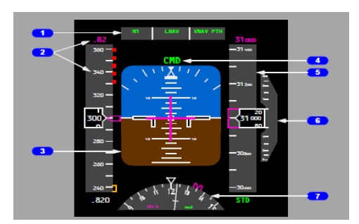 
A. Altimeter
B. Attitude Indicator
C. Flight Mode Annunciator (FMA)
D. Airspeed Indicator
E. Heading Indicator
ans: C

25. On the B738 PFD diagram (Figure 4.2A), what does item 2 (left tape) represent?

A. Altimeter
B. Airspeed Indicator
C. Vertical Speed Indicator
D. Heading Indicator
E. Attitude Indicator
ans: B

26. What type of displays are typically used in the current generation of glass cockpits, replacing older CRT displays?
A. Plasma displays
B. LED displays
C. Liquid Crystal Displays (LCDs)
D. Electromechanical dials
E. Holographic projectors
ans: C

27. What issue makes a large part of the potential visual range unusable for pilots during low visibility approaches?
A. Glare from cockpit lights
B. The nose of the aircraft cutting off the view of the nearest portion (approx. 35%)
C. Fog affecting instrument readings
D. Rain distorting the windshield
E. Air traffic control limitations
ans: B

28. Approximately how many seconds above Decision Height (DH) does visual contact need to be established for adequate assessment?
A. 0 seconds (at DH)
B. 1 second
C. 3 seconds
D. 10 seconds
E. 30 seconds
ans: C

29. For lateral control on approach, what is the minimum number of approach light segments (or runway lights) that should be visible?
A. 1
B. 2
C. 3
D. 5
E. 10
ans: C

30. What is Runway Visual Range (RVR)?
A. The pilot's actual slant vision distance
B. An instrument-derived value representing horizontal distance visible from the approach end
C. The maximum altitude for visual approach
D. The distance measured by the aircraft's radar
E. A value calculated based on ceiling height
ans: B

31. What is Slant Visual Range (SVR)?
A. The same as RVR
B. The horizontal distance measured at the runway midpoint
C. The distance between the pilot's eye and the farthest point visible along the slant path
D. The visibility reported by the control tower
E. A fixed value based on the approach type
ans: C

32. How does SVR typically compare to RVR in fog conditions (except at very low altitude)?
A. SVR is always greater than RVR
B. SVR is typically less than RVR because fog density often increases with height
C. SVR and RVR are always identical
D. SVR is only measured during the day, RVR at night
E. SVR depends on airspeed, RVR does not
ans: B

33. At very low altitudes (e.g., less than 30 feet), how does SVR relate to RVR?
A. SVR is much less than RVR
B. SVR is much greater than RVR
C. SVR is nearly the same as RVR
D. The relationship is unpredictable
E. SVR becomes zero
ans: C

34. What is the Down Vision Angle?
A. The angle the aircraft nose points down during descent
B. The angle between the pilot's line of sight (at neutral eye height) and the aircraft's longitudinal axis
C. The angle of the glide slope
D. The angle subtended by the runway width
E. The maximum bank angle allowed on approach
ans: B

35. Is the Cockpit Cut-Off Angle a fixed angle like the Down Vision Angle?
A. Yes, it is fixed for each aircraft type
B. No, it varies depending on factors like pitch attitude and pilot seat adjustment
C. It is fixed only during cruise flight
D. It only varies with airspeed
E. It is fixed for Captains but variable for First Officers
ans: B

36. When does the Cockpit Cut-Off Angle equal the Down Vision Angle?
A. When pitch attitude is zero
B. When flaps are fully extended
C. When the aircraft is heavy
D. When visibility is unlimited
E. Never
ans: A

37. How does the Cockpit Cut-Off Angle change with a positive (nose-up) pitch attitude?
A. It increases
B. It decreases (becomes smaller)
C. It remains the same
D. It becomes equal to the pitch attitude
E. It becomes negative
ans: B

38. What defines the AFT boundary of the visual ground segment?
A. The Slant Visual Range (SVR)
B. The runway threshold
C. The Cockpit Cut-Off Angle
D. The aircraft's altitude
E. The approach lighting system end
ans: C

39. Which factor is NOT listed as affecting the visual segment during final approach?
A. Aircraft geometry (pitch attitude)
B. Aircraft weight
C. Outside air temperature
D. Aircraft configuration (flaps)
E. Seat adjustment and eye position
ans: C

40. According to Table 4.1 (B737 data), how does increasing flap setting (e.g., from Flaps 15 to Flaps 30/40) generally affect pitch attitude on a 3° glideslope?
A. Increases pitch attitude
B. Decreases pitch attitude
C. Has no effect on pitch attitude
D. Effect depends only on weight
E. Makes pitch attitude oscillate
ans: B

41. How does reducing the pitch attitude (making it less positive or more negative) affect the visual segment and cut-off angle?
A. Decreases visual segment, decreases cut-off angle
B. Increases visual segment, increases cut-off angle
C. Decreases visual segment, increases cut-off angle
D. Increases visual segment, decreases cut-off angle
E. Has no effect on either
ans: B

42. What is the consequence of a pilot sitting too low (e.g., 1 cm below neutral eye height)?
A. Improved forward visibility
B. Reduction in cockpit cut-off angle and loss of visual ground segment
C. Increased Down Vision Angle
D. Better instrument scan
E. No significant effect
ans: B

43. What is the fundamental purpose of using checklists in the cockpit?
A. To increase pilot workload
B. To satisfy regulatory paperwork requirements
C. To eliminate errors of omission, especially during high workload or stress
D. To replace the need for pilot training
E. To provide entertainment during cruise flight
ans: C

44. Checklists in commercial jetliners require adherence to Standard Operating Procedures (SOP) during which phases of flight?
A. Only during takeoff and landing
B. Only during emergencies
C. Only during cruise
D. In all phases of flight
E. Only during pre-flight
ans: D

45. Which type of checklist is NOT categorized under "NATURE OF THE TASK"?
A. Normal checklist
B. Abnormal checklist
C. Emergency checklist
D. Before Takeoff checklist
ans: D

46. How are Normal checklists typically performed?
A. Memory items only
B. Read and Do (reference items)
C. After completing tasks using scan flows, then confirming with the checklist
D. Only when requested by ATC
E. By the cabin crew
ans: C

47. What does the checklist response "(AS REQUIRED)" usually mean?
A. The item must always be turned ON
B. The item must always be turned OFF
C. The action is optional and can be skipped
D. The crew must state the actual condition or position based on the situation
E. The item requires maintenance action
ans: D

48. How are Abnormal checklists generally performed?
A. Using scan flows only
B. As Memory/Recall items
C. Using the "Read and Do" concept
D. Only after landing
E. They are optional
ans: C

49. What must be done with "Irreversible items" on abnormal or emergency checklists?
A. Skipped if time is critical
B. Performed by the Pilot Flying only
C. Cross-checked by both crewmembers before action
D. Actioned first before any other item
E. Deferred until after landing
ans: C

50. Which type of checklist relies on Memory or Recall items that must be performed immediately?
A. Normal checklist
B. Abnormal checklist
C. Emergency checklist
D. Pre-flight checklist
E. Post-flight checklist
ans: C

51. What is always the first crew action when dealing with an Emergency checklist situation involving warnings?
A. Reading the checklist
B. Configuring the aircraft for landing
C. Contacting ATC
D. Cancellation of the warning (audio or visual)
E. Performing irreversible items
ans: D

52. What minimum altitude (AGL) is typically required before taking action (beyond warning cancellation) on an engine failure checklist after takeoff?
A. 100 ft AGL
B. 200 ft AGL
C. 400 ft AGL
D. 1000 ft AGL
E. No altitude restriction applies
ans: C

53. During takeoff, what is the priority order if both an emergency and an abnormal situation occur?
A. Perform abnormal checklist first, then emergency
B. Perform emergency checklist (recall items) first, then normal, then the rest of emergency/abnormal
C. Perform normal checklist first, then emergency, then abnormal
D. Land immediately, then perform checklists
E. Perform checklists simultaneously
ans: B

54. With the Autopilot (A/P) engaged during normal procedures, who is responsible for Flight path control (manipulating FCU/MCP)?
A. Pilot Monitoring (PM)
B. Pilot Flying (PF)
C. Air Traffic Control (ATC)
D. Flight Engineer (F/E)
E. Cabin Crew
ans: B

55. With the Autopilot (A/P) engaged during normal procedures, who is primarily responsible for Normal Checklist reading?
A. Pilot Flying (PF)
B. Pilot Monitoring (PM)
C. Both pilots simultaneously
D. The senior pilot present
E. Ground personnel via radio
ans: B

56. With the Autopilot (A/P) disengaged, who is responsible for Manual Flight path control?
A. Pilot Monitoring (PM)
B. Pilot Flying (PF)
C. Flight Management System (FMS)
D. Ground Control
E. The checklist itself
ans: B

57. During Emergency and Abnormal procedures, who is typically responsible for reading the checklist (Paper/Electronic/ECAM)?
A. Pilot Flying (PF)
B. Pilot Monitoring (PM)
C. Flight Engineer (F/E) if available
D. The pilot who first noticed the failure
E. Air Traffic Control
ans: B

58. During Emergency and Abnormal procedures, who is responsible for Flight path and airspeed control?
A. Pilot Monitoring (PM)
B. Pilot Flying (PF)
C. The Autopilot always takes over
D. The checklist dictates the controller
E. Flight Engineer (F/E)
ans: B

59. In older generation aircraft with a Flight Engineer (F/E), if the Captain wants the F/E to work the checklist, what should the Captain direct the F/O to do?
A. Read the checklist as well
B. Monitor the F/E
C. Fly the airplane
D. Communicate with ATC
E. Take a break
ans: C

60. What is the absolute priority or "rule of thumb" in any situation, especially an abnormal or emergency one?
A. Communicate
B. Navigate
C. Aviate (Fly the Plane)
D. Run the checklist
E. Conserve fuel
ans: C

61. What is the sequence of priorities after ensuring the aircraft is under control (Aviate)?
A. Communicate, Troubleshoot, Navigate
B. Troubleshoot, Communicate, Navigate
C. Navigate, Communicate
D. Communicate, Navigate
E. Troubleshoot, Navigate, Communicate
ans: C

### Chapter 5: JET CHARACTERISTICS

1. The ancient Greek story of Icarus illustrates the early human dream of flying and the potential danger of what?
A. Flying too low over the sea
B. Using wings made by someone else
C. Ignoring instructions and flying too close to the sun, melting the wax wings
D. Not having a proper tail design for stability
E. Attempting to carry passengers
ans: C

2. What assumption did the "Tower Jumpers" of the Middle Ages make about bird flight?
A. Birds use lightweight materials
B. Bird wings are the source of lift, and flapping provides propulsion
C. Birds navigate using magnetic fields
D. Birds require specific weather conditions
E. Birds have hollow bones for buoyancy
ans: B

3. What was a key benefit derived from the efforts of the Tower Jumpers for aviation?
A. They perfected wing-flapping mechanisms
B. They proved human flight was impossible
C. They helped differentiate between lift and propulsive sources
D. They developed lightweight construction techniques
E. They established the first flight schools
ans: C

4. Leonardo da Vinci is considered a major contributor to which field relevant to flight?
A. Jet engine design
B. Lighter-than-air technology
C. Aerodynamics
D. Radio communication
E. Air traffic control
ans: C

5. Da Vinci's hang glider design featured which characteristics?
A. Flapping wings powered by pedals
B. A hot air balloon for lift
C. Fixed inner wings and control surfaces near the tips
D. A steam-powered engine
E. A tail-less delta wing design
ans: C

6. The invention of lighter-than-air balloons, like the unmanned lanterns used by Zhuge Liang, relied on what principle?
A. Capturing wind in a large sail
B. Using a vacuum to create lift
C. Heating air inside an envelope to make it rise
D. Utilizing hydrogen gas for buoyancy
E. Flapping large fabric wings
ans: C

7. When was the first recorded manned balloon flight?
A. 1452
B. 1783
C. 1804
D. 1900
E. 1911
ans: B

8. Who is called "The Father of Aerodynamics" for being the first to understand the underlying principles and forces of flight?
A. Leonardo da Vinci
B. Icarus
C. Orville Wright
D. Sir George Cayley
E. Zhuge Liang
ans: D

9. Sir George Cayley set forth the concept of a modern airplane in 1799 as a fixed-wing machine with separate systems for what?
A. Navigation, Communication, and Power
B. Lift, Propulsion, and Flight Controls
C. Structure, Fuel, and Passengers
D. Landing Gear, Wings, and Tail
E. Radio, Radar, and Autopilot
ans: B

10. Which were the four forces of flight first named by Sir George Cayley?
A. Up, Down, Forward, Backward
B. Rise, Fall, Push, Pull
C. Lift, Weight, Thrust, Drag
D. Buoyancy, Gravity, Acceleration, Friction
E. Inertia, Momentum, Force, Reaction
ans: C

11. The Wright Brothers, Orville and Wilbur, were originally makers of what?
A. Clocks
B. Automobiles
C. Bicycles
D. Steam engines
E. Gliders
ans: C

12. Where did the Wright Brothers conduct their first successful manned flights in 1903?
A. Dayton, Ohio
B. Kitty Hawk (Kill Devil Hills), North Carolina
C. Paris, France
D. London, England
E. Langley, Virginia
ans: B

13. What was a key feature of the engine designed by the Wright Brothers for their 1903 Flyer?
A. It was extremely heavy but powerful (500 hp)
B. It was lightweight (180 lbs) but produced low power (13 hp)
C. It used jet propulsion
D. It required no fuel
E. It was an electric motor
ans: B

14. The Wright Brothers were the first to utilize which important tool extensively in their aviation experiments?
A. Flight simulators
B. Jet engines
C. Radio controls
D. Wind tunnels
E. Computers
ans: D

15. What was the main benefit of using wind tunnels, as pioneered by the Wright Brothers for aircraft design?
A. Testing engines at high altitude
B. Measuring fuel efficiency
C. Simulating pilot controls
D. Testing aerodynamic properties (like lift/drag) safely without risking lives
E. Training pilots in navigation
ans: D

16. The period between WWI and WWII (1918-1939) is often referred to as the:
A. Jet Age
B. Balloon Era
C. Glider Phase
D. Golden Age of Aviation
E. Supersonic Period
ans: D

17. What major change occurred in aircraft design during the "Golden Age of Aviation"?
A. From jets to propellers
B. From metal monoplanes to wood/wire biplanes
C. From slow, wood/wire biplanes to faster, all-metal monoplanes
D. From manned to unmanned aircraft
E. Introduction of lighter-than-air passenger services
ans: C

18. What invention introduced during WWII helped coordinate air-traffic flow?
A. GPS
B. Jet Engines
C. Radar
D. Autopilots
E. Pressurized cabins
ans: C

19. What was the name of the first commercial jet airliner, introduced in 1952?
A. Boeing 707
B. Douglas DC-8
C. De Havilland Comet
D. Concorde
E. Airbus A300
ans: C

20. The crew of the De Havilland Comet consisted of:
A. One pilot
B. Two pilots (Captain, First Officer)
C. Two pilots and a flight engineer
D. Two pilots, a flight engineer, and a navigator
E. Two pilots and two navigators
ans: D

21. Aerodynamics is a branch of fluid mechanics focusing on studying:
A. Water in motion
B. Air in motion
C. Liquids at rest
D. Engine combustion
E. Wing structures
ans: B

22. Atmospheric pressure is defined as:
A. The speed of air molecules
B. The temperature of the air
C. The weight of the air column above the measurement point
D. The density of the air
E. The humidity level
ans: C

23. What is the general rule for atmospheric pressure as altitude increases?
A. Pressure increases
B. Pressure remains constant
C. Pressure decreases
D. Pressure becomes zero
E. Pressure increases up to the tropopause, then decreases
ans: C

24. What is the standard temperature lapse rate in the International Standard Atmosphere (ISA)?
A. Increases 2°C per 1,000 ft
B. Decreases 1°C per 1,000 ft
C. Decreases 2°C per 1,000 ft
D. Remains constant with altitude
E. Decreases 3°C per 1,000 ft
ans: C

25. What are the ISA standard temperature and pressure conditions at sea level?
A. 0°C and 1013.25 hPa
B. 15°C and 1000.00 hPa
C. 20°C and 1013.25 hPa
D. 15°C and 1013.25 hPa
E. 15°F and 29.92 inHg
ans: D

26. The Continuity Equation (A1V1 = A2V2) is based on which fundamental principle?
A. Bernoulli's Principle
B. Newton's Second Law
C. Conservation of Mass Law
D. Conservation of Energy
E. Ideal Gas Law
ans: C

27. Newton's First Law of Motion relates to:
A. Force, mass, and acceleration (F=ma)
B. Action and reaction
C. Inertia (a body at rest stays at rest, a body in motion stays in motion)
D. Gravity
E. Fluid dynamics
ans: C

28. Newton's Second Law of Motion states that acceleration is:
A. Directly proportional to mass and inversely proportional to force
B. Directly proportional to force and inversely proportional to mass
C. Proportional only to the force applied
D. Proportional only to the mass of the body
E. Constant for all objects
ans: B

29. Newton's Third Law of Motion describes:
A. Inertia
B. F=ma
C. Conservation of mass
D. Lift generation
E. Equal and opposite reactions for every action
ans: E

30. Bernoulli's Principle states that as the velocity of a fluid (like air) increases, its internal pressure:
A. Increases
B. Decreases
C. Remains constant
D. Becomes negative
E. Is unrelated to velocity
ans: B

31. How is lift primarily generated by an airfoil according to Bernoulli's principle?
A. High pressure below pushes the wing up more than high pressure above pushes down
B. Faster airflow over the curved top surface creates lower pressure above the wing than below it
C. The wing physically pushes air downwards, causing an upward reaction
D. The engine thrust is angled slightly upwards
E. Air density differences create buoyancy
ans: B

32. The net aerodynamic force resulting from pressure differences on an airfoil is focused on a point called the:
A. Center of Gravity (CG)
B. Center of Pressure (CP)
C. Aerodynamic Center (AC)
D. Leading Edge
E. Trailing Edge
ans: B

33. The Lift Equation (L = ½ ρ CL V² S) shows that lift is directly proportional to:
A. Air density, lift coefficient, velocity (squared), and surface area
B. Weight, thrust, drag, and velocity
C. Altitude, temperature, pressure, and humidity
D. Wingspan, wing chord, aspect ratio, and taper ratio
E. Angle of attack only
ans: A

34. What happens to lift as the angle of attack increases (up to a point)?
A. Lift decreases linearly
B. Lift remains constant
C. Lift increases, primarily due to an increase in the lift coefficient (CL)
D. Lift becomes drag
E. The Center of Pressure moves forward
ans: C

35. What is the "Critical Angle of Attack"?
A. The angle for zero lift
B. The angle for maximum lift coefficient, beyond which the wing stalls
C. The angle of the wing relative to the fuselage (angle of incidence)
D. The angle for minimum drag
E. The angle where lift equals weight
ans: B

36. What is Induced Drag?
A. Drag caused by the aircraft's shape (form drag)
B. Drag caused by surface roughness (skin friction drag)
C. Drag that is a by-product of producing lift
D. Drag caused by extending landing gear
E. Wave drag at supersonic speeds
ans: C

37. How does Induced Drag typically change with airspeed?
A. Increases as airspeed increases
B. Decreases as airspeed increases (since angle of attack is usually lower)
C. Remains constant regardless of airspeed
D. Is highest at maximum speed
E. Is zero during cruise flight
ans: B

38. What is the Angle of Attack (α)?
A. The angle between the wing chord line and the longitudinal axis
B. The angle between the wing chord line and the relative wind
C. The angle of the wing relative to the ground (dihedral)
D. The angle of the flight path relative to the horizontal
E. The angle of wing sweep
ans: B

39. Which airspeed is Indicated Airspeed (IAS) corrected for position and instrument error?
A. True Airspeed (TAS)
B. Ground Speed (GS)
C. Equivalent Airspeed (EAS)
D. Calibrated Airspeed (CAS)
E. Mach Number
ans: D

40. Which airspeed is Calibrated Airspeed (CAS) corrected for compressibility effects?
A. True Airspeed (TAS)
B. Ground Speed (GS)
C. Equivalent Airspeed (EAS)
D. Indicated Airspeed (IAS)
E. Mach Number
ans: C

41. Which airspeed represents the actual speed of the aircraft through the air mass (EAS corrected for density)?
A. Indicated Airspeed (IAS)
B. Calibrated Airspeed (CAS)
C. Equivalent Airspeed (EAS)
D. True Airspeed (TAS)
E. Ground Speed (GS)
ans: D

42. Which airspeed is True Airspeed (TAS) corrected for wind?
A. Indicated Airspeed (IAS)
B. Calibrated Airspeed (CAS)
C. Equivalent Airspeed (EAS)
D. Ground Speed (GS)
E. Mach Number
ans: D

43. Parasite Drag is composed of which three types?
A. Induced, Wave, Interference
B. Form, Interference, Skin Friction
C. Profile, Structural, Induced
D. Lift, Weight, Thrust
E. Fuselage, Wing, Tail
ans: B

44. At low airspeeds, which type of drag is predominant?
A. Parasite Drag
B. Form Drag
C. Skin Friction Drag
D. Induced Drag
E. Interference Drag
ans: D

45. At high airspeeds, which type of drag is predominant?
A. Induced Drag
B. Parasite Drag
C. Lift-induced drag
D. Vortex drag
E. Stall drag
ans: B

46. The point where the Induced Drag and Parasite Drag curves intersect on a drag vs. airspeed graph represents:
A. Maximum drag
B. Minimum total drag (and typically best L/D ratio)
C. Stall speed
D. Maximum speed
E. Zero lift condition
ans: B

47. What is the Chord Line of a wing?
A. The line defining the upper curvature
B. The line defining the lower curvature
C. An imaginary line connecting the leading and trailing edges
D. The line equidistant from the upper and lower surfaces (Mean Line)
E. The wingspan divided by the area
ans: C

48. What is the "Camber" of a wing?
A. The thickness of the wing
B. The wingspan
C. The displacement between the Chord Line and the Mean Line
D. The angle of sweep
E. The aspect ratio
ans: C

49. Which are the three primary flight controls that move the aircraft about its axes?
A. Flaps, Slats, Spoilers
B. Elevator, Aileron, Rudder
C. Trim Tabs, Control Tabs, Balance Tabs
D. Throttle, Mixture, Propeller Control
E. Landing Gear, Brakes, Steering
ans: B

50. What is the main function of secondary flight controls like flaps and slats?
A. To control yaw
B. To control roll at high speeds
C. To provide the required lift at low speeds (takeoff/landing)
D. To steer the aircraft on the ground
E. To reduce engine noise
ans: C

51. How were flight controls typically linked to the control column/stick in early/classic aircraft designs?
A. Hydraulically
B. Electrically (Fly-by-wire)
C. Mechanically via steel cables
D. Pneumatically
E. Radio signals
ans: C

52. What was the purpose of Control Tabs introduced in the mid-fifties on larger piston aircraft?
A. To trim the aircraft automatically
B. To assist the pilot in overcoming large aerodynamic forces on control surfaces
C. To act as primary roll control
D. To improve stall characteristics
E. To function as speed brakes
ans: B

53. What system uses hydraulic pressure to move the large control surfaces on modern jet transports?
A. Cable and pulley system
B. Fly-by-wire system
C. Hydraulic Powered Controls
D. Pneumatic system
E. Electric actuators only
ans: C

54. What is the purpose of an "Artificial Feel" system in aircraft with hydraulic powered controls?
A. To reduce the power needed from the hydraulic system
B. To eliminate the need for pilot input
C. To provide the pilot with feedback forces similar to conventional controls, preventing over-control
D. To automatically trim the aircraft
E. To dampen Dutch roll oscillations
ans: C

55. What technology replaces mechanical linkages with electrical signals generated by computers to move control surfaces?
A. Hydraulic power
B. Control tabs
C. Artificial feel
D. Fly-by-wire
E. Pneumatic actuation
ans: D

56. What is a major advantage of fly-by-wire systems?
A. Increased system weight
B. Simpler maintenance compared to cables
C. Reduced precision and efficiency
D. Significant weight reduction and more precise control
E. Lower initial cost
ans: D

57. What is the purpose of a Trimmable Horizontal Stabilizer (THS)?
A. To act as the primary pitch control (replaces elevator)
B. To provide roll control
C. To allow trimming the aircraft across a wide CG range and reduce trim drag
D. To function as a speed brake
E. To dampen yaw oscillations
ans: C

58. Why are outboard ("Low Speed") ailerons often locked out at high speeds on large wingspan aircraft?
A. To reduce drag
B. To prevent excessive wing twist and potential roll reversal
C. Because inboard ailerons are more effective at high speed
D. To save hydraulic power
E. Because they are only needed for takeoff
ans: B

59. What is the basic function of spoilers deployed symmetrically on both wings?
A. To increase lift (act as flaps)
B. To control yaw
C. To spoil lift, acting as speed brakes or increasing descent rate
D. To provide roll control only
E. To trim the aircraft in pitch
ans: C

60. How do roll spoilers assist with roll control?
A. They deploy symmetrically to slow the aircraft
B. They deploy on the upward-moving wing to increase its lift
C. They deploy on the downward-moving wing (wing moving down in the roll) to spoil its lift
D. They are linked directly to the rudder
E. They change the wing's camber
ans: C

61. What system is used to limit rudder deflection at high airspeeds?
A. Yaw Damper
B. Roll Spoilers
C. Rudder Limiter
D. Mach Trim
E. THS (Trimmable Horizontal Stabilizer)
ans: C

62. Slotted flaps and leading-edge flaps/slats are examples of what type of devices?
A. High Drag Devices
B. Primary Flight Controls
C. High Lift Devices
D. Stability Augmentation Systems
E. Propulsion Systems
ans: C

63. Speed brakes and ground spoilers are primarily examples of what type of devices?
A. High Lift Devices
B. Primary Flight Controls
C. High Drag Devices
D. Engine Controls
E. Navigation Aids
ans: C

64. What phenomenon occurs when airflow separates from the wing at a high angle of attack?
A. Mach Tuck
B. Dutch Roll
C. Stall
D. Ground Effect
E. Wing Sweep
ans: C

65. What device provides an artificial warning of an impending stall by vibrating the control column?
A. Stall Horn
B. Angle of Attack Indicator
C. Stick Shaker
D. Yaw Damper
E. Mach Trim system
ans: C

66. What system automatically adds nose-up elevator/stabilizer trim at high Mach numbers to counteract Mach Tuck?
A. Yaw Damper
B. Stick Shaker
C. Mach Trim
D. Rudder Limiter
E. Autopilot
ans: C

67. What is the primary purpose of a Yaw Damper?
A. To limit rudder travel at high speed
B. To prevent or damp out Dutch Roll oscillations
C. To provide artificial rudder feel
D. To assist in roll control
E. To trim the aircraft in yaw
ans: B

68. What is Mach Tuck?
A. A tendency for the aircraft to roll unexpectedly at high speeds
B. A nose-down pitching tendency that occurs at high Mach numbers due to CP shift
C. The point where drag increases sharply near Mach 1
D. A buffet caused by shockwave formation
E. A system for retracting the landing gear efficiently
ans: B

69. What phenomenon is a coupled roll and yaw oscillation, particularly noticeable in swept-wing aircraft?
A. Mach Tuck
B. Stall Buffet
C. Flutter
D. Dutch Roll
E. Spiral Dive
ans: D

70. What are the two main types of engines producing thrust mentioned for airplanes?
A. Steam Engines and Electric Motors
B. Reciprocating Engines and Jet Turbine Engines
C. Rocket Engines and Ramjet Engines
D. Turboprop and Turboshaft Engines
E. Internal Combustion and External Combustion Engines
ans: B

71. What is a key difference in how reciprocating (piston/propeller) and jet engines produce thrust?
A. Jets accelerate a large mass of air slightly; props accelerate a small mass greatly.
B. Props accelerate a large mass of air slightly; jets accelerate a smaller mass greatly.
C. Only jets use combustion.
D. Only props use Newton's third law.
E. Jets create lift; props create thrust.
ans: B

72. What are the four basic stages shared by both reciprocating and jet engine cycles?
A. Spin, Burn, Cool, Exhaust
B. Intake, Compression, Combustion, Exhaust
C. Suck, Squeeze, Bang, Blow
D. Intake, Bypass, Burn, Rotate
E. Mix, Ignite, Expand, Turn
ans: B

73. What is a major design difference regarding the "chambers" used for the four stages in jet vs. reciprocating engines?
A. Jets use one chamber; reciprocating use four separate chambers.
B. Reciprocating use one chamber; jets use separate, optimized sections/chambers for each stage.
C. Both use identical chamber designs.
D. Only jets have an exhaust chamber.
E. Only reciprocating engines compress the air.
ans: B

74. What are the five basic components of a typical jet engine listed?
A. Propeller, Gearbox, Piston, Crankshaft, Exhaust Pipe
B. Fan, Low-Pressure Compressor, High-Pressure Compressor, Combustor, Turbine
C. Air intake, Compressor section, Burner section, Turbine section, Exhaust section
D. Inlet, Diffuser, Nozzle, Stator, Rotor
E. Starter, Igniter, Fuel Pump, Oil Pump, Generator
ans: C

75. What is the function of the Compressor section in a jet engine?
A. To ignite the fuel
B. To draw air in, compress it, and deliver it to the burner section
C. To extract energy to drive the fan/compressor
D. To expel hot gases to produce thrust
E. To mix fuel and air
ans: B

76. What are the two main types of compressors used in jet engines?
A. Piston and Rotary
B. Centrifugal Flow and Axial Flow
C. Low Bypass and High Bypass
D. Single Spool and Twin Spool
E. Ram Air and Mechanically Driven
ans: B

77. What is the function of the Turbine section in a jet engine?
A. To compress the incoming air
B. To mix fuel and air
C. To ignite the mixture
D. To absorb energy from the hot gases to drive the compressor (and fan)
E. To form the final exhaust nozzle
ans: D

78. What is the purpose of the Exhaust section?
A. To draw air into the engine
B. To compress the air
C. To burn the fuel
D. To direct the high-velocity exhaust gases rearward to produce thrust
E. To drive the turbine
ans: D

79. What was a major limitation of early centrifugal compressor engines?
A. Low compression ratios and large frontal area (high drag)
B. Small frontal area but very heavy
C. Inability to operate at high altitudes
D. Very quiet operation
E. High efficiency but low power output
ans: A

80. Why were twin-spool (or triple-spool) axial flow compressors developed?
A. To reduce engine weight
B. To allow different compressor sections (LPC/HPC) to rotate at their own optimum speeds, increasing efficiency and compression ratio
C. To eliminate the need for a turbine section
D. To enable reverse thrust
E. To simplify engine construction
ans: B

81. What is the defining characteristic of a Turboprop engine?
A. It has no compressor, only a turbine and propeller
B. It uses most of the exhaust gas energy for direct thrust
C. It uses an additional turbine stage (power turbine) to drive a propeller via a reduction gearbox
D. It is a type of piston engine with a turbocharger
E. It only operates at supersonic speeds
ans: C

82. What is the defining characteristic of a Turbofan engine?
A. It has no bypass air; all air goes through the core
B. It uses a large fan at the front to accelerate a large mass of bypass air, providing most of the thrust
C. It drives a propeller like a turboprop
D. It has no turbine section
E. It is only used on military aircraft
ans: B

83. What is the main advantage of a high by-pass ratio turbofan engine compared to a low by-pass or turbojet engine?
A. Higher exhaust velocity
B. Smaller frontal area
C. Better propulsive efficiency (lower fuel consumption) and lower noise levels
D. Simpler construction
E. Ability to operate without air
ans: C

84. What is the purpose of Thrust Reversers?
A. To assist in takeoff
B. To help decelerate the aircraft after landing, reducing brake wear
C. To provide steering on the ground
D. To increase engine efficiency during cruise
E. To clean the engine internally
ans: B

85. Modern high by-pass engines typically use which type of thrust reverser?
A. Bucket type (hot stream + cold stream)
B. Clamshell type (hot stream + cold stream)
C. Cold stream reversers (acting on bypass fan air only)
D. Reversing propeller pitch
E. Internal engine flow diverters
ans: C

86. What does EPR stand for as an engine thrust indication?
A. Engine Performance Rating
B. Exhaust Pressure Ratio
C. Engine Pressure Ratio
D. Estimated Power Requirement
E. Electronic Power Regulator
ans: C

87. Which indicator shows the rotational speed of the low-pressure compressor/fan spool?
A. EPR
B. EGT
C. N1
D. N2
E. FF
ans: C

88. Which indicator shows the rotational speed of the high-pressure compressor spool?
A. EPR
B. EGT
C. N1
D. N2
E. FF
ans: D

89. What does EGT stand for?
A. Engine Gas Temperature
B. Exhaust Gas Temperature
C. Estimated Ground Time
D. Engine Generator Torque
E. Emergency Gauge Test
ans: B

90. What does the Fuel Flow (FF) indicator measure?
A. Total fuel remaining in tanks
B. Fuel pressure
C. Fuel temperature
D. Rate of fuel consumption (e.g., kg or lbs per hour)
E. Fuel purity
ans: D

91. What are the two main environmental problems associated with jet engine operations mentioned?
A. Water Pollution and Soil Erosion
B. Air Pollution and Noise Pollution
C. Light Pollution and Radio Interference
D. Ozone Creation and Global Cooling
E. Deforestation and Habitat Loss
ans: B

92. Which is NOT listed as a major pollutant produced from jet engine combustion?
A. Carbon Monoxide (CO)
B. Unburned Hydrocarbons (H/C)
C. Sulfur Dioxide (SO2)
D. Nitrogen Oxide (NO)
ans: C

93. High by-pass turbofan engines helped reduce which environmental impact compared to older turbojets?
A. Air pollution (lower emissions per passenger mile) and Noise pollution
B. Only air pollution
C. Only noise pollution
D. Neither air nor noise pollution
E. Water consumption
ans: A

94. What is the basic reason for turbojet engine exhaust noise?
A. Combustion explosions inside the engine
B. The whining of the compressor blades
C. Shear turbulence between the high-velocity exhaust jet and the slower ambient air
D. The vibration of the engine casing
E. Sonic booms from the aircraft structure
ans: C

95. What is a key goal of Take Off Noise Abatement Procedures?
A. To fly as low as possible over populated areas
B. To use maximum engine power for the entire climb
C. To climb quickly to gain vertical distance from the ground, then potentially reduce thrust/accelerate
D. To take off only at night
E. To use minimum flap settings
ans: C

96. What is the goal of Low Drag Approach procedures?
A. To use maximum flaps and gear early in the approach
B. To fly the approach as slowly as possible
C. To maintain a clean configuration (delaying flaps/gear) to higher speeds/lower altitudes, reducing noise
D. To perform steep descents
E. To land with thrust reversers deployed
ans: C

### Chapter 6: AIRCRAFT SYSTEMS

1.  Why is air considered important in the operation of many jet aircraft systems?
    A. It is lighter than other energy sources
    B. It is reliable, easily available, and a powerful source of energy
    C. It is only used for cooling
    D. It is required only for engine combustion
    E. It provides lubrication
    ans: B

2.  What is the air supplied by the APU, engines, or external carts called?
    A. Ram Air
    B. Conditioned Air
    C. Bleed Air
    D. Pressurized Air
    E. Cabin Air
    ans: C

3.  What are the three main sub-systems composing the overall Air System?
    A. Hydraulic, Electrical, Fuel
    B. Pneumatic, Air Conditioning, Pressurization
    C. Engine Start, Anti-Ice, Wing Flaps
    D. APU, Engines, Ground Cart
    E. Ducts, Valves, Sensors
    ans: B

4.  What is the main objective of the pneumatic system?
    A. To cool the cabin air
    B. To pressurize the hydraulic reservoirs only
    C. Organization and distribution of engine and APU bleed air, and engine starting
    D. To provide electrical power
    E. To control flight surfaces
    ans: C

5.  Which component separates the left and right sides of the pneumatic system manifold?
    A. Starter valve
    B. Pre-cooler
    C. Isolation valve
    D. Bleed Trip sensor
    E. Bleed Air valve
    ans: C

6.  Which component is NOT listed as a primary part of the Pneumatic System?
    A. Bleed Air valves
    B. Air Cycle Machine (ACM)
    C. Pre-cooler
    D. Pneumatic Ducts
    E. Isolation valve
    ans: B

7.  What is the function of Engine Bleed Air Valves?
    A. To start the engine
    B. To isolate the left and right pneumatic ducts
    C. To provide bleed air from the engine compressor stages to the pneumatic manifold
    D. To cool the bleed air using fan air
    E. To prevent overpressure in the APU
    ans: C

8.  What happens if an overpressure condition is sensed in an engine bleed air line?
    A. The isolation valve opens
    B. The APU starts automatically
    C. The pre-cooler shuts down
    D. The associated engine bleed air valve closes automatically
    E. The starter valve engages
    ans: D

9.  What is the function of Bleed Trip Sensors?
    A. To measure duct pressure
    B. To cool the bleed air
    C. To automatically close the respective engine bleed air valve in case of overpressure or temperature
    D. To open the starter valve
    E. To indicate bleed air leaks
    ans: C

10. What is the function of a Pre-cooler in the pneumatic system?
    A. To heat the bleed air for anti-icing
    B. To act as the main ducting
    C. To cool the hot engine bleed air using cold fan air
    D. To sense bleed air leaks
    E. To start the engine
    ans: C

11. What is the purpose of the Starter Valve?
    A. To regulate bleed air pressure
    B. To allow pneumatic pressure to power the engine starter
    C. To isolate pneumatic system sides
    D. To provide air for air conditioning
    E. To cool the bleed air
    ans: B

12. What procedure uses bleed air from one running engine to start the other engine?
    A. APU Start
    B. Ground Cart Start
    C. Cross-Bleed Start
    D. Isolation Start
    E. Pre-cooler Start
    ans: C

13. Which is NOT a primary source of bleed air for the pneumatic system?
    A. Engine Bleed
    B. APU Bleed
    C. Hydraulic System Pump
    D. Ground Air source
    ans: C

14. Which system is NOT listed as a user (need) of the pneumatic system?
    A. Air conditioning
    B. Pressurization
    C. Engine starting
    D. Landing gear retraction
    E. Wing and engine thermal Anti-icing
    ans: D

15. Which source of bleed air is primarily used on the ground before engine start?
    A. Engine Bleed
    B. APU Bleed
    C. Cross-Bleed
    D. Ram Air
    E. Hydraulic bleed
    ans: B

16. What is the primary purpose of the Air Conditioning system?
    A. To pressurize the cabin
    B. To regulate the temperature of bleed air supplied to the cabin and flight deck
    C. To provide engine starting air
    D. To cool the hydraulic fluid
    E. To inflate the emergency slides
    ans: B

17. What is the refrigeration unit in an aircraft air conditioning system commonly called?
    A. ACM
    B. Pre-cooler
    C. Heat Exchanger
    D. PACK
    E. Condenser
    ans: D

18. What is the primary component within an air conditioning PACK?
    A. Isolation Valve
    B. Series of heat exchangers and an Air Cycle Machine (ACM)
    C. Fuel heater
    D. Bleed trip sensor
    E. Pneumatic duct
    ans: B

19. What does the Air Cycle Machine (ACM) consist of?
    A. A fan and a heater
    B. A pump and a filter
    C. A compressor and a turbine
    D. An evaporator and a condenser
    E. Two heat exchangers
    ans: C

20. What system diverts some hot bleed air before the PACK to mix with the cold air exiting the PACK for temperature control?
    A. Ram Air System
    B. Pre-cooler System
    C. Water Separator System
    D. Trim Air System
    E. Bleed Valve System
    ans: D

21. What is the purpose of the Pressurization system?
    A. To provide high-pressure air for engine starting
    B. To cool the cabin
    C. To increase cabin pressure and lower cabin altitude for occupant breathing
    D. To inflate the tires
    E. To operate the hydraulic system
    ans: C

22. How is cabin pressure primarily controlled?
    A. By varying the amount of air entering from the PACKs
    B. By modulating the Outflow Valve to control the amount of air leaving the cabin
    C. By opening and closing passenger windows
    D. By adjusting the Trim Air valves
    E. By changing engine thrust
    ans: B

23. What component prevents cabin differential pressure from exceeding structural limits?
    A. Outflow Valve
    B. Negative Pressure Relief Valve
    C. Pressurization Controller
    D. Positive Pressure Relief Valve
    E. Isolation Valve
    ans: D

24. What component prevents external pressure from exceeding internal pressure (e.g., during a rapid descent)?
    A. Outflow Valve
    B. Positive Pressure Relief Valve
    C. Pressurization Controller
    D. Negative Pressure Relief Valve
    E. Cabin Air Filter
    ans: D

25. What is the normal mode of operation for most pressurization systems?
    A. Manual Mode
    B. Semiautomatic Mode
    C. Automatic Mode
    D. Standby Mode
    E. Alternate Mode
    ans: C

26. In Automatic mode, what does the controller typically do just before landing?
    A. Depressurizes the cabin rapidly
    B. Programs the cabin to land slightly pressurized (below field altitude)
    C. Fully opens the outflow valve
    D. Switches to manual mode
    E. Increases cabin altitude to match aircraft altitude
    ans: B

27. What is the core philosophy of the fuel system?
    A. Storing fuel only in the fuselage
    B. Using fuel primarily for cooling
    C. Sorting, routing, and pressurizing fuel to each engine at the required flow and pressure
    D. Transferring fuel between tanks continuously
    E. Generating electrical power from fuel flow
    ans: C

28. Where are fuel tanks primarily located in modern jet aircraft?
    A. In the fuselage only
    B. Within the wings (and sometimes center/stabilizer tanks)
    C. In external drop tanks
    D. Around the engines
    E. Under the cabin floor
    ans: B

29. What is the function of Fuel Boost Pumps?
    A. To measure fuel quantity
    B. To supply fuel under pressure from the tanks to the engines/APU
    C. To heat the fuel
    D. To vent the fuel tanks
    E. To transfer fuel between wings
    ans: B

30. What is the purpose of the Fuel Crossfeed Valve?
    A. To shut off fuel to an engine
    B. To allow feeding any engine from any tank
    C. To measure fuel temperature
    D. To vent the fuel tanks
    E. To boost fuel pressure
    ans: B

31. Why must center tank fuel generally be used before wing tank fuel?
    A. Center tank fuel is lower quality
    B. To maintain proper aircraft balance and wing bending relief
    C. Wing tank pumps are stronger
    D. Center tank fuel heats up faster
    E. It is easier to measure center tank fuel
    ans: B

32. What principle does a hydraulic system use to transmit pressure?
    A. Bernoulli's Principle
    B. Newton's Laws of Motion
    C. Pascal's Law
    D. Archimedes' Principle
    E. Conservation of Energy
    ans: C

33. What is the core purpose of an aircraft hydraulic system?
    A. To provide lubrication for the engines
    B. To generate electrical power
    C. To use pressurized fluid to perform mechanical work (move flight controls, gear, etc.)
    D. To cool the avionics
    E. To provide potable water
    ans: C

34. Which component holds the hydraulic fluid for system operation?
    A. Actuator
    B. Pump
    C. Hydraulic Reservoir
    D. Heat Exchanger
    E. Filter
    ans: C

35. Why are hydraulic reservoirs typically pressurized?
    A. To increase the fluid temperature
    B. To prevent fluid contamination
    C. To ensure a positive fluid flow to the hydraulic pumps
    D. To reduce the system weight
    E. To cool the fluid
    ans: C

36. What are the two primary kinds of pumps used to pressurize hydraulic systems?
    A. Centrifugal and Axial
    B. AC and DC powered
    C. Engine Driven Pump (EDP) and Electric Motor Driven Pump (EMDP)
    D. Hand pump and Windmill pump
    E. Boost pump and Transfer pump
    ans: C

37. What is the function of a Power Transfer Unit (PTU)?
    A. To convert AC to DC power
    B. To transfer hydraulic power from one system to another without transferring fluid
    C. To pump fuel between tanks
    D. To cool the hydraulic fluid
    E. To pressurize the standby reservoir
    ans: B

38. Where are hydraulic heat exchangers often located?
    A. In the pneumatic ducts
    B. Inside the hydraulic reservoir
    C. Near the engine exhaust
    D. In the main fuel tanks
    E. Attached to the actuators
    ans: D

39. Which of these is typically NOT powered by the main hydraulic systems?
    A. Ailerons, elevators, rudder
    B. Landing gear extension and retraction
    C. Flaps and slats
    D. Cabin lighting
    E. Wheel brakes
    ans: D

40. What provides hydraulic power in case of complete main system failure (e.g., dual engine failure)?
    A. Engine Driven Pumps only
    B. Electric Pumps only
    C. Standby system (possibly pressurized by electric pump or Ram Air Turbine - RAT)
    D. Manual reversion using cables
    E. Accumulator pressure only
    ans: C

41. What is the primary function of the aircraft electrical system?
    A. To provide hydraulic pressure
    B. To generate and distribute electrical power (AC and DC)
    C. To cool the cabin
    D. To provide engine fuel
    E. To pressurize the cabin
    ans: B

42. What are the two main types of electrical power used on aircraft?
    A. High voltage and Low voltage
    B. Engine power and APU power
    C. Alternating Current (AC) and Direct Current (DC)
    D. Primary power and Backup power
    E. Ground power and Battery power
    ans: C

43. What device maintains a constant frequency output from engine-driven generators despite varying engine RPM?
    A. Transformer Rectifier Unit (TRU)
    B. Static Inverter
    C. Constant Speed Drive (CSD) or Integrated Drive Generator (IDG)
    D. Battery Charger
    E. Circuit Breaker
    ans: C

44. What is the function of a Transformer Rectifier Unit (TRU)?
    A. To convert DC to AC
    B. To convert AC to DC
    C. To step up AC voltage
    D. To regulate generator frequency
    E. To charge the battery directly from DC power
    ans: B

45. What component converts DC power (e.g., from the battery) to AC power, typically for essential/standby busses?
    A. Transformer Rectifier Unit (TRU)
    B. Static Inverter
    C. Battery Charger
    D. Constant Speed Drive (CSD)
    E. AC Generator
    ans: B

46. What is the primary source of DC power in the normal electrical system configuration?
    A. The battery
    B. A DC generator
    C. AC power converted to DC by Transformer Rectifier Units (TRUs)
    D. The static inverter
    E. Solar panels
    ans: C

47. In case of complete AC power loss, what typically powers the AC and DC Standby busses?
    A. Ram Air Turbine (RAT) only
    B. APU generator only
    C. The battery (directly for DC standby, via static inverter for AC standby)
    D. External ground power
    E. They become unpowered
    ans: C

48. What does GPWS stand for?
    A. Global Positioning Waypoint System
    B. Ground Proximity Warning System
    C. General Purpose Warning System
    D. Glide Path Waypoint System
    E. Gear Position Warning System
    ans: B

49. What type of accident is GPWS designed to prevent?
    A. Mid-air collisions
    B. Engine failures
    C. Controlled Flight Into Terrain (CFIT)
    D. Runway overruns
    E. In-flight fires
    ans: C

50. What enhancement did EGPWS/TAWS add to traditional GPWS?
    A. Weather radar integration
    B. Traffic alert capability
    C. A worldwide digital terrain database and GPS position information
    D. Automatic landing capability
    E. Engine performance monitoring
    ans: C

51. Which GPWS mode warns of excessive descent rate?
    A. Mode 1 ("SINK RATE")
    B. Mode 2 ("TERRAIN")
    C. Mode 3 ("DON'T SINK")
    D. Mode 4 ("TOO LOW")
    E. Mode 5 ("GLIDESLOPE")
    ans: A

52. Which GPWS mode warns of excessive terrain closure rate?
    A. Mode 1 ("SINK RATE")
    B. Mode 2 ("TERRAIN")
    C. Mode 3 ("DON'T SINK")
    D. Mode 4 ("TOO LOW")
    E. Mode 6 ("BANK ANGLE")
    ans: B

53. What does TCAS stand for?
    A. Terrain Collision Alert System
    B. Traffic Collision Avoidance System
    C. Transponder Control and Alert System
    D. Taxiway Control Advisory System
    E. Takeoff Configuration Alert System
    ans: B

54. TCAS is designed to reduce the incidence of what type of event?
    A. Controlled Flight Into Terrain (CFIT)
    B. Runway incursions
    C. Mid-air collisions
    D. Engine failures
    E. Loss of control
    ans: C

55. TCAS relies on receiving signals from what equipment on other aircraft?
    A. GPS receivers
    B. Weather radar
    C. Active Mode C or Mode S transponders
    D. Radio altimeters
    E. Emergency Locator Transmitters (ELTs)
    ans: C

56. What type of alert does TCAS issue when an intruder poses a potential collision threat, requiring visual acquisition?
    A. Resolution Advisory (RA)
    B. Terrain Alert
    C. Traffic Advisory (TA)
    D. Windshear Alert
    E. Stall Warning
    ans: C

57. What type of alert does TCAS issue when a collision is imminent, providing a recommended vertical avoidance maneuver?
    A. Traffic Advisory (TA)
    B. Ground Proximity Warning
    C. Configuration Warning
    D. Resolution Advisory (RA)
    E. Windshear Warning
    ans: D

58. How should pilots respond to a TCAS Resolution Advisory (RA)?
    A. Ignore it if it conflicts with ATC instructions
    B. Follow the RA promptly and appropriately, even if it conflicts with ATC instructions
    C. Ask ATC for confirmation before maneuvering
    D. Make a horizontal turn away from the traffic
    E. Maintain current flight path and wait for the other aircraft to maneuver
    ans: B

59. What information does TCAS use to build its 3D map of surrounding traffic?
    A. Visual sightings by the pilot
    B. Reports from ATC radar
    C. Interrogation/response time (range), transponder altitude reports, and directional antenna (bearing)
    D. Weather radar returns
    E. GPS coordinates broadcast by all aircraft
    ans: C

60. What system has priority over TCAS advisories in the cockpit?
    A. Autopilot commands
    B. Flight Management System (FMS) route
    C. Ground Proximity Warning System (GPWS/EGPWS) alerts
    D. ATC instructions
    E. Passenger announcements
    ans: C

61. If a TCAS RA commands a climb while the aircraft is at its maximum altitude, what should the crew do?
    A. Maintain altitude and ignore the RA
    B. Request lower altitude from ATC
    C. Follow the climb RA as best as possible, potentially trading speed for height temporarily
    D. Descend immediately
    E. Disengage the autopilot and manually override
    ans: C

62. What frequency is used by TCAS to interrogate other aircraft?
    A. 1090 MHz
    B. 1030 MHz
    C. 121.5 MHz
    D. 400 Hz
    E. 2.4 GHz
    ans: B

63. What frequency is used by transponders to reply to TCAS interrogations?
    A. 1090 MHz
    B. 1030 MHz
    C. 121.5 MHz
    D. 400 Hz
    E. 5.0 GHz
    ans: A

### Chapter 7: AIRCRAFT DOCUMENTS

1.  What is the primary reason regulatory authorities enforce maintenance documentation systems?
    A. To generate revenue for the authority
    B. To ensure manufacturers provide detailed manuals
    C. To maintain the maintenance quality and airworthiness of aircraft
    D. To track pilot flight hours
    E. To standardize aircraft paint schemes
    ans: C

2.  According to the introduction, who provides the initial aircraft documentation?
    A. The regulatory authority (e.g., ECAA)
    B. The airline operator
    C. The aircraft manufacturers
    D. The pilot union
    E. The maintenance organization (AMO)
    ans: C

3.  What document contains the airline's maintenance policies, procedures, and information needed for maintenance paperwork?
    A. Aircraft Flight Manual (AFM)
    B. Minimum Equipment List (MEL)
    C. Maintenance Control Manual (MCM)
    D. Airplane Technical Log
    E. Operation Specifications (OPSPECS)
    ans: C

4.  Which entity must EgyptAir provide a copy of its Maintenance Control Manual to?
    A. International Civil Aviation Organization (ICAO)
    B. Aircraft Manufacturer (e.g., Boeing, Airbus)
    C. Egyptian Civil Aviation Authority (ECAA)
    D. International Air Transport Association (IATA)
    E. The pilot union
    ans: C

5.  Which item is included in the Maintenance Control Manual?
    A. Daily flight schedule
    B. Passenger manifests
    C. Structure and functionality of the management system for maintenance operation
    D. Pilot training records
    E. Fuel prices
    ans: C

6.  What is the role of the contracted maintenance organization (AMO) regarding continued airworthiness information?
    A. To issue regulations
    B. To fly the aircraft
    C. To obtain and assess continued airworthiness information
    D. To provide pilot licenses
    E. To design aircraft modifications
    ans: C

7.  What is the purpose of the airline's Documentation System mentioned?
    A. To keep pilot medical records
    B. To log passenger complaints
    C. To keep a list of valid documents and identify their revision status
    D. To manage flight crew rosters
    E. To record in-flight meal choices
    ans: C

8.  Which document, issued by ECAA, must be carried on board as the original certificate?
    A. Noise certificate
    B. Certificate of Registration
    C. Insurance Certificate
    D. Air Operator Certificate (AOC)
    E. Aircraft Flight Manual (AFM)
    ans: B

9.  Which document confirms the aircraft meets its type design and is safe to fly?
    A. Certificate of Registration
    B. Noise certificate
    C. Certificate of Airworthiness
    D. Airplane radio license
    E. Insurance Certificate
    ans: C

10. What is required for the Noise certificate carried on board?
    A. Must be laminated
    B. Original certificate or a certified copy
    C. Must be displayed in the cabin
    D. Only required for international flights
    E. Issued by the engine manufacturer
    ans: B

11. Who issues the Air Operator Certificate (AOC)?
    A. The aircraft manufacturer
    B. The insurance company
    C. Egyptian Telecommunication Authority
    D. Egyptian Civil Aviation Authority (ECAA)
    E. The maintenance organization
    ans: D

12. The Airplane radio license is issued by whom?
    A. ECAA
    B. The pilot
    C. Egyptian Telecommunication Authority
    D. The radio manufacturer
    E. ICAO
    ans: C

13. What form of the Insurance Certificate is required on board?
    A. The original policy document
    B. A certified copy of the certificate
    C. A verbal confirmation from the broker
    D. A copy of the payment receipt
    E. Not required if the AOC is present
    ans: B

14. Which document, issued by ECAA, is required for permission to fly or land in Egyptian territories?
    A. Aircraft Flight Manual (AFM)
    B. Certificate of Airworthiness
    C. Permission to fly/land (original copy)
    D. Air Operator Certificate (AOC)
    E. Flight Crew License
    ans: C

15. What does AFM stand for?
    A. Aircraft Fabrication Manual
    B. Approved Flight Manual
    C. Aircraft Flight Manual
    D. Airframe Maintenance Manual
    E. Airline Finance Manual
    ans: C

16. Which document provides operating procedures and limitations specific to the aircraft type?
    A. Maintenance Control Manual
    B. Aircraft Technical Log
    C. Aircraft Flight Manual (AFM) or Flight Crew Operation Manual (FCOM)
    D. Deferred Defect Log
    E. Certificate of Registration
    ans: C

17. What is the Minimum Equipment List (MEL)?
    A. A list of all equipment installed on the aircraft
    B. A list of items that must be operative for flight
    C. A list specifying equipment that may be inoperative for flight, subject to conditions
    D. A list of maintenance tools required
    E. A list of emergency equipment locations
    ans: C

18. Which additional document should be located onboard besides the primary certificates and manuals?
    A. Airline annual report
    B. Aircraft Technical Log
    C. Pilot employment contract
    D. Airport directory
    E. Catering menu
    ans: B

19. What information must be included in a maintenance record entry after an inspection?
    A. Pilot's name and flight number
    B. Weather conditions during inspection
    C. Type of inspection, date, aircraft time, and signature/license of approving person
    D. Fuel quantity remaining
    E. Number of passengers onboard
    ans: C

20. Which maintenance check is typically performed every 24 to 36 hours?
    A. Weekly check
    B. A check
    C. C check
    D. Daily check
    E. Transient check / PDC / ALC
    ans: D

21. What is the typical interval for an 'A check'?
    A. 8 days
    B. Each 750 hours or 2 months
    C. 8A or 18 months
    D. 8C / Overhaul check
    E. 24 to 36 hours
    ans: B

22. What is the primary purpose of the Aircraft Technical Log?
    A. To record passenger names
    B. To record flight crew schedules
    C. To record defects, malfunctions, maintenance carried out, and relevant operating information
    D. To log fuel uplift only
    E. To serve as the aircraft's registration document
    ans: C

23. How many copies are typically made of the technical logbook pages, besides the master?
    A. One
    B. Two
    C. Three
    D. Four
    E. None, only the master exists
    ans: C

24. Which copy of the technical log remains on board until the next letter check?
    A. Master Copy
    B. Second Copy
    C. Third Copy
    D. Fourth Copy
    E. None, all copies are removed after each flight
    ans: A

25. What information must the commander record in the technical log for each flight?
    A. Preferred cruising altitude
    B. Details of any defect affecting airworthiness or safe operation, or a "Nil Defect" entry
    C. Passenger meal count
    D. Cabin crew names
    E. Fuel supplier name
    ans: B

26. What condition prohibits aircraft fueling?
    A. While passengers are boarding
    B. While an aircraft engine is running
    C. During nighttime
    D. If the cabin lights are off
    E. While the APU is running
    ans: B

27. What must be ensured about the fuel delivered and loaded onto the aircraft?
    A. It is the cheapest available
    B. It is free from contamination and of the correct grade/specification
    C. It is measured in litres only
    D. It fills the tanks completely
    E. It contains a special additive for high altitude flight
    ans: B

28. What safety precaution must be taken regarding the aircraft and fueling vehicles before fueling?
    A. They must be painted the same color
    B. Their engines must be running
    C. They must be washed thoroughly
    D. They must be statically bonded and grounded
    E. Their tires must be deflated
    ans: D

29. When is a Certificate of Release to Service required before flight?
    A. After every flight, regardless of maintenance
    B. Only after major overhaul (D check)
    C. After completion of a maintenance check or any defect rectification
    D. Only when requested by the pilot
    E. After fueling is completed
    ans: C

30. Where must inoperative system or equipment be recorded according to the deferred maintenance procedures?
    A. In the pilot's personal logbook
    B. On a note left in the galley
    C. In the concerned aircraft deferred defect logbook
    D. On the passenger boarding pass
    E. In the airport operations log
    ans: C

31. What does MEL stand for?
    A. Maintenance Engineering Log
    B. Maximum Equipment Load
    C. Minimum Equipment List
    D. Master Engine Log
    E. Mandatory Exemption Log
    ans: C

32. How are deferred items typically marked in the cockpit?
    A. With bright red paint
    B. They are removed from the aircraft
    C. Placarded as "Inoperative" or "deactivated"
    D. Covered with duct tape
    E. Highlighted in the AFM
    ans: C

33. What is the time interval for rectifying a Category "B" MEL item?
    A. As required
    B. 3 days or 72 hours
    C. 10 days or 240 hours
    D. 120 days or 2880 hours
    E. Before the next flight
    ans: B

34. What is the time interval for rectifying a Category "C" MEL item?
    A. As required
    B. 3 days or 72 hours
    C. 10 days or 240 hours
    D. 120 days or 2880 hours
    E. Within the next flight leg
    ans: C

35. What is the time interval for rectifying a Category "D" MEL item?
    A. As required
    B. 3 days or 72 hours
    C. 10 days or 240 hours
    D. 120 days or 2880 hours
    E. Immediately
    ans: D

36. What does CDL stand for?
    A. Critical Defect Log
    B. Component Deviation List
    C. Configuration Deviation List
    D. Cockpit Document Log
    E. Control Device List
    ans: C

37. What kind of deficiencies are covered by the CDL?
    A. Inoperative primary flight instruments
    B. Missing or inoperative equipment covered by the MEL
    C. Secondary airframe and engine part deficiencies (e.g., missing fairings)
    D. Engine performance issues
    E. Software glitches in the FMS
    ans: C

38. What information might a pilot need to find in the Deferred Deviation List (DDL) or Deferred Deviation Guide (DDG)?
    A. Maintenance procedures ("M") for MEL items
    B. Operational procedures ("O") required when operating with certain MEL/CDL defects
    C. The price list for spare parts
    D. The schedule for the next C check
    E. Contact information for the manufacturer
    ans: B

39. What does ETOPS stand for?
    A. Engine Turn Off Procedure System
    B. Estimated Time Over Point Station
    C. Extended Twin Engine Operations
    D. Emergency Turn Or Procedure Sequence
    E. Extra Tank Operations System
    ans: C

40. What check must be performed immediately prior to an ETOPS flight?
    A. A full 'A' check
    B. An ETOPS routine line maintenance check verifying critical items
    C. A cabin interior inspection only
    D. A fuel sample check only
    E. A check of the entertainment system
    ans: B

41. If a defect makes an aircraft NON-RVSM CAPABLE, what must be clearly stated in the Deferred Defect Log and Technical Log?
    A. The estimated repair time
    B. The cost of the required part
    C. That the aircraft is NON-RVSM CAPABLE
    D. The pilot's opinion on the defect
    E. The weather forecast for the intended route
    ans: C

42. Who must be notified immediately if an aircraft is downgraded to non-RVSM or non-CAT II capable?
    A. The aircraft manufacturer
    B. All passengers booked on the next flight
    C. The Maintenance Control Center (MCC) and Integrated Operations Control Center (IOCC)
    D. The fuel supplier
    E. The catering company
    ans: C

43. What is the Operations Specification (OPSPECS) document?
    A. A marketing brochure for the airline
    B. A regulatory document issued by the CAA detailing operational authorizations
    C. The aircraft maintenance schedule
    D. The pilot's employment contract
    E. A list of airport charges
    ans: B

44. Which item is typically stated in the OPSPECS?
    A. Pilot salaries
    B. In-flight meal recipes
    C. Air Operator Certificate number and area of operations
    D. Aircraft paint color codes
    E. Cabin crew uniform regulations
    ans: C

45. Which specific approval would be found in the OPSPECS?
    A. Approval for specific routes
    B. Approval for Low Visibility Operations (LVP) and CAT II/III
    C. Approval for the type of coffee served onboard
    D. Approval of the airline's logo
    E. Approval of the pilot's roster
    ans: B

46. Which specific approval would be found in the OPSPECS?
    A. Pilot training curriculum
    B. Maximum passenger weight
    C. RVSM capability approval
    D. Price of airline tickets
    E. Cabin interior design
    ans: C

47. Which specific approval would be found in the OPSPECS?
    A. Choice of hotel for crew layovers
    B. ETOPS authorization
    C. The airline's advertising budget
    D. Seat assignment policy
    E. Baggage allowance limits
    ans: B

48. What document must be presented to ramp inspectors upon request?
    A. The pilot's personal flight log
    B. The airline's latest financial statement
    C. The Operation Specifications (OPSPECS)
    D. The aircraft cleaning schedule
    E. The passenger list
    ans: C

49. Which of the following provisions might also be included in the OPSPECS?
    A. Catering contracts
    B. Parts Pool Arrangement
    C. Ground handling agreements
    D. Pilot pension plan details
    E. Aircraft leasing terms
    ans: B

50. The Airplane Technical Log is crucial for flight crews to ensure what?
    A. The aircraft has enough fuel
    B. The cabin is clean
    C. Required maintenance checks have been performed and the aircraft is released to service
    D. The correct number of meals are loaded
    E. The entertainment system is working
    ans: C

### Chapter 8: WEIGHT AND BALANCE

1.  Why is a good knowledge of weight and balance considered vitally important to pilots?
    A. It helps in choosing the best cruising altitude.
    B. It directly affects aircraft performance, safety, and efficiency.
    C. It is required for passing customs inspections.
    D. It determines the type of fuel to be used.
    E. It simplifies communication with air traffic control.
    ans: B

2.  What is a potential negative effect of improperly loading an airplane?
    A. Faster cruising speeds
    B. Improved landing characteristics
    C. Possible hazardous situations at low landing and takeoff speeds
    D. Reduced fuel consumption
    E. Enhanced stability
    ans: C

3.  Learning weight and balance for large jets is described as more challenging than for small aircraft primarily due to:
    A. Simpler regulations for small aircraft
    B. Less importance of balance in small aircraft
    C. Heavy loads and additional terminologies associated with jets
    D. The use of different units of measurement
    E. Small aircraft not having a Center of Gravity
    ans: C

4.  Who is considered the sole person responsible for the safety of the flight regarding weight and balance?
    A. The ground handling crew
    B. The maintenance engineer
    C. The pilot
    D. The dispatcher
    E. The regulatory authority
    ans: C

5.  What is the purpose of this chapter as stated in the introduction?
    A. To teach pilots how to load cargo
    B. To explain the history of aircraft weight limitations
    C. To illustrate vital terms and present manual/computerized load sheets
    D. To detail the structural design of aircraft wings
    E. To provide examples of flight routes
    ans: C

6.  Which item is included in the Basic Empty Weight?
    A. Usable fuel
    B. Passengers and baggage
    C. Cargo
    D. Structure and Power plant
    E. Flight crew and their baggage
    ans: D

7.  Which fluid is specifically mentioned as being part of the Basic Empty Weight?
    A. Potable water
    B. Engine injection fluid
    C. Usable fuel
    D. Engine and constant-speed drive system oil
    E. Hydraulic fluid in the lines only
    ans: D

8.  Which item is NOT part of the Basic Empty Weight?
    A. Furnishings
    B. Chemical toilet fluid
    C. Basic emergency equipment
    D. Payload (passengers, baggage, cargo)
    E. Unusable fuel
    ans: D

9.  What defines Unusable Fuel?
    A. Fuel used during taxi and run-up
    B. Fuel remaining after a fuel run-out test, which cannot be normally used in flight
    C. Fuel contained in the center tank only
    D. Fuel reserved for emergency use by the APU
    E. The total fuel loaded minus the trip fuel
    ans: B

10. Dry Operating Weight (DOW) is the Basic Empty Weight plus which additional items?
    A. Payload and usable fuel
    B. Unusable fuel and engine oil only
    C. Flight/cabin crew, baggage, manuals, catering, water, safety equipment, etc.
    D. Cargo and mail only
    E. Taxi fuel and trip fuel
    ans: C

11. Which item is part of the Dry Operating Weight calculation?
    A. Passenger weight
    B. Cargo weight
    C. Usable fuel weight
    D. Flight and cabin crew and their baggage
    E. Engine injection fluid
    ans: D

12. Maximum Zero Fuel Weight (MZFW) is the maximum permissible weight of the aircraft:
    A. Including all usable fuel
    B. Before adding payload
    C. Less usable fuel and other consumable propulsion agents
    D. During landing only
    E. With only the crew onboard
    ans: C

13. Actual Zero Fuel Weight (AZFW) is calculated as:
    A. Basic Empty Weight + Usable Fuel
    B. Dry Operating Weight + Payload
    C. Maximum Take-off Weight - Trip Fuel
    D. Dry Operating Weight + Usable Fuel
    E. Basic Empty Weight + Payload
    ans: B

14. The Actual Zero Fuel Weight must never exceed the:
    A. Maximum Landing Weight
    B. Basic Empty Weight
    C. Maximum Zero Fuel Weight
    D. Dry Operating Weight
    E. Maximum Taxi Weight
    ans: C

15. Maximum Landing Weight (MLW) is primarily what type of limitation?
    A. Performance limitation based on runway length
    B. Fuel capacity limitation
    C. Structural limitation
    D. Regulatory limitation based on noise
    E. Passenger comfort limitation
    ans: C

16. Maximum Take-Off Weight (MTOW) is the maximum weight authorized:
    A. At the start of taxi
    B. At takeoff brake release (excluding taxi/run-up fuel)
    C. At the top of climb
    D. At landing touchdown
    E. Including reserve fuel only
    ans: B

17. What is another name for Maximum Taxi Weight?
    A. Maximum Zero Fuel Weight
    B. Maximum Landing Weight
    C. Maximum Ramp Weight
    D. Maximum Gross Weight
    E. Maximum Payload Weight
    ans: C

18. Maximum Taxi Weight includes fuel for which phase(s) of operation that MTOW excludes?
    A. Climb and cruise
    B. Descent and landing
    C. Taxi and run-up
    D. Holding
    E. Diversion to alternate
    ans: C

19. What does Gross Weight refer to?
    A. The weight of the empty airplane
    B. The weight of the payload only
    C. The total weight of the airplane at a specific point in time (after items have been added)
    D. The maximum permissible weight
    E. The weight of the fuel only
    ans: C

20. What constitutes the Payload?
    A. Crew and their baggage
    B. Fuel and engine oil
    C. Revenue items: passengers, passenger baggage, and/or cargo
    D. Emergency equipment and manuals
    E. Unusable fuel and catering
    ans: C

21. What constitutes the Useful Load?
    A. Payload only
    B. Usable fuel only
    C. Payload, usable fuel, and engine injection fluid
    D. Dry Operating Weight minus Basic Empty Weight
    E. Maximum Take-Off Weight minus Dry Operating Weight
    ans: C

22. What is the Datum Line?
    A. The aircraft's centerline
    B. The Mean Aerodynamic Chord (MAC)
    C. An imaginary reference line from which all measurement calculations are taken
    D. The line representing the Center of Gravity (CG)
    E. The wingspan reference line
    ans: C

23. What do Body Station Numbers typically represent?
    A. Passenger seat numbers
    B. The number of inches a point is aft or forward of the datum line
    C. Flight level increments
    D. Engine power settings
    E. Fuel tank capacities
    ans: B

24. In Figure 8.3, if the datum is at the nose, what is the body station number for the main gear located 1200 inches aft?
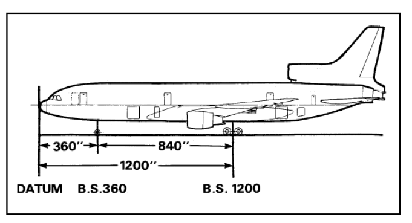
    A. 360
    B. 840
    C. 1200
    D. -1200
    E. Cannot be determined
    ans: C

25. What is the Center of Gravity (CG)?
    A. The geometric center of the aircraft
    B. The point where the wings attach to the fuselage
    C. The point in an aircraft around which all weight is evenly distributed or balanced
    D. The location of the main landing gear
    E. The rearmost point of the aircraft
    ans: C

26. What is the Moment Arm?
    A. The weight of an object
    B. The vertical distance from the CG to the ground
    C. The horizontal distance from the CG of an object to the datum line
    D. The length of the fuselage
    E. The wingspan
    ans: C

27. How is Moment calculated?
    A. Weight divided by Moment Arm
    B. Weight plus Moment Arm
    C. Weight times Moment Arm
    D. Moment Arm divided by Weight
    E. Weight squared times Moment Arm
    ans: C

28. In the balanced bar example (Figure 8.4), why does the 10-pound weight balance the 20-pound weight?
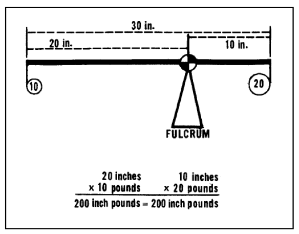
    A. The bar itself is heavier on the left side
    B. The 10-pound weight has a moment arm twice as long as the 20-pound weight, making the moments equal
    C. Gravity is stronger on the left side
    D. The 20-pound weight is closer to the CG
    E. The fulcrum is adjustable
    ans: B

29. Why can the aircraft's CG not be used as the primary reference point (datum) for calculations?
    A. It is difficult to measure its exact location
    B. It changes with each loading situation
    C. It is always located at the nose
    D. It is proprietary information
    E. Regulations prohibit its use as a datum
    ans: B

30. What is the Mean Aerodynamic Chord (MAC)?
    A. The longest chord length on a tapered wing
    B. The average wingspan
    C. The chord of an imaginary rectangular wing section with equivalent force vectors to the actual wing
    D. The distance from LEMAC to TEMAC
    E. The thickness-to-chord ratio
    ans: C

31. What does LEMAC stand for?
    A. Left Engine Mean Aerodynamic Chord
    B. Lower Edge Mean Aerodynamic Chord
    C. Lengthwise Engine Mount Actuator Connection
    D. Leading Edge Mean Aerodynamic Chord
    E. Limit Exceeded Maximum Allowable Chord
    ans: D

32. What does TEMAC stand for?
    A. Trailing Edge Mean Aerodynamic Chord
    B. Tail Engine Mount Actuator Connection
    C. Tip Edge Mean Aerodynamic Chord
    D. Top Edge Maximum Allowable Chord
    E. Temperature Effect Maximum Allowable Chord
    ans: A

33. How is the length of the Mean Aerodynamic Chord (100% MAC) determined?
    A. By measuring the wingspan
    B. By calculating the distance between LEMAC and TEMAC
    C. By referring to the aircraft registration certificate
    D. By measuring the fuselage length
    E. By averaging the root and tip chords only
    ans: B

34. If LEMAC is at station 860.2 and TEMAC is at station 1040.9, what is the MAC length?
    A. 14%
    B. 25.3 inches
    C. 180.7 inches
    D. 860.2 inches
    E. 1040.9 inches
    ans: C

35. If the MAC length is 180.7 inches and the forward CG limit is 25.3 inches aft of LEMAC, what is the forward limit expressed as % MAC?
    A. 10%
    B. 14%
    C. 25%
    D. 45%
    E. 100%
    ans: B

36. If the MAC length is 200 inches and the forward CG limit is 50 inches aft of LEMAC, what is the forward limit expressed as % MAC?
    A. 14%
    B. 20%
    C. 25%
    D. 40%
    E. 50%
    ans: C

37. What is a Load Index (LI) figure used for?
    A. To determine the aircraft's maximum speed
    B. To represent the CG position of a specific load for calculation purposes
    C. To calculate fuel burn
    D. To measure the length of the MAC
    E. To indicate the revision status of a manual
    ans: B

38. What does the Dry Operating Index (DOI) correspond to?
    A. The CG of the Basic Empty Weight
    B. The CG of the Zero Fuel Weight
    C. The CG of the Dry Operating Weight
    D. The CG of the Takeoff Weight
    E. The CG of the Landing Weight
    ans: C

39. How is the Load Index Zero Fuel Weight (LIZFW) calculated?
    A. By adding fuel index to LITOW
    B. By adding passenger and cargo load indices to the Basic Empty Index
    C. By starting with the Dry Operating Index and adding passenger/cargo indices
    D. By subtracting payload index from LITOW
    E. It is a fixed value for the aircraft type
    ans: C

40. How is the Load Index Takeoff Weight (LITOW) determined?
    A. It is the same as LIZFW
    B. By adding the fuel weight index correction to the LIZFW
    C. By subtracting the fuel index from the DOI
    D. By adding payload index to the DOI
    E. It is found directly from the weight limitation chart
    ans: B

41. Looking at Table 8.1, what is the Dry Operating Weight (D.O.W.) for configuration 12-21.286 with registration GBP?
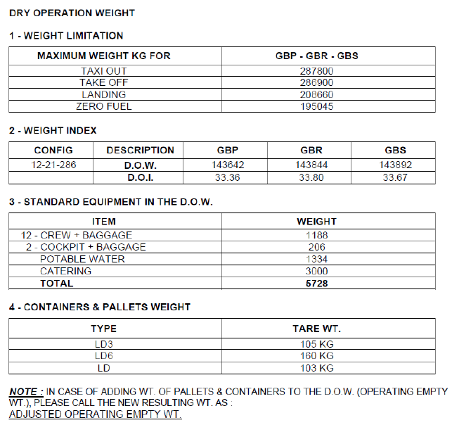
    A. 33.36
    B. 143642 kg
    C. 143844 kg
    D. 143892 kg
    E. 5728 kg
    ans: B

42. From Table 8.1, what standard equipment weight is listed for 12 CREW + BAGGAGE?

    A. 208 kg
    B. 1188 kg
    C. 134 kg
    D. 3000 kg
    E. 5728 kg
    ans: B

43. According to Figure 8.2, what is the Maximum Landing Weight?
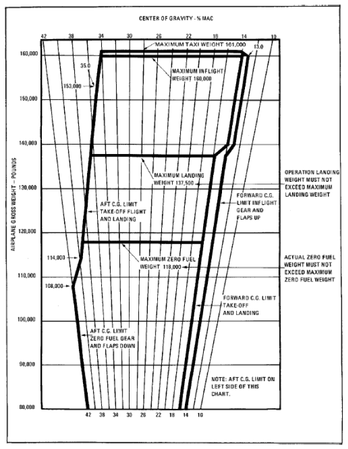
    A. 108,000 lbs
    B. 119,800 lbs
    C. 137,500 lbs
    D. 158,000 lbs
    E. 161,000 lbs
    ans: C

44. In Figure 8.2, the area between the "FORWARD C.G. LIMIT / TAKE-OFF AND LANDING" line and the "AFT C.G. LIMIT / LANDING GEAR AND FLAPS DOWN" line represents what?

    A. The permissible CG range for landing with gear and flaps down
    B. The permissible CG range for takeoff
    C. The area where fuel must be located
    D. The unusable CG range
    E. The MAC range
    ans: A

45. What is the primary difference between a Manual Load Sheet and a Computerized Load Sheet?
    A. Manual is less accurate
    B. Computerized uses indices, manual uses direct weights
    C. Manual requires calculations to be done by hand, Computerized performs them automatically
    D. Only Computerized sheets show the CG limits
    E. Manual sheets are only for cargo aircraft
    ans: C

### Chapter 9: JET PERFORMANCE

1.  What is the main objective of Chapter 9, "Jet Performance"?
A.  To provide detailed maintenance procedures for jet engines
B.  To explain the history of jet aircraft development
C.  To provide flight crews with basic knowledge of jet performance fundamentals
D.  To teach advanced navigation techniques for jets
E.  To discuss aircraft certification processes
ans: C

2.  The information in this chapter is intended to be used in conjunction with which document?
    A.  Maintenance Control Manual (MCM)
    B.  Aircraft Flight Manual (AFM) / Airplane Operations Manual (AOM)
    C.  Minimum Equipment List (MEL)
    D.  Weight and Balance Manual
E.  Company Route Manual
ans: B

3.  Which topic is NOT listed as a subchapter for discussion?
    A.  Basic Parameters and Takeoff Speeds
    B.  Takeoff Performance
    C.  Engine Maintenance Procedures
    D.  Climb Performance
E.  Approach Climb (Go Around) and Landing Performance
ans: C

4.  Which of the following are the most basic parameters mentioned for performance calculations?
    A.  Engine Type, Fuel Type, Oil Type
    B.  Temperatures, Speeds, Altitudes
    C.  Runway Length, Wind Direction, Time of Day
    D.  Pilot Experience, Cabin Configuration, Cargo Weight
E.  Latitude, Longitude, Magnetic Variation
ans: B

5.  What is Ram Rise?
    A.  The decrease in air temperature due to expansion
    B.  An increase in air temperature due to compressibility/friction at the probes
    C.  The rate of climb achieved during takeoff
    D.  The pressure increase inside the engine compressor
E.  The altitude gained during rotation
ans: B

6.  Total Air Temperature (TAT) is defined as:
    A.  Static Air Temperature minus Ram Rise
    B.  The temperature measured by the probes, equivalent to OAT plus 100% Ram Rise
    C.  The temperature inside the cabin
    D.  The temperature of the engine exhaust gas
E.  Same as Ram Air Temperature (RAT)
ans: B

7.  Static Air Temperature (SAT or OAT) is:
    A.  The temperature measured by the aircraft probes (TAT)
    B.  The free air temperature, corrected for instrument error and compressibility
    C.  Always equal to ISA temperature
    D.  TAT plus Ram Rise
E.  The temperature inside the engine
ans: B

8.  If an airplane is stationary on the ground, what is the relationship between TAT, RAT, and SAT?
    A.  TAT > RAT > SAT
    B.  TAT < RAT < SAT
    C.  TAT = RAT = SAT
    D.  TAT = RAT, but SAT is different
E.  RAT = SAT, but TAT is different
ans: C

9.  What does Indicated Altitude represent when the altimeter sub-scale is set to QNH?
    A.  Height above the ground (AGL)
    B.  Height above the Standard Datum Plane (Pressure Altitude)
    C.  Height above mean sea level (AMSL)
    D.  Density Altitude
E.  True Altitude
ans: C

10. What is Pressure Altitude?
    A.  Indicated altitude corrected for temperature
    B.  The aircraft height above the Standard Datum Plane (QNE - 29.92 inHg or 1013.25 hPa)
    C.  The height measured by the radio altimeter
    D.  The altitude shown when QFE is set
E.  The actual height above mean sea level
ans: B

11. Density Altitude is Pressure Altitude corrected for what?
    A.  Nonstandard pressure only
    B.  Wind conditions
    C.  Instrument error
    D.  Nonstandard temperature
E.  Aircraft weight
ans: D

12. Aircraft performance calculations are based on which altitude?
    A.  Indicated Altitude
    B.  Pressure Altitude
    C.  Density Altitude
    D.  True Altitude
E.  Absolute Altitude
ans: C

13. How is Absolute Altitude measured?
    A.  Barometric altimeter set to QNH
    B.  Barometric altimeter set to QNE
    C.  Radio/radar altimeter measuring height above the surface directly below
    D.  GPS calculation
E.  By reference to airport elevation
ans: C

14. In extreme cold weather conditions, how does True Altitude compare to Indicated Altitude?
    A.  True Altitude is higher than Indicated Altitude
    B.  True Altitude is lower than Indicated Altitude
    C.  True Altitude is equal to Indicated Altitude
    D.  The relationship depends on the pressure setting
E.  The relationship depends on airspeed
ans: B

15. What does VSIG represent?
    A.  Stall speed in landing configuration
    B.  Speed at which initial airflow separation starts
    C.  Minimum control speed on the ground
    D.  The actual speed where the wing fully stalls (airflow completely separated)
E.  Rotation speed
ans: D

16. VMCG is the minimum speed on the ground where the aircraft is controllable using:
    A.  Ailerons only
    B.  Nose wheel steering only
    C.  Maximum rudder deflection only, following a critical engine failure
    D.  Brakes only
E.  Spoilers only
ans: C

17. VMCA is the minimum speed in flight where the aircraft is controllable using:
    A.  Ailerons only
    B.  Maximum rudder deflection only, following a critical engine failure
    C.  Flaps and slats only
    D.  Spoilers and rudder
E.  Elevator only
ans: B

18. Why does VMCG typically decrease at high temperature or high altitude?
    A.  Rudder becomes more effective
    B.  Engine thrust output is lower, resulting in less yaw moment from engine failure
    C.  Air density increases
    D.  Tire friction increases
E.  Wings produce more lift
ans: B

19. What is VLOF?
    A.  The speed at which the engine fails
    B.  The speed at which the airplane lifts off the ground
    C.  The minimum unstick speed
    D.  The final takeoff climb speed
E.  The maximum flap operating speed
ans: B

20. What physical limitation imposes an upper limit on VLOF?
    A.  Maximum Brake Energy Speed (VMBE)
    B.  Minimum Control Speed Air (VMCA)
    C.  Stall Speed (VS)
    D.  Maximum Tire Speed
E.  Maximum flap extension speed
ans: D

21. What does VMBE represent?
    A.  Minimum brake effectiveness speed
    B.  Maximum speed for brake energy absorption during a rejected takeoff
    C.  Velocity for minimum brake effort
    D.  Speed at which brakes must be energized
E.  Best economy speed for brake wear
ans: B

22. VEF is the speed at which:
    A.  The aircraft lifts off
    B.  Rotation is initiated
    C.  The critical engine is assumed to fail during takeoff calculations
    D.  Maximum braking is applied
E.  Flaps are retracted
ans: C

23. What is V1 speed primarily used as a reference for?
    A.  The speed to rotate the aircraft
    B.  The speed to climb after takeoff
    C.  The point to apply takeoff thrust
    D.  Deciding whether to reject or continue the takeoff after an engine failure
E.  The minimum speed for flap retraction
ans: D

24. If an engine failure is recognized *before* V1, the takeoff:
    A.  Must be continued
    B.  Must be rejected
    C.  May optionally be continued
    D.  Requires immediate flap retraction
E.  Requires ATC permission to reject
ans: B

25. If an engine failure is recognized *at or above* V1, the takeoff:
    A.  Must be rejected
    B.  Requires immediate landing on the remaining runway
    C.  Must be continued
    D.  Requires declaration of an emergency before proceeding
E.  Allows the pilot to choose whether to continue or reject
ans: C

26. Is V1 considered a "decision speed"?
    A.  Yes, the decision is made exactly at V1
    B.  No, V1 is the speed by which the first braking action must be applied; the decision must be made before V1
    C.  Yes, it's the speed the pilot decides whether to apply full power
    D.  No, V1 is only relevant for all-engine takeoffs
E.  Yes, it's the speed the pilot decides which runway to use
ans: B

27. VR (Rotation Speed) must be greater than or equal to:
    A.  V2
    B.  VLOF
    C.  V1 and 1.05 VMCA
    D.  VMCG only
E.  Vs only
ans: C

28. V2 (Takeoff Climb Speed) is the speed that must be reached by the screen height and maintained after an engine failure at or after V1. Its lower limits are based on:
    A.  VMCG and VMBE
    B.  VLOF and VR
    C.  1.2 VS (or 1.13 VS1G) and 1.1 VMCA
    D.  VEF and V1
E.  Maximum tire speed
ans: C

29. Takeoff Distance Required (TODR) is the longest of which two distances?
    A.  All-engine takeoff run and accelerate-stop distance
    B.  Engine-out distance to screen height and 115% of all-engine distance to screen height
    C.  Takeoff run required and landing distance required
    D.  Accelerate-stop distance required and accelerate-go distance required
E.  Distance to V1 and distance from V1 to stop
ans: B

30. Accelerate-Stop Distance Required (ASDR) is the sum of distances needed to accelerate to V1 (assuming engine failure at VEF) and then:
    A.  Climb to screen height
    B.  Decelerate to a full stop
    C.  Reach V2 speed
    D.  Retract the landing gear
E.  Lift off the runway
ans: B

31. Takeoff Run Required (TORR) measures the distance from the start of ground roll to a point equidistant between VLOF and:
    A.  V1
    B.  VR
    C.  The point of stopping
    D.  The screen height point
E.  V2
ans: D

32. What does TODA (Takeoff Distance Available) consist of?
    A.  Runway length only
    B.  Runway length plus Stopway length
    C.  Runway length plus Clearway length
    D.  Clearway length only
E.  Stopway length only
ans: C

33. What is a Clearway?
    A.  An area on the runway kept clear of debris
    B.  An area beyond the runway suitable for stopping an aircraft
    C.  An area beyond the runway over which the aircraft can climb to screen height, free of obstacles
    D.  A designated taxi route to the runway
E.  The paved portion of the runway shoulder
ans: C

34. What does ASDA (Accelerate-Stop Distance Available) consist of?
    A.  Runway length only
    B.  Runway length plus Clearway length
    C.  Runway length plus Stopway length
    D.  Stopway length only
E.  Clearway length only
ans: C

35. What does TORA (Takeoff Run Available) usually equal?
    A.  Runway length plus Clearway
    B.  Runway length plus Stopway
    C.  The physical length of the runway available for ground roll
    D.  ASDA minus Stopway
E.  TODA minus Clearway
ans: C

36. What is a "Balanced Field Length" takeoff?
    A.  When TODA equals ASDA
    B.  When Takeoff Distance Required (TODR) equals Accelerate-Stop Distance Required (ASDR)
    C.  When Clearway and Stopway are equal in length
    D.  When V1 equals VR
E.  When takeoff weight equals landing weight
ans: B

37. The takeoff path (engine out after V1) is divided into four segments. The first segment ends when:
    A.  Screen height (35 ft) is reached
    B.  The landing gear is fully retracted
    C.  A height of 400 ft is reached
    D.  Flaps are retracted
E.  Final climb speed is reached
ans: B

38. The second segment of the takeoff path ends at:
    A.  Gear retraction complete
    B.  A gross height of at least 400 ft (minimum acceleration height)
    C.  Flap retraction complete
    D.  Screen height (35 ft)
E.  1500 ft AGL
ans: B

39. What occurs during the third segment of the takeoff path?
    A.  Initial climb at V2 with gear down
    B.  Climb from gear up to 400 ft at V2
    C.  Horizontal acceleration and flap/slat retraction
    D.  Climb from end of acceleration to 1500 ft
E.  Level flight cruise
ans: C

40. The fourth segment of the takeoff path involves climbing to at least 1500 ft with what configuration?
    A.  Takeoff thrust, takeoff flaps, gear down
    B.  Takeoff thrust, takeoff flaps, gear up
    C.  Maximum continuous thrust, flaps up, gear up
    D.  Idle thrust, flaps up, gear up
E.  Go-around thrust, approach flaps, gear down
ans: C

41. Climb Gradient is typically expressed as:
    A.  Feet per minute
    B.  Knots per second
    C.  A percentage (ratio of height gained to horizontal distance covered)
    D.  An angle in degrees
E.  G-force experienced
ans: C

42. How does a headwind generally affect takeoff performance distances (TODR, ASDR)?
    A.  Increases both TODR and ASDR
    B.  Decreases both TODR and ASDR
    C.  Increases TODR, Decreases ASDR
    D.  Decreases TODR, Increases ASDR
E.  Has no effect on distances
ans: B

43. How does an uphill runway slope generally affect takeoff performance distances (TODR, ASDR)?
    A.  Decreases both
    B.  Increases both
    C.  Decreases TODR, Increases ASDR
    D.  Increases TODR, Decreases ASDR
E.  Has no effect
ans: B

44. Regulations typically require performance calculations to use what percentage of measured headwind and tailwind?
    A.  100% headwind, 100% tailwind
    B.  50% headwind, 100% tailwind
    C.  100% headwind, 150% tailwind
    D.  50% headwind, 150% tailwind
E.  0% headwind, 0% tailwind (wind ignored)
ans: D

45. On wet or contaminated runways, V1 speeds are typically:
    A.  Increased
    B.  Reduced
    C.  Unchanged
    D.  Equal to VR
E.  Dependent on temperature only
ans: B

46. What is the required screen height for demonstrating Takeoff Distance on a wet runway, compared to a dry runway?
    A.  Same as dry (35ft)
    B.  Higher than dry (e.g., 50ft)
    C.  Lower than dry (15ft)
    D.  Zero feet
E.  Dependent on V1 speed
ans: C

47. Regulated Takeoff Weight (RTOW) charts are typically unique to:
    A.  The pilot flying
    B.  The destination airport only
    C.  A specific runway, engine make/model, and aircraft configuration
    D.  All aircraft of the same type regardless of engine
E.  Daytime operations only
ans: C

48. Which is NOT typically a primary limitation determining the RTOW?
    A.  A/C Structure limit
    B.  Runway limit (Field Length)
    C.  Cabin pressurization limit
    D.  Tire speed limit
E.  Climb limit (Second Segment Gradient)
ans: C

49. The "Net" flight path used for obstacle clearance calculations is:
    A.  Identical to the Gross flight path
    B.  Higher than the Gross flight path
    C.  Lower than the Gross flight path (Gross gradient reduced by a factor)
    D.  Calculated ignoring engine failure
E.  Only used for landing calculations
ans: C

50. For a twin-engine aircraft, the minimum Net climb gradient in the second segment is typically the Gross gradient (e.g., 2.4%) reduced by:
    A.  0.0%
    B.  0.5%
    C.  0.8%
    D.  1.0%
E.  1.5%
ans: C

51. What does using a "Flex Temperature" or "Assumed Temperature Method (ATM)" achieve?
    A.  Increases maximum engine thrust
    B.  Allows takeoff with less than full rated thrust, saving engine life
    C.  Heats the runway for better performance
    D.  Calculates Vmcg more accurately
E.  Eliminates the need for performance calculations
ans: B

52. What is a major difference between using ATM/Flex and using an Engine De-rate?
    A.  Flex/ATM reduces Vmcg, De-rate does not
    B.  De-rate produces less thrust reduction than Flex/ATM
    C.  De-rate is treated as using a fundamentally different (lower thrust) engine with a lower Vmcg; Flex/ATM uses full rated Vmcg
    D.  Flex/ATM is only for Airbus, De-rate is only for Boeing
E.  There is no difference
ans: C

53. The "Improved Climb" technique involves using excess runway to:
    A.  Lift off at a lower speed (V2)
    B.  Use reduced flap settings
    C.  Accelerate to higher takeoff speeds (V1, VR, V2) to achieve better climb gradients
    D.  Apply less than takeoff thrust
E.  Delay gear retraction
ans: C

54. What is the typical time limit for using Maximum Takeoff Thrust?
    A.  1 minute
    B.  5 minutes (sometimes 10 minutes OEI)
    C.  30 minutes
    D.  Unlimited
E.  Until reaching cruise altitude
ans: B

55. Maximum Continuous Thrust (MCT) is typically used:
    A.  For normal takeoff
    B.  During cruise flight for maximum speed
    C.  Only in case of emergency (e.g., engine failure en-route climb/drift down)
    D.  For taxiing
E.  During approach and landing
ans: C

56. What is the primary purpose of flying at the "Best Angle of Climb" speed (Vx)?
    A.  To reach altitude in the minimum time
    B.  To achieve the greatest altitude gain over a given horizontal distance
    C.  To maximize fuel efficiency
    D.  To achieve the smoothest ride
E.  To minimize engine wear
ans: B

57. What is the primary purpose of flying at the "Best Rate of Climb" speed (Vy)?
    A.  To reach altitude in the minimum time
    B.  To achieve the greatest altitude gain over a given horizontal distance
    C.  To maximize ground distance covered during climb
    D.  To minimize noise footprint
E.  To stay below ATC speed restrictions
ans: A

58. What is Load Factor ("G")?
    A.  The ratio of thrust to weight
    B.  The ratio of lift produced by the wing to the gross weight of the airplane
    C.  The aircraft's weight in kilograms
    D.  The bank angle in degrees
E.  The number of passengers divided by the number of seats
ans: B

59. How does increasing the bank angle in a level turn affect Load Factor?
    A.  Decreases Load Factor
    B.  Increases Load Factor
    C.  Has no effect on Load Factor
    D.  Makes Load Factor negative
E.  Only affects load factor if speed changes
ans: B

60. What happens to stall speed as Load Factor increases?
    A.  Stall speed decreases
    B.  Stall speed remains the same
    C.  Stall speed increases
    D.  Stall becomes impossible
E.  Stall occurs at a lower angle of attack
ans: C

61. What is the "aerodynamic ceiling"?
    A.  The maximum certified altitude of the aircraft
    B.  The altitude where the engines produce zero thrust
    C.  The altitude where the buffet boundaries merge (low and high speed buffet speeds become equal at 1.0g)
    D.  The physical top of the aircraft cabin
E.  The altitude where cabin pressure can no longer be maintained
ans: C

62. What is the relationship between Optimum Altitude for range and aircraft weight?
    A.  Optimum altitude increases as weight increases
    B.  Optimum altitude decreases as weight increases
    C.  Optimum altitude is independent of weight
    D.  Optimum altitude is always the service ceiling
E.  Optimum altitude is highest at max takeoff weight
ans: B

63. Long Range Cruise (LRC) speed compared to Maximum Range Cruise (MRC) speed results in:
    A.  Significantly lower speed for much better fuel mileage
    B.  Significantly higher speed for slightly worse (e.g., 1% less) fuel mileage
    C.  The same speed but lower altitude
    D.  The same fuel mileage but lower speed
E.  Maximum possible speed regardless of fuel
ans: B

64. What is the purpose of a "Drift Down" procedure?
    A.  A normal descent profile for fuel saving
    B.  A procedure following an engine failure in cruise to descend to a lower altitude while minimizing range loss
    C.  A method for avoiding turbulence
    D.  A visual approach technique
E.  A way to quickly lose altitude in an emergency
ans: B

65. For landing distance calculations for dispatch to a destination airport on a dry runway, the demonstrated landing distance must not exceed what percentage of the effective runway length?
    A.  50%
    B.  60%
    C.  80%
    D.  100%
E.  115%
ans: B

66. For landing distance calculations for dispatch to a destination airport on a wet runway, the required landing distance must be at least what percentage of the dry demonstrated distance?
    A.  100%
    B.  60%
    C.  167%
    D.  115%
E.  80%
ans: D

67. Landing Reference Speed (VREF or VTH) is typically defined as:
    A.  1.1 VS
    B.  1.2 VS
    C.  1.3 VS
    D.  1.5 VS
E.  VMCA
ans: C

68. If the required descent distance using the "times 3 plus 10" rule is 109 NM for FL330, what distance would be required for FL270?
    A. 81 NM
    B. 91 NM
    C. 100 NM
    D. 109 NM
E. 119 NM
ans: B

69. If the remaining distance to touchdown is 40 NM, using the "distance times 3 minus 3000" rule, what approximate altitude (Flight Level) should the aircraft be crossing?
    A. FL120
    B. FL150
    C. FL090
    D. FL100
E. FL180
ans: C

70. If an aircraft has a 20 knot headwind during descent, how might the required descent distance calculation be adjusted compared to a no-wind scenario?
    A. Add approximately 6 NM
    B. Add approximately 3 NM
    C. Subtract approximately 3 NM
    D. Subtract approximately 6 NM
E. No adjustment needed for headwind
ans: D

71. If an aircraft has a 30 knot tailwind during descent, how might the required descent distance calculation be adjusted compared to a no-wind scenario?
    A. Add approximately 9 NM
    B. Add approximately 6 NM
    C. Subtract approximately 6 NM
    D. Subtract approximately 9 NM
E. No adjustment needed for tailwind
ans: A

### Chapter 10: INSTRUMENT NAVIGATION

1.  Airline transport pilots typically operate under which type of flight plan?
A.  VFR (Visual Flight Rules)
B.  IFR (Instrument Flight Rules)
C.  SVFR (Special Visual Flight Rules)
D.  CVFR (Controlled Visual Flight Rules)
E.  DVFR (Defense Visual Flight Rules)
ans: B

2.  What is the objective of Chapter 10 regarding pilot knowledge?
A.  To teach pilots advanced aircraft systems maintenance
B.  To provide a detailed history of EgyptAir
C.  To ensure pilots know basic navigation principles using conventional and modern aids
D.  To focus solely on Visual Flight Rules (VFR) navigation
E.  To certify pilots for specific aircraft types
ans: C

3.  Which of the following is NOT listed as a Key Learning Point for this chapter?
A.  Types of Navigation
B.  Modern navigation and Area Navigation
C.  Engine Performance Calculations
D.  Holding Patterns
E.  HSI and RMI
ans: C

4.  What is the basic definition of navigation?
A.  The process of fueling an aircraft
B.  The process of monitoring and controlling the movement of an object from one point to another
C.  The process of communicating with air traffic control
D.  The process of performing pre-flight checks
E.  The process of calculating aircraft weight and balance
ans: B

5.  Which type of navigation relies solely on pilots using identifiable landmarks from the cockpit?
A.  Dead Reckoning
B.  Radio Navigation
C.  Pilotage or Piloting
D.  Celestial Navigation
E.  Inertial Navigation
ans: C

6.  Which type of navigation requires continuous VMC conditions?
A.  Dead Reckoning
B.  Radio Navigation (VOR/NDB)
C.  Inertial Navigation (INS/IRS)
D.  Pilotage or Piloting
E.  GPS Navigation
ans: D

7.  Which type of navigation is based primarily on mathematic calculations using aircraft speed, track, distance, and elapsed time?
A.  Pilotage
B.  Radio Navigation
C.  Dead Reckoning
D.  Visual Navigation
E.  GPS Navigation
ans: C

8.  If an aircraft flies 200 NM at a ground speed of 100 knots, how long will the flight take based on Dead Reckoning? (Time = Distance / Speed)
A.  1 hour
B.  1.5 hours
C.  2 hours
D.  0.5 hours
E.  4 hours
ans: C

9.  If an aircraft flies 300 NM at a ground speed of 150 knots, how long will the flight take based on Dead Reckoning? (Time = Distance / Speed)
A.  1 hour
B.  1.5 hours
C.  2 hours
D.  2.5 hours
E.  3 hours
ans: C

10. An aircraft departs point A at 10:00 UTC flying towards point B, 400 NM away. If the ground speed is 200 knots, what is the estimated time of arrival (ETA) at point B?
A.  11:00 UTC
B.  11:30 UTC
C.  12:00 UTC
D.  12:30 UTC
E.  13:00 UTC
ans: C

11. An aircraft departs point X at 08:30 UTC flying towards point Y, 330 NM away. If the ground speed is 220 knots, what is the estimated time of arrival (ETA) at point Y? (Time = 330/220 = 1.5 hours)
A.  09:30 UTC
B.  10:00 UTC
C.  10:30 UTC
D.  11:00 UTC
E.  09:00 UTC
ans: B

12. What does VOR stand for?
A.  Visual Omni Range
B.  Very High Frequency Omni-Directional Range
C.  VOR Operational Receiver
D.  Variable Orientation Radio
E.  Vertical Obstacle Radar
ans: B

13. VOR navigation relies on the "line of sight" concept because it operates in which frequency band?
A.  LF (Low Frequency)
B.  MF (Medium Frequency)
C.  HF (High Frequency)
D.  VHF (Very High Frequency)
E.  UHF (Ultra High Frequency)
ans: D

14. How many radials does a VOR ground station provide?
A.  90
B.  180
C.  270
D.  360
E.  400
ans: D

15. A VOR radial is always referenced as being aligned with:
A.  True North
B.  The direction the aircraft is heading
C.  Magnetic North (0° or 360° radial)
D.  Grid North
E.  The runway alignment
ans: C

16. If ATC clears an aircraft to "intercept radial 347 CVO VOR", what does this mean?
A.  Fly towards the VOR on a track of 347° magnetic
B.  Fly away from the VOR on a track of 347° magnetic
C.  Fly towards the VOR on a track of 167° magnetic (reciprocal of 347)
D.  Maintain a heading of 347° magnetic
E.  Intercept the 347 DME arc
ans: B

17. If ATC clears an aircraft to "intercept 225 radial inbound CVO VOR", what course should the pilot track TO the VOR?
A.  225°
B.  360°
C.  180°
D.  045° (Reciprocal of 225°)
E.  Cannot be determined
ans: D

18. If an aircraft is tracking inbound on the 090 course TO a VOR, and the CDI needle deflects to the left, which way should the pilot turn to re-intercept?
A.  Right
B.  Left
C.  Maintain heading
D.  Descend
E.  Climb
ans: B

19. What does NDB stand for?
A.  Navigational Direction Beacon
B.  Non-Directional Beacon
C.  Near Distance Beacon
D.  New Digital Beacon
E.  Nautical Distance Beacon
ans: B

20. What airborne equipment receives signals from an NDB?
A.  VOR receiver
B.  GPS receiver
C.  ADF (Automatic Direction Finder)
D.  DME (Distance Measuring Equipment)
E.  ILS receiver
ans: C

21. A major advantage of NDB over VOR, especially in mountainous areas, is:
A.  Higher frequency provides clearer signal
B.  Lower frequency signals can propagate around obstacles (does not strictly require line-of-sight)
C.  Provides distance information
D.  Is less affected by atmospheric interference
E.  Provides vertical guidance
ans: B

22. Which environmental effect does NOT typically affect NDB signal accuracy?
A.  Night effect
B.  Terrain effect
C.  Doppler effect
D.  Shoreline effect
E.  Bank effect
ans: C

23. "Homing" to an NDB involves:
A.  Flying a constant track corrected for wind
B.  Keeping the ADF needle on the nose, resulting in a curved path in crosswinds
C.  Flying directly away from the station
D.  Maintaining a specific radial from the NDB
E.  Circling the NDB at a constant distance
ans: B

24. What does DME measure?
A.  Bearing to the station
B.  Altitude above the station
C.  Slant range distance to the station
D.  Ground speed towards the station only
E.  Magnetic variation at the station
ans: C

25. DME readings for ground speed and time-to-station are most accurate when:
A.  Flying directly overhead the station
B.  Flying parallel to the station at a distance
C.  Flying directly to or directly from the station
D.  The aircraft is stationary
E.  Flying a DME arc
ans: C

26. What does ILS stand for?
A.  Inertial Landing System
B.  Instrument Location Service
C.  Instrument Landing System
D.  Integrated Localizer System
E.  International Lighting Standard
ans: C

27. What are the two main ground components of an ILS providing guidance?
A.  VOR and NDB
B.  Localizer and Glide Slope
C.  DME and Marker Beacons
D.  GPS and WAAS
E.  PAPI and VASI
ans: B

28. What type of guidance does the Localizer provide?
A.  Vertical guidance (glide path)
B.  Distance information
C.  Horizontal guidance (alignment with runway centerline)
D.  Altitude information
E.  Speed commands
ans: C

29. What type of guidance does the Glide Slope provide?
A.  Horizontal guidance (runway alignment)
B.  Distance information
C.  Altitude information
D.  Vertical guidance (descent path)
E.  Speed information
ans: D

30. A full-scale deflection of the CDI on a localizer typically represents approximately how much angular deviation?
A.  0.5°
B.  1.0°
C.  2.5°
D.  5.0°
E.  10.0°
ans: C

31. What is the standard angle for an ILS glide slope path?
A.  1.5°
B.  2.5°
C.  3.0°
D.  5.0°
E.  Varies significantly between runways
ans: C

32. What are the minimums typically associated with a Category I (CAT I) ILS approach?
A.  0 ft Decision Height, 0 m RVR
B.  50 ft Decision Height, 75 m RVR
C.  100 ft Decision Height, 200 m RVR
D.  200 ft Decision Height, 550 m RVR (or 800 m visibility)
E.  500 ft Decision Height, 1000 m RVR
ans: D

33. What does RNAV stand for?
A.  Radio Navigation
B.  Radar Navigation
C.  Area Navigation
D.  Route Navigation
E.  Required Navigation
ans: C

34. What capability does RNAV provide?
A.  Navigation strictly between ground-based navaids
B.  Visual navigation using landmarks only
C.  Ability to fly direct between waypoints without necessarily overflying ground navaids
D.  Automatic landing capability only
E.  Weather avoidance routing only
ans: C

35. Which system uses gyroscopes and accelerometers to determine aircraft position based on detected motion from an initial position?
A.  GPS
B.  VOR/DME
C.  INS (Inertial Navigation System)
D.  ADF/NDB
E.  ILS
ans: C

36. What is a primary source of error in older INS systems?
A.  Signal interference from weather
B.  Loss of satellite lock
C.  Integration drift (errors accumulating over time)
D.  Magnetic variation changes
E.  Incorrect frequency tuning
ans: C

37. What technology improvement helped reduce integration drift in IRS compared to INS?
A.  Faster processors
B.  More accurate accelerometers
C.  Use of laser gyros
D.  GPS augmentation
E.  Better cooling systems
ans: C

38. How many satellite signals are typically required for a GPS receiver to determine a 3D position (latitude, longitude, altitude)?
A.  1
B.  2
C.  3
D.  4
E.  24
ans: D

39. What does RNP stand for in the context of navigation performance?
A.  Required Navigation Procedures
B.  Required Navigation Performance
C.  Regional Navigation Plan
D.  RNAV Navigation Procedures
E.  Remote Navigation Plotting
ans: B

40. RNP 10 requires an aircraft's navigation system to maintain position accuracy within what radius 95% of the time?
A.  1 NM
B.  5 NM
C.  10 NM
D.  0.3 NM
E.  20 NM
ans: C

41. What does HSI stand for?
A.  Heading Stability Indicator
B.  Horizontal Situation Indicator
C.  Height Sensing Instrument
D.  Hydraulic System Indicator
E.  High Speed Instrument
ans: B

42. The HSI typically combines information from the heading indicator and which navigation sources?
A.  GPS and Weather Radar
B.  ADF and DME only
C.  VOR, ILS, or ADF
D.  Radio Altimeter and Air Data Computer
E.  Transponder and TCAS
ans: C

43. What does RMI stand for?
A.  Runway Monitoring Instrument
B.  Required Mandatory Instrument
C.  Remote Magnetic Indicator
D.  Radio Magnetic Indicator
E.  Range Measuring Instrument
ans: D

44. An RMI typically displays heading information along with bearings TO which type of stations?
A.  GPS satellites only
B.  ILS markers only
C.  Two selectable VOR or NDB stations
D.  TCAS targets
E.  Weather radar targets
ans: C

45. To calculate the required Rate of Climb (Ft/min) from a required climb gradient (Ft/NM), what other information is needed?
A.  Aircraft weight
B.  Outside Air Temperature
C.  Ground Speed (knots)
D.  Wind direction
E.  Bank angle
ans: C

46. If a SID requires a climb gradient of 400 ft/NM and the aircraft ground speed is 180 knots, what is the required rate of climb? (ROC = (Gradient * GS) / 60)
A.  1000 ft/min
B.  1200 ft/min
C.  1500 ft/min
D.  1800 ft/min
E.  2400 ft/min
ans: B

47. If a SID requires a climb gradient of 5% and the aircraft ground speed is 200 knots, what is the approximate required rate of climb? (ROC = Gradient% * GS * 100 / 60 * approx = Gradient% * GS * 1.67 - more simply: 5 * 200 = 1000 ft/min)
A.  500 ft/min
B.  800 ft/min
C.  1000 ft/min
D.  1200 ft/min
E.  1500 ft/min
ans: C

48. Using the "altitude divided by 1000 times 3, plus 10" rule, what is the approximate descent distance required from FL300?
A.  90 NM
B.  100 NM
C.  110 NM
D.  120 NM
E.  130 NM
ans: B

49. A standard holding pattern uses turns in which direction?
A.  Left
B.  Right
C.  Alternating left and right
D.  Direction depends on wind
E.  Direction specified by ATC each time
ans: B

50. What is the standard time for the inbound leg of a holding pattern at or below 14,000 ft ASL?
A.  30 seconds
B.  1 minute
C.  1.5 minutes
D.  2 minutes
E.  Depends on airspeed
ans: B

51. According to FAA regulations, what is the maximum holding speed from 6,001 ft MSL to 14,000 ft MSL?
A.  200 KIAS
B.  210 KIAS
C.  230 KIAS
D.  265 KIAS
E.  No limit
ans: C

52. According to ICAO regulations, what is the maximum holding speed from 14,001 ft up to 20,000 ft?
A.  200 kts
B.  230 kts
C.  240 kts
D.  265 kts
E.  M 0.83
ans: C

53. Flying a DME arc requires maintaining a constant:
A.  Bearing from the station
B.  Ground speed
C.  Altitude
D.  Distance (DME reading) from the station
E.  Radial from the station
ans: D

54. An SDF (Simplified Directional Facility) approach course compared to a standard ILS localizer is often:
A.  More precise
B.  Wider and potentially less precise
C.  Always aligned with the runway
D.  Equipped with a mandatory glide slope
E.  Used only in VMC
ans: B

55. What visual path indicator system uses two rows of lights (wing bars) showing red and white combinations to indicate glide path position?
A.  PAPI
B.  VASI
C.  TRI-COLOR
D.  Pulsating VASI
E.  MLS
ans: B

56. What visual path indicator system uses a single row of lights, typically showing combinations of red and white lights (e.g., 2 red, 2 white for on-slope)?
A.  VASI
B.  PAPI
C.  TRI-COLOR
D.  Pulsating VASI
E.  SDF lights
ans: B

### Chapter 11: FLIGHT PLANNING

1.  What is the primary purpose of an operator establishing a fuel policy?
A.  To minimize flight times
B.  To ensure sufficient fuel is carried for the planned operation and reserves
C.  To calculate the maximum takeoff weight
D.  To determine the optimal cruising altitude
E.  To comply with noise abatement procedures
ans: B

2.  What does Taxi Fuel account for?
A.  Fuel for the flight from takeoff to landing only
B.  Fuel for holding at the destination
C.  Fuel for engine start up and taxi to the take-off position, considering delays
D.  Fuel required for diversion to an alternate airport
E.  The mandatory final reserve fuel
ans: C

3.  What segments of flight does Trip Fuel cover?
A.  Taxi and engine start only
B.  Take-off, climb, cruise, descent, approach and landing
C.  Diversion to alternate and holding
D.  Contingency reserves only
E.  En-route cruise only
ans: B

4.  What is Contingency Fuel intended to compensate for?
A.  Fuel required for taxiing after landing
B.  Planned holding at the destination
C.  Deviations from expected fuel consumption, forecast weather, or planned routing/altitudes
D.  The flight to an alternate airport
E.  Engine start-up fuel
ans: C

5.  Contingency fuel is calculated as the higher of several options. Which is one of those options?
A.  10% of the planned trip fuel
B.  5% of the planned trip fuel
C.  Fuel for 10 minutes holding at 1500 ft
D.  Fuel required for taxi-in
E.  Fuel for APU usage on the ground
ans: B

6.  Under certain conditions (e.g., fuel monitoring program), contingency fuel might be calculated based on flying time. What is one such time duration mentioned?
A.  10 minutes flying time
B.  15 minutes flying time
C.  20 minutes flying time
D.  30 minutes flying time
E.  45 minutes flying time
ans: C

7.  What is the minimum required altitude above the destination aerodrome used for calculating the 15-minute holding contingency fuel option?
A.  500 ft
B.  1000 ft
C.  1500 ft
D.  3000 ft
E.  5000 ft
ans: C

8.  Option (b) for contingency fuel calculation involves holding fuel for how long above the destination?
A.  3 minutes
B.  5 minutes
C.  10 minutes
D.  15 minutes
E.  20 minutes
ans: B

9.  If an alternate airport is required, Alternate Fuel should be sufficient to cover which phases of flight, starting from the destination?
A.  Cruise directly to the alternate only
B.  Landing at the destination and taxiing to the gate
C.  A missed approach at destination, climb, cruise, descent, approach and landing at the alternate
D.  Holding at the destination for 30 minutes
E.  Taxi fuel at the alternate only
ans: C

10. If two alternates are required, the Alternate Fuel quantity must be sufficient to reach which alternate?
A.  The closer alternate
B.  The alternate requiring the lesser amount of fuel
C.  The alternate requiring the greater amount of fuel
D.  An average fuel amount for both alternates
E.  The alternate chosen by the pilot in flight
ans: C

11. For an airplane with turbine engines, what is the minimum duration Final Reserve Fuel must be sufficient for?
A.  15 minutes at holding speed, 1500 ft above alternate/destination
B.  30 minutes at holding speed, 1500 ft above alternate/destination
C.  45 minutes at holding speed, 1500 ft above alternate/destination
D.  60 minutes at holding speed, 1500 ft above alternate/destination
E.  Fuel to reach the furthest suitable airport
ans: B

12. For an airplane with reciprocating engines, what is the minimum duration Final Reserve Fuel must be sufficient for?
A.  15 minutes at holding speed, 1500 ft above alternate/destination
B.  30 minutes at holding speed, 1500 ft above alternate/destination
C.  45 minutes at holding speed, 1500 ft above alternate/destination
D.  60 minutes at holding speed, 1500 ft above alternate/destination
E.  Fuel to reach the en-route alternate
ans: C

13. What is Additional Fuel?
A.  Same as Contingency Fuel
B.  Fuel required for specific operations like ETOPS or all-weather operations
C.  The fuel required for taxi-out
D.  Fuel added at the commander's discretion
E.  The unusable fuel quantity
ans: B

14. What is Extra Fuel?
A.  Same as Final Reserve Fuel
B.  Fuel required for the alternate flight
C.  Additional fuel the commander considers necessary beyond all legal requirements
D.  Fuel burnt during climb
E.  Mandatory fuel for de-icing procedures
ans: C

15. In the diagram Figure 11.1, what does the segment labelled "Trip Fuel" represent?
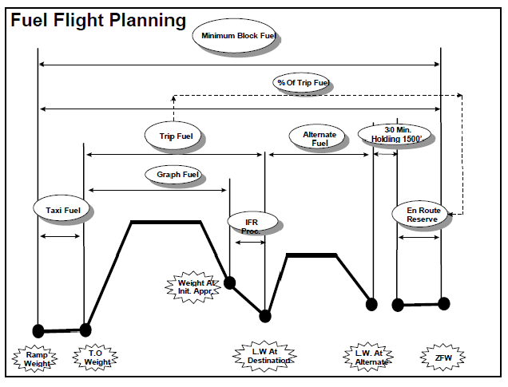 
A.  Fuel from engine start to takeoff
B.  Fuel from takeoff to landing at destination
C.  Fuel from destination to alternate
D.  Holding fuel at alternate
E.  Contingency fuel allowance
ans: B

16. In Figure 11.1, where is the "Alternate Fuel" segment located relative to the destination?

A.  Before takeoff
B.  During climb
C.  During cruise to destination
D.  After arrival at destination, representing fuel to fly to the alternate
E.  Combined with taxi fuel
ans: D

17. According to Figure 11.2, which fuel components are represented by the blue line (expected burn)?
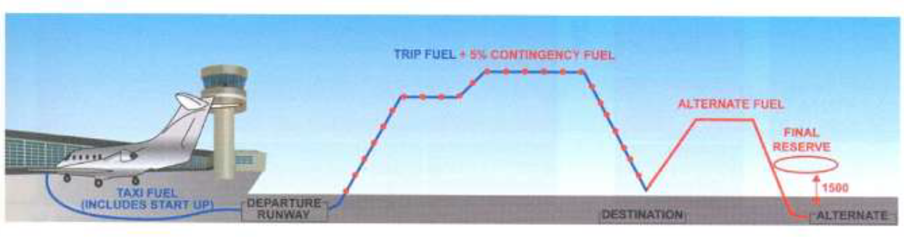
A.  Contingency and Final Reserve
B.  Alternate Fuel and Final Reserve
C.  Taxi Fuel and Trip Fuel
D.  Extra Fuel and Additional Fuel
E.  Contingency Fuel and Alternate Fuel
ans: C

18. In Figure 11.2, the red dotted line superimposed on the trip fuel represents which fuel component?

A.  Alternate Fuel
B.  Final Reserve Fuel
C.  Contingency Fuel
D.  Extra Fuel
E.  Taxi Fuel
ans: C

19. In Figure 11.3, the "Minimum Planned Fuel" (green column) includes all required fuel EXCEPT:
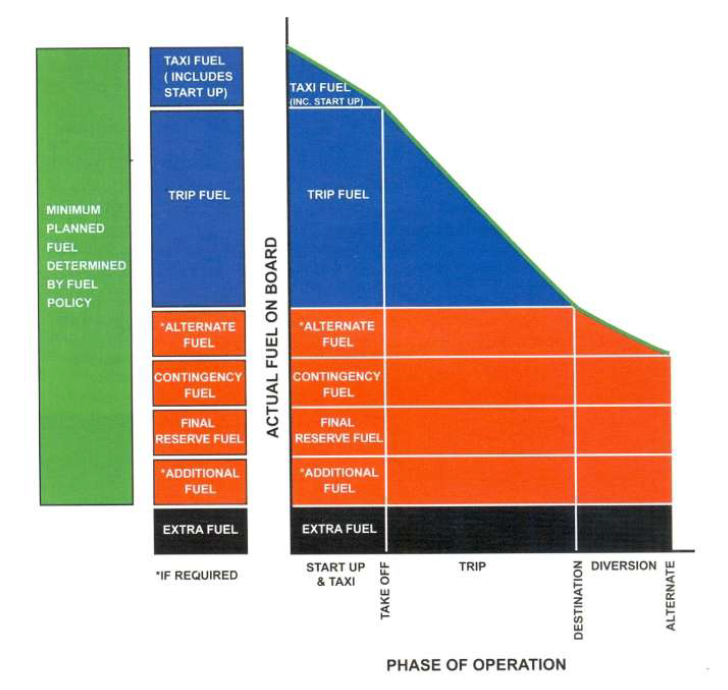 
A.  Trip Fuel
B.  Contingency Fuel
C.  Alternate Fuel
D.  Final Reserve Fuel
E.  Extra Fuel
ans: E

20. According to Figure 11.3, the "Actual Fuel on Board" includes the minimum planned fuel plus:

A.  Additional Taxi Fuel
B.  More Contingency Fuel
C.  Extra Fuel (at commander's discretion)
D.  Unusable Fuel
E.  A second Alternate Fuel allowance
ans: C

21. When re-planning in flight to a new destination, the fuel required should include Trip Fuel, Contingency Fuel (based on new trip), Alternate Fuel (if required for new destination), and which other component that MUST remain unused upon landing?
A.  Taxi Fuel
B.  Additional Fuel
C.  Extra Fuel
D.  Final Reserve Fuel
E.  Original Trip Fuel
ans: D

22. The absolute minimum fuel required for diversion consists of Alternate Fuel plus:
A.  Contingency Fuel
B.  Taxi Fuel
C.  Final Reserve Fuel (30 minutes holding at 1500 ft)
D.  Extra Fuel
E.  Trip fuel from the original destination
ans: C

23. What action should be taken immediately when fuel remaining on board approaches the minimum fuel required for diversion?
A.  Declare an emergency (MAYDAY)
B.  Request priority handling
C.  Proceed to the alternate airport immediately
D.  Continue to the destination hoping for improvement
E.  Shut down one engine to conserve fuel
ans: C

24. What are the three main inputs for a Computerized Flight Planning system?
A.  Pilot preferences, Cabin layout, Catering order
B.  Aircraft performance/fuel policy database, Meteo database, Navigation database
C.  Passenger names, Baggage weights, Cargo manifest
D.  Airport landing fees, Air traffic control charges, Fuel prices
E.  Maintenance schedule, Crew roster, Aircraft registration
ans: B

25. The aircraft performance database used by computerized flight planning considers which three flight regimes?
A.  Takeoff, Cruise, Landing
B.  Taxi, Climb, Hold
C.  Climb, Cruise, Descent
D.  Approach, Go-Around, Taxi-in
E.  Preflight, Inflight, Postflight
ans: C

26. What data is typically received from the meteorological database for flight planning?
A.  Airport operating hours
B.  NOTAMs
C.  Upper winds and temperatures
D.  Runway surface conditions only
E.  Passenger terminal information
ans: C

27. How often are meteorological forecasts typically updated in the SITA Flight Planning example?
A.  Every hour
B.  Every 6 hours
C.  Every 12 hours
D.  Every 24 hours
E.  Continuously in real-time
ans: C

28. Which items are included in the Navigation Database used for flight planning?
A.  Fuel prices and airline routes only
B.  Reporting points, airports, SIDs, STARs, routes, NOTAMs
C.  Pilot names and license numbers
D.  Aircraft maintenance history
E.  Historical weather data only
ans: B

29. Why might multiple routes be calculated between a city pair in computerized flight planning?
A.  To confuse the pilots
B.  To account for different aircraft types only
C.  Because unique factors like weather patterns mean the ideal route can vary day-to-day
D.  To test the computer system's capacity
E.  To offer passengers different scenic options
ans: C

30. What criteria might a user select for the flight planning system to determine the optimum plan?
A.  Most scenic route
B.  Route passing over most VORs
C.  Route with most turbulence
D.  Least time, least fuel, or least cost
E.  Route avoiding specific countries
ans: D

31. Final Reserve fuel for a turbine engine aircraft ensures endurance for:
A.  15 minutes
B.  30 minutes
C.  45 minutes
D.  60 minutes
E.  90 minutes
ans: B

32. Contingency fuel compensates for unforeseen events. One standard calculation is:
A.  1% of trip fuel
B.  3% of trip fuel
C.  5% of trip fuel
D.  10% of trip fuel
E.  15% of trip fuel
ans: C

33. Alternate fuel calculation assumes starting after what event at the destination?
A.  Completing the landing roll
B.  Taxiing to the gate
C.  Executing a missed approach
D.  Shutting down the engines
E.  Starting the APU
ans: C

34. Which fuel component is absolutely required for all public transport flights under the fuel policy?
A.  Extra Fuel
B.  Additional Fuel
C.  Alternate Fuel
D.  Final Reserve Fuel
E.  Refueling fuel
ans: D

35. The minimum fuel required on board upon arrival at the destination aerodrome (when an alternate is required) consists of:
A.  Trip fuel only
B.  Alternate fuel, contingency fuel, and final reserve fuel (+ additional/extra if carried)
C.  Final reserve fuel only
D.  Contingency fuel only
E.  Alternate fuel only
ans: B

36. The minimum fuel required on board upon arrival at the *alternate* aerodrome should consist of:
A.  Zero fuel
B.  Trip fuel from the original departure point
C.  Contingency fuel and final reserve fuel (+ additional/extra if carried)
D.  Alternate fuel only
E.  Taxi fuel only
ans: C

37. Re-planning in flight requires calculating fuel needed from the re-planning point. This must include trip fuel, contingency (based on remaining trip), alternate (if needed), and what mandatory reserve?
A.  Original Contingency Fuel
B.  Final Reserve Fuel
C.  Buffer Fuel
D.  Holding Fuel
E.  Taxi Fuel
ans: B

38. The computerized flight planning system uses a 'type' specific database for:
A.  Navigation routes
B.  Meteorological data
C.  Airport information
D.  Aircraft performance
E.  Fuel costs
ans: D

39. Optimization during the cruise phase in computerized flight planning might be based on minimum Time or minimum:
A.  Altitude
B.  Airspeed
C.  Fuel or Cost
D.  Distance
E.  Noise
ans: C

40. The Navigation Database contains millions of data items including reporting points, airports, and:
A.  Pilot rosters
B.  Catering menus
C.  SIDs and STARs
D.  Maintenance schedules
E.  Passenger preferences
ans: C

41. If the planned trip fuel is 10,000 kg, what is the minimum contingency fuel based on the 5% rule?
A.  300 kg
B.  500 kg
C.  1000 kg
D.  1500 kg
E.  2000 kg
ans: B

42. If the planned trip fuel is 20,000 kg, what is the minimum contingency fuel based on the 5% rule?
A.  500 kg
B.  1000 kg
C.  1500 kg
D.  2000 kg
E.  2500 kg
ans: B

43. A jet aircraft must carry final reserve fuel sufficient for 30 minutes holding at 1500 ft above which location?
A.  Departure aerodrome
B.  En-route alternate only
C.  Alternate aerodrome (or destination if no alternate is required)
D.  The highest point along the route
E.  Any suitable airport worldwide
ans: C

### Chapter 12: METEOROLOGY

1.  What is meteorology the study of?
A.  Aircraft navigation techniques
B.  The Earth's geology and rock formations
C.  The Earth's atmosphere and the physical processes within it
D.  Engine performance and fuel efficiency
E.  Aircraft maintenance procedures
ans: C

2.  Why is the study of meteorology important for pilots?
A.  It helps them choose the best in-flight movie
B.  The atmosphere is the medium through which the aircraft moves, affecting its operation
C.  It dictates the paint color of the aircraft
D.  It determines the aircraft's maximum weight capacity
E.  It is required only for passing ground school exams
ans: B

3.  What force holds the atmosphere to the Earth?
A.  Magnetic force
B.  Centrifugal force
C.  Solar wind pressure
D.  Force of gravity
E.  Aerodynamic lift
ans: D

4.  What is the most abundant gas in the dry air composition of the lower atmosphere?
A.  Oxygen
B.  Argon
C.  Carbon Dioxide
D.  Nitrogen
E.  Water Vapor
ans: D

5.  Approximately what percentage of dry air in the lower atmosphere is Oxygen?
A.  78.09%
B.  20.95%
C.  0.93%
D.  0.03%
E.  4.00%
ans: B

6.  Water (H2O) can exist in the atmosphere in which physical states?
A.  Solid and liquid only
B.  Liquid and gas only
C.  Solid and gas only
D.  Solid (ice), liquid (water), and gaseous (water vapor)
E.  Plasma state only
ans: D

7.  What is the lowest layer of the atmosphere, extending from the surface up to an average height of 11 km?
A.  Stratosphere
B.  Mesosphere
C.  Troposphere
D.  Thermosphere
E.  Exosphere
ans: C

8.  How does temperature generally change with increasing altitude in the troposphere?
A.  Increases steadily
B.  Remains constant
C.  Decreases
D.  Increases then decreases
E.  Fluctuates randomly
ans: C

9.  What is the boundary separating the troposphere and the stratosphere called?
A.  Stratopause
B.  Mesopause
C.  Tropopause
D.  Ionosphere boundary
E.  Ozone layer
ans: C

10. How does the height of the tropopause generally compare between the poles and the equator?
A.  Highest at the poles, lowest at the equator
B.  Lowest at the poles, highest at the equator
C.  Same height everywhere
D.  Varies with longitude only
E.  Depends on the season only
ans: B

11. How does temperature generally change with increasing altitude in the stratosphere?
A.  Decreases steadily
B.  Remains constant initially (isothermal layer) then increases
C.  Increases steadily from the tropopause
D.  Decreases then increases
E.  Fluctuates based on cloud cover
ans: B

12. What causes the temperature increase in the upper stratosphere?
A.  Friction from meteors
B.  Absorption of ultraviolet radiation by ozone
C.  Proximity to the sun
D.  Greenhouse gas effect
E.  Heat released from cloud formation
ans: B

13. Which atmospheric layer lies above the stratosphere, where temperature decreases again with height?
A.  Troposphere
B.  Mesosphere
C.  Thermosphere
D.  Exosphere
E.  Ionosphere
ans: B

14. What are the standard sea level pressure and temperature values in the International Standard Atmosphere (ISA)?
A.  1000 hPa and 0°C
B.  1013.25 hPa and 15°C
C.  1000 mb and 20°C
D.  29.92 inHg and 59°C
E.  1013.25 mb and 25°C
ans: B

15. What is the standard temperature lapse rate in the ISA below the tropopause?
A.  1°C per 1000 ft
B.  1.98°C (approx 2°C) per 1000 ft
C.  3°C per 1000 ft
D.  0°C per 1000 ft (isothermal)
E.  0.3°C per 1000 ft
ans: B

16. If the actual air temperature at a certain level is -30°C and the ISA temperature for that level is -25°C, what is the ISA deviation?
A.  ISA +5°C
B.  ISA -5°C
C.  ISA +30°C
D.  ISA -25°C
E.  ISA 0°C
ans: B

17. If the actual air temperature at FL200 is -20°C and the ISA temperature is -25°C, what is the ISA deviation?
A.  ISA +5°C
B.  ISA -5°C
C.  ISA +20°C
D.  ISA -25°C
E.  ISA 0°C
ans: A

18. What is the primary cause of atmospheric circulation and weather?
A.  Earth's magnetic field
B.  Gravitational pull of the moon
C.  Uneven heating of the Earth's surface by the sun
D.  Volcanic eruptions
E.  Movement of tectonic plates
ans: C

19. What force, caused by the Earth's rotation, deflects moving air to the right in the Northern Hemisphere?
A.  Pressure Gradient Force
B.  Gravitational Force
C.  Centrifugal Force
D.  Frictional Force
E.  Coriolis Force
ans: E

20. In the Northern Hemisphere, wind flows in which direction around a high-pressure system (anticyclone)?
A.  Clockwise
B.  Counterclockwise
C.  Directly towards the center
D.  Directly away from the center
E.  Variable direction
ans: A

21. In the Northern Hemisphere, wind flows in which direction around a low-pressure system (depression)?
A.  Clockwise
B.  Counterclockwise
C.  Directly towards the center
D.  Directly away from the center
E.  Variable direction
ans: B

22. What does QFE represent?
A.  Atmospheric pressure at Mean Sea Level (MSL)
B.  Atmospheric pressure corrected to MSL using ISA conditions (QNH)
C.  Atmospheric pressure at the aerodrome elevation or runway threshold
D.  Standard pressure (1013.25 hPa)
E.  Indicated altitude when standard pressure is set
ans: C

23. What does QNH represent?
A.  Atmospheric pressure at aerodrome elevation (QFE)
B.  Atmospheric pressure at MSL assuming ISA conditions (altimeter setting for altitude AMSL)
C.  Atmospheric pressure corrected to MSL using actual temperature (QFF)
D.  Standard pressure (1013.25 hPa)
E.  Pressure altitude
ans: B

24. If flying from an area of high pressure towards an area of low pressure without changing the altimeter setting, the true altitude of the aircraft will:
A.  Increase
B.  Decrease
C.  Remain the same
D.  Match the indicated altitude exactly
E.  Fluctuate unpredictably
ans: B

25. If flying from an area of low pressure towards an area of high pressure without changing the altimeter setting, the altimeter will indicate:
A.  Higher than the true altitude
B.  Lower than the true altitude
C.  The same as the true altitude
D.  Pressure altitude
E.  Density altitude
ans: B

26. A line on a weather chart joining places of equal pressure is called an:
A.  Isotherm
B.  Isobar
C.  Isotach
D.  Isoheight
E.  Isogon
ans: B

27. What is the term for the temperature to which air must be cooled at constant pressure and water content to reach saturation?
A.  Ambient temperature
B.  Dew point temperature
C.  Wet bulb temperature
D.  Freezing point
E.  Boiling point
ans: B

28. Relative humidity expresses the amount of water vapor in the air as a percentage of what?
A.  The total volume of air
B.  The weight of dry air
C.  The amount needed to cause precipitation
D.  The maximum amount the air could hold at that temperature and pressure
E.  The amount present at sea level
ans: D

29. How does the density of air generally change with increasing altitude?
A.  Increases
B.  Decreases
C.  Remains constant
D.  Increases then decreases
E.  Decreases then increases
ans: B

30. How does water vapor content affect air density?
A.  Increases density (water is heavy)
B.  Decreases density (water vapor is less dense than dry air)
C.  Has no effect on density
D.  Increases density only below freezing
E.  Decreases density only above boiling point
ans: B

31. Density altitude is pressure altitude corrected for:
A.  Wind speed
B.  Non-standard temperature
C.  Humidity
D.  Aircraft weight
E.  Latitude
ans: B

32. If the pressure altitude is 5,000 ft and the temperature is 10°C warmer than ISA, the density altitude will be:
A.  Equal to 5,000 ft
B.  Lower than 5,000 ft
C.  Higher than 5,000 ft
D.  Cannot be determined without humidity
E.  Equal to the true altitude
ans: C

33. Calculating density altitude: If pressure altitude is 10,000 ft and ISA deviation is +5°C, what is the approximate density altitude? (Add 120 ft per °C deviation)
A.  9,400 ft
B.  10,000 ft
C.  10,600 ft
D.  11,200 ft
E.  10,005 ft
ans: C

34. Heat transfer through direct contact between bodies is called:
A.  Radiation
B.  Convection
C.  Advection
D.  Conduction
E.  Latent heat transfer
ans: D

35. The vertical movement of air due to heating is called:
A.  Advection
B.  Conduction
C.  Radiation
D.  Convection
E.  Insolation
ans: D

36. The horizontal movement of air is called:
A.  Convection
B.  Conduction
C.  Advection
D.  Radiation
E.  Turbulence
ans: C

37. An increase in temperature with an increase in altitude is known as a:
A.  Standard lapse rate
B.  Temperature inversion
C.  Diurnal variation
D.  Adiabatic cooling
E.  Isothermal layer
ans: B

38. Which atmospheric condition is generally associated with temperature inversions?
A.  Unstable air with strong vertical currents
B.  Heavy precipitation
C.  Stable air with limited vertical movement, potentially trapping pollutants
D.  Strong surface winds
E.  Rapid cloud formation
ans: C

39. The stability of the atmosphere is determined by comparing the temperature lapse rate of a parcel of air with the:
A.  Dry Adiabatic Lapse Rate (DALR) only
B.  Saturated Adiabatic Lapse Rate (SALR) only
C.  Environmental Lapse Rate (ELR)
D.  Standard ISA lapse rate
E.  Dew point lapse rate
ans: C

40. Air is considered absolutely stable if the Environmental Lapse Rate (ELR) is:
A.  Greater than the DALR
B.  Less than the SALR (and therefore less than the DALR)
C.  Equal to the DALR
D.  Equal to the SALR
E.  Negative (an inversion)
ans: B

41. Air is considered absolutely unstable if the Environmental Lapse Rate (ELR) is:
A.  Less than the SALR
B.  Equal to the SALR
C.  Between the SALR and DALR
D.  Greater than the DALR (and therefore greater than the SALR)
E.  Zero (isothermal)
ans: D

42. Conditional instability exists when the Environmental Lapse Rate (ELR) is:
A.  Less than the SALR
B.  Greater than the DALR
C.  Between the Saturated Adiabatic Lapse Rate (SALR) and the Dry Adiabatic Lapse Rate (DALR)
D.  Equal to zero
E.  Negative
ans: C

43. Clouds composed primarily of ice crystals, found at high altitudes, belong to which classification?
A.  Cumuliform
B.  Stratiform
C.  Cirriform
D.  Nimbiform
E.  Lenticular
ans: C

44. Clouds formed in unstable air with significant vertical development are classified as:
A.  Cirriform
B.  Stratiform
C.  Cumuliform
D.  Fog
E.  Haze
ans: C

45. Clouds formed in stable air, often in layers with little vertical development, are classified as:
A.  Cirriform
B.  Cumuliform
C.  Stratiform
D.  Thunderstorms
E.  Lenticular
ans: C

46. Which cloud type is associated with thunderstorms?
A.  Cirrus (Ci)
B.  Stratus (St)
C.  Altostratus (As)
D.  Cumulonimbus (Cb)
E.  Cirrocumulus (Cc)
ans: D

47. Lenticular clouds (Altocumulus Lenticularis) are typically associated with:
A.  Warm fronts
B.  Cold fronts
C.  Thunderstorms
D.  Mountain waves
E.  Sea breezes
ans: D

48. What type of lifting action causes Orographic clouds?
A.  Convection (surface heating)
B.  Frontal uplift
C.  Air being forced to rise over high ground/mountains
D.  Convergence in low-pressure areas
E.  Mechanical turbulence
ans: C

49. An air mass originating over a large land mass in polar regions during winter would be classified as:
A.  Maritime Tropical (mT)
B.  Continental Tropical (cT)
C.  Maritime Polar (mP)
D.  Continental Polar (cP)
E.  Continental Arctic (cA)
ans: D

50. An air mass originating over warm oceans in the sub-tropics would be classified as:
A.  Continental Polar (cP)
B.  Maritime Polar (mP)
C.  Continental Tropical (cT)
D.  Maritime Tropical (mT)
E.  Maritime Arctic (mA)
ans: D

51. What generally happens to the stability of a cold air mass moving over a warmer surface?
A.  It becomes more stable
B.  It becomes more unstable
C.  Its stability does not change
D.  It forms stratiform clouds
E.  It dissipates quickly
ans: B

52. What is the boundary between two different air masses called?
A.  An isobar
B.  A front
C.  A trough
D.  A ridge
E.  The tropopause
ans: B

53. Which type of front occurs when warm air replaces cold air?
A.  Cold front
B.  Warm front
C.  Occluded front
D.  Stationary front
E.  Upper front
ans: B

54. Which type of front occurs when cold air replaces warm air?
A.  Warm front
B.  Cold front
C.  Occluded front
D.  Stationary front
E.  Sea breeze front
ans: B

55. What type of cloud sequence typically precedes a warm front?
A.  Cumulus -> Towering Cumulus -> Cumulonimbus
B.  Cirrus -> Cirrostratus -> Altostratus -> Nimbostratus -> Stratus
C.  Altocumulus -> Stratocumulus -> Fog
D.  Isolated Cumulus only
E.  Clear skies becoming overcast Stratus suddenly
ans: B

56. Which type of front is associated with faster movement, steeper slope, and often cumuliform clouds and showery precipitation?
A.  Warm front
B.  Stationary front
C.  Cold front
D.  Occluded front (warm type)
E.  Sea breeze front
ans: C

57. An occluded front forms when:
A.  A warm front stalls
B.  Two air masses mix completely
C.  A cold front catches up to a warm front
D.  A high-pressure system develops
E.  A front moves offshore
ans: C

58. What are the three essential conditions for thunderstorm formation?
A.  High pressure, cold air, strong winds
B.  Stable air, dry conditions, clear skies
C.  An unstable lapse rate, sufficient moisture, a lifting/trigger action
D.  Low pressure, fog, light winds
E.  An inversion, calm winds, low humidity
ans: C

59. Which is NOT one of the five typical trigger actions for thunderstorms?
A.  Convection
B.  Frontal Lifting
C.  Subsidence (sinking air)
D.  Orographic Uplift
E.  Convergence
ans: C

60. What are the three stages in the lifecycle of a thunderstorm cell?
A.  Formation, Mature, Dissipation
B.  Growth (Cumulus), Mature, Dissipation (Anvil)
C.  Initial, Active, Final
D.  Developing, Storming, Decaying
E.  Lifting, Precipitating, Spreading
ans: B

61. Which stage of a thunderstorm is characterized by the onset of precipitation reaching the surface and the presence of both updrafts and downdrafts?
A.  Growth (Cumulus) Stage
B.  Mature Stage
C.  Dissipating Stage
D.  Occluded Stage
E.  Anvil Stage
ans: B

62. What feature characterizes the dissipating stage of a thunderstorm?
A.  Strong updrafts only
B.  Formation of the gust front
C.  Dominance of downdrafts and the appearance of an anvil top
D.  Absence of precipitation
E.  Formation of hail only
ans: C

63. A line of thunderstorms often formed just ahead of a cold front is known as a:
A.  Ridge line
B.  Squall line
C.  Trough line
D.  Convergence line
E.  Frontal wave
ans: B

64. What is windshear?
A.  A steady wind from one direction
B.  A sudden change in wind speed and/or direction over a short distance
C.  Turbulence caused only by mountains
D.  The average wind speed over an hour
E.  Wind blowing parallel to isobars
ans: B

65. A strong downdraft descending from the center of a cumulonimbus, typically less than 5 km across, is called a:
A.  Gust front
B.  Squall line
C.  Microburst
D.  Tornado
E.  Updraft core
ans: C

66. When is structural icing possible?
A.  Any time the temperature is below 10°C
B.  When flying in visible moisture (clouds, precipitation) at temperatures below freezing (0°C)
C.  Only in thunderstorms
D.  Only when flying above the freezing level
E.  Only in dry, cold air
ans: B

67. Which type of ice forms from large supercooled water droplets that spread out before freezing, resulting in a clear, dense, hard coating?
A.  Rime Ice
B.  Clear Ice (Glaze Ice)
C.  Mixed Ice
D.  Hoar Frost
E.  Snow
ans: B

68. Which type of ice forms from small supercooled water droplets freezing instantly on impact, resulting in a rough, milky, opaque appearance?
A.  Clear Ice
B.  Rime Ice
C.  Mixed Ice
D.  Hoar Frost
E.  Rain Ice
ans: B

69. What is the term for the local wind that blows from the sea towards the land during the day?
A.  Land Breeze
B.  Sea Breeze
C.  Katabatic Wind
D.  Anabatic Wind
E.  Mountain Wind
ans: B

70. What is the term for the local wind that blows from the land towards the sea during the night?
A.  Land Breeze
B.  Sea Breeze
C.  Katabatic Wind
D.  Anabatic Wind
E.  Valley Wind
ans: A

71. A flow of cold air down a slope at night is called a:
A.  Valley wind (Anabatic)
B.  Sea breeze
C.  Mountain wind (Katabatic)
D.  Foehn wind
E.  Chinook wind
ans: C

72. A flow of warm air up a slope during the day due to surface heating is called a:
A.  Mountain wind (Katabatic)
B.  Land breeze
C.  Valley wind (Anabatic)
D.  Mistral wind
E.  Bora wind
ans: C

73. What is a jet stream?
A.  Any wind above 30 knots
B.  A narrow band of strong winds (typically > 60 knots) in the upper troposphere/lower stratosphere
C.  The exhaust from a jet engine
D.  A surface wind found only near airports
E.  A vertical current within a thunderstorm
ans: B

74. Turbulence encountered in cloudless skies, often associated with jet streams, is called:
A.  Mechanical Turbulence
B.  Convective Turbulence
C.  Clear Air Turbulence (CAT)
D.  Wake Turbulence
E.  Orographic Turbulence
ans: C

75. A METAR is a report of:
A.  Forecast weather conditions over a large area
B.  Actual weather conditions observed at an aerodrome at a specific time
C.  Pilot reports of turbulence or icing
D.  Upper air wind and temperature forecasts
E.  Long-term climate predictions
ans: B

76. A TAF is a:
A.  Report of current weather conditions
B.  Forecast of weather conditions expected at an aerodrome over a period of time
C.  Warning of severe weather affecting low-level flights (AIRMET)
D.  Warning of severe weather affecting all aircraft (SIGMET)
E.  Special report of significant weather change (SPECI)
ans: B

77. What does the code CAVOK mean in a METAR or TAF?
A.  Caution, Volcanic Ash Observed Nearby
B.  Ceiling and Visibility Okay (Visibility ≥ 10km, no significant clouds below 5000ft/MSA, no significant weather)
C.  Clouds and Visibility Obscured by Khamsin
D.  Ceiling at Various Altitudes, Okay visibility
E.  Crosswind And Visibility Okay
ans: B

78. A SIGMET provides information concerning:
A.  Routine weather forecasts for general aviation
B.  Weather phenomena potentially hazardous to all aircraft operations en-route
C.  Weather phenomena potentially hazardous only to low-level flights (AIRMET)
D.  Actual observed weather at an airport (METAR)
E.  Runway surface conditions only
ans: B

79. On a Significant Weather (SIGWX) chart, what does a scalloped border typically enclose?
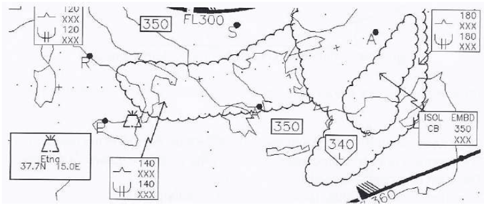
A.  An area of forecasted clear air turbulence
B.  An area of forecasted icing
C.  An area of active thunderstorms (CBs)
D.  A region of volcanic ash
E.  An area of specific weather phenomena (e.g., widespread fog, clouds, precipitation)
ans: E

80. On Upper Wind and Temperature (WT) charts, how is wind direction indicated?
A.  By a number representing degrees from true north
B.  By an arrow pointing in the direction the wind is blowing TO
C.  By an arrow pointing in the direction the wind is blowing FROM, with barbs/pennants indicating speed
D.  By color codes
E.  By isobars
ans: C

81. On a WT chart, what does a triangle (pennant) on the wind barb represent?
A.  5 knots
B.  10 knots
C.  20 knots
D.  50 knots
E.  Variable wind direction
ans: D

82. On a WT chart, what does a full barb represent?
A.  5 knots
B.  10 knots
C.  20 knots
D.  50 knots
E.  Calm wind
ans: B

83. On a WT chart, what does a half barb represent?
A.  5 knots
B.  10 knots
C.  20 knots
D.  50 knots
E.  Light and variable wind
ans: A

### Chapter 13: ATC

1.  What is the primary role of Air Traffic Controllers (ATC) mentioned in the introduction?
A.  To fly the aircraft remotely
B.  To aid pilots in undergoing successful flights and enhance safety
C.  To perform aircraft maintenance
D.  To calculate fuel requirements
E.  To issue weather forecasts
ans: B

2.  How does comprehending the nature and rationale of ATC benefit pilots?
A.  Reduces fuel consumption directly
B.  Makes it easier to understand communication and reduces workload
C.  Eliminates the need for checklists
D.  Allows pilots to ignore clearances
E.  Provides better in-flight entertainment options
ans: B

3.  Which abbreviation stands for Area Control Center?
A.  ACARS
B.  ACAS
C.  ACC
D.  ADF
E.  ATIS
ans: C

4.  What does ATIS stand for?
A.  Aircraft Traffic Information Service
B.  Automatic Terminal Information Service
C.  Air Traffic Identification System
D.  Alternate Taxiway Information System
E.  Approach Tower Information Standard
ans: B

5.  What does RVSM stand for?
A.  Runway Visual Separation Minima
B.  Required Vertical Separation Minimum
C.  Reduced Vertical Separation Minimum
D.  Radar Vectoring Service Management
E.  Route Verification System Module
ans: C

6.  What is an Aerodrome Control Tower primarily established to do?
A.  Provide flight information service only
B.  Manage en-route traffic
C.  Provide air control service to aerodrome traffic
D.  Issue weather forecasts for the region
E.  Coordinate military operations
ans: C

7.  An authorization for an aircraft to proceed under conditions specified by an ATC unit is called:
A.  Position Report
B.  Flight Plan
C.  Air Traffic Control Clearance
D.  ATIS Broadcast
E.  Wake Turbulence Advisory
ans: C

8.  What is the primary purpose of Air Traffic Control Service?
A.  To provide weather information and flight planning assistance
B.  To manage airport ground operations only
C.  To prevent collisions and expedite/maintain an orderly flow of air traffic
D.  To collect landing fees
E.  To coordinate airline schedules
ans: C

9.  An aerodrome to which an aircraft may proceed if landing at the intended destination becomes impossible or inadvisable is called:
A.  Departure Aerodrome
B.  En-Route Fix
C.  Control Zone
D.  Alternate Aerodrome
E.  Holding Point
ans: D

10. What is the definition of a Control Zone (CTR)?
A.  Airspace extending upwards from a specified limit above the earth
B.  Controlled airspace extending upwards from the surface of the earth to a specified upper limit
C.  Airspace where only VFR flights are permitted
D.  Airspace reserved for military operations
E.  The area immediately surrounding an ATC tower building
ans: B

11. The lowest altitude providing 1000 ft (300m) clearance above all objects within a 25 NM radius sector of a navaid is called:
A.  Minimum En-route Altitude (MEA)
B.  Minimum Obstruction Clearance Altitude (MOCA)
C.  Minimum Sector Altitude (MSA)
D.  Minimum Descent Altitude (MDA)
E.  Transition Altitude
ans: C

12. What is the Transition Altitude?
A.  The altitude above which flight level is used
B.  The altitude at or below which vertical position is controlled by reference to altitudes (QNH)
C.  The lowest usable flight level
D.  The minimum altitude for VFR flight
E.  The altitude where cabin pressurization starts
ans: B

13. What is the Transition Level?
A.  The altitude used below the Transition Altitude
B.  The height of the Transition Altitude above MSL
C.  The lowest flight level available for use above the Transition Altitude
D.  The flight level equivalent to 18,000 ft
E.  A level used only in Class A airspace
ans: C

14. Which item is typically NOT included in an ATC Flight Plan?
A.  Aircraft Identification
B.  Type of aircraft and wake turbulence category
C.  Pilot's name and license number
D.  Route to be followed
E.  Fuel endurance
ans: C

15. What is the purpose of ATIS?
A.  To provide en-route weather via VOLMET
B.  To provide continuous broadcast of current, routine weather and airport information
C.  To give specific taxi instructions
D.  To issue takeoff and landing clearances
E.  To control aircraft separation
ans: B

16. When is RVR typically reported in an ATIS?
A.  When visibility is greater than 10 km
B.  When visibility is less than 5000 m
C.  When visibility is less than 1500 m
D.  Only during nighttime
E.  Only when requested by a pilot
ans: C

17. What time reference is used for all ATC clearances and pilot reports?
A.  Local Standard Time (LST)
B.  Local Daylight Time (LDT)
C.  Coordinated Universal Time (UTC) / Zulu Time (Z)
D.  Pilot's home base time
E.  Estimated Time of Arrival (ETA)
ans: C

18. In which Airspace Class are only IFR flights permitted, provided with ATC service and separation from all other aircraft?
A.  Class G
B.  Class E
C.  Class C
D.  Class B
E.  Class A
ans: E

19. In which Airspace Class are both IFR and VFR flights permitted, all flights receive ATC service, and all flights are separated from each other?
A.  Class G
B.  Class F
C.  Class D
D.  Class B
E.  Class A
ans: D

20. In Class D airspace, what service and separation are provided to VFR flights?
A.  Separated from all flights
B.  Separated from IFR flights only, receive traffic information on other VFR flights
C.  Receive traffic information on all other flights, no separation provided by ATC
D.  No service provided
E.  Separated from VFR flights only
ans: C

21. What is the typical speed limitation below 10,000 ft AMSL in most airspace classes (unless otherwise permitted)?
A.  200 kts IAS
B.  230 kts IAS
C.  250 kts IAS
D.  300 kts IAS
E.  No speed limit
ans: C

22. Which ATC unit typically handles clearances before engine start (Clearance Delivery) and taxi instructions (Ground)?
A.  Approach Control Office
B.  Area Control Center
C.  Aerodrome Control Tower
D.  Flight Information Centre (FIC)
E.  Central Management Unit (CMU)
ans: C

23. Which ATC unit is responsible for controlling aircraft operating in the Control Area (e.g., en-route)?
A.  Aerodrome Control Tower
B.  Approach Control Office
C.  Area Control Center (ACC)
D.  Flight Service Station (FSS)
E.  Central Management Unit (CMU)
ans: C

24. What are the two basic methods of separation provided by ATC for IFR flights?
A.  Visual and Instrument separation
B.  Speed and Altitude separation
C.  Vertical and Horizontal (longitudinal/lateral) separation
D.  Time and Distance separation only
E.  Radar and Non-Radar separation
ans: C

25. What is the standard vertical separation minimum in RVSM airspace?
A.  500 ft
B.  1,000 ft
C.  2,000 ft
D.  4,000 ft
E.  5,000 ft
ans: B

26. What is the standard vertical separation minimum below FL290 or above FL410 (outside RVSM)?
A.  500 ft
B.  1,000 ft
C.  2,000 ft
D.  4,000 ft
E.  Dependent on aircraft type
ans: C

27. What are the typical components of an ATC clearance sequence?
A.  Aircraft ID, Route, Altitude, Frequency, Squawk
B.  Station Name, Aircraft ID, Clearance Limit, Route, Altitude/Level, Instructions/Information
C.  Time, Position, Altitude, Next Position, ETA
D.  Clearance Type, Validity, Conditions, Readback Required
E.  Weather, Runway, Taxi route, Takeoff clearance
ans: B

28. What is the purpose of a Calculated Take-Off Time (CTOT) or "Slot Time"?
A.  To ensure pilots calculate takeoff performance correctly
B.  To sequence traffic flow within the FIR, especially over Europe
C.  To indicate the exact time the wheels must leave the ground
D.  To limit the number of aircraft departing per hour
E.  To coordinate pushback times with ground crew
ans: B

29. What is the typical tolerance window around a CTOT for takeoff?
A.  Exactly on time only
B.  +/- 5 minutes
C.  5 minutes before to 10 minutes after
D.  10 minutes before to 5 minutes after
E.  +/- 15 minutes
ans: C

30. The Flight Level Orientation Scheme (e.g., East Odd, West Even) applies within which airspace?
A.  Only in Class A airspace
B.  Only below 10,000 ft
C.  Only in uncontrolled airspace
D.  Within RVSM airspace (and generally above Transition Level)
E.  Only for VFR flights
ans: D

31. An aircraft flying on a magnetic course of 090° would typically fly at which levels in RVSM airspace?
A.  Even Flight Levels (e.g., FL300, FL320, FL340)
B.  Odd Flight Levels (e.g., FL290, FL310, FL330)
C.  VFR altitudes
D.  Altitudes ending in 500 (e.g., FL305, FL325)
E.  Any level assigned by ATC
ans: B

32. An aircraft flying on a magnetic course of 270° would typically fly at which levels in RVSM airspace?
A.  Even Flight Levels (e.g., FL300, FL320, FL340)
B.  Odd Flight Levels (e.g., FL290, FL310, FL330)
C.  Altitudes below FL290 only
D.  Altitudes assigned randomly
E.  Levels determined by the pilot
ans: A

33. What is the wake turbulence category for an aircraft with a Maximum Takeoff Weight (MTOW) greater than 136,000 kg?
A.  Light (L)
B.  Medium (M)
C.  Heavy (H)
D.  Super Heavy (J)
E.  Not categorized
ans: C

34. What is the wake turbulence category for an aircraft with an MTOW between 7,000 kg and 136,000 kg?
A.  Light (L)
B.  Medium (M)
C.  Heavy (H)
D.  Super Heavy (J)
E.  Small
ans: B

35. Under radar separation, what is the typical minimum distance separation behind a Heavy (H) aircraft for a following Medium (M) aircraft?
A.  3 NM
B.  4 NM
C.  5 NM
D.  6 NM
E.  8 NM
ans: C

36. What are the basic conditions required to operate under Visual Flight Rules (VFR) in a control zone?
A.  Clearance from ATC only
B.  Ceiling > 1500ft (450m) AND Ground visibility > 5 km
C.  Below FL100 only
D.  During daylight hours only
E.  No specific conditions apply
ans: B

37. What is the general IFR minimum altitude requirement over high terrain or mountainous areas?
A.  500 ft above the highest obstacle within 8 km
B.  1000 ft (300m) above the highest obstacle within 8 km
C.  2000 ft (600m) above the highest obstacle within 8 km
D.  At least FL100
E.  Same as the Minimum Sector Altitude (MSA)
ans: C

38. Which item is typically included in a routine ATC position report?
A.  Fuel remaining
B.  Number of passengers
C.  Aircraft identification, Position, Time, Level, Next position and ETA
D.  Weather conditions at destination
E.  Engine parameters
ans: C

39. Which situation would require a pilot to make a Special Air Report?
A.  Reaching cruising altitude
B.  Experiencing light turbulence
C.  Encountering severe icing
D.  Receiving a new ATC clearance
E.  Crossing a FIR boundary
ans: C

40. What does TIBA stand for?
A.  Terminal Information Bravo Alpha
B.  Traffic Information Broadcast by Aircraft
C.  Transponder Information Block Allocation
D.  Taxi Information Bravo Area
E.  Turbulence Information Below Altitude
ans: B

41. When is a TIBA broadcast mandatory?
A.  In all controlled airspace
B.  In areas where radar services are not provided
C.  Only when requested by ATC
D.  During takeoff and landing only
E.  When flying VFR
ans: B

42. If a pilot inadvertently deviates from the cleared track, what action is required?
A.  Continue on the new track
B.  Request a new clearance for the current track
C.  Take necessary actions to regain the original track and report the deviation to ATC
D.  Maintain altitude and wait for ATC instructions
E.  Activate the emergency transponder code
ans: C

43. What transponder code should be set in case of a general emergency?
A.  7500
B.  7600
C.  7700
D.  1200
E.  2000
ans: C

44. What transponder code indicates unlawful interference (hijacking)?
A.  7700
B.  7600
C.  7500
D.  7000
E.  0000
ans: C

45. What is the standard VHF emergency frequency?
A.  123.45 MHz
B.  118.00 MHz
C.  121.5 MHz
D.  131.25 MHz
E.  243.0 MHz
ans: C

46. What is the standard procedure for a communication failure in IMC conditions when radar service is *not* being provided?
A.  Return to departure airport immediately
B.  Land at the nearest suitable airport
C.  Maintain last assigned speed/level for 20 minutes after compulsory report failure, then follow filed flight plan
D.  Squawk 7700 and await light signals
E.  Climb 1000 ft above assigned level and proceed direct destination
ans: C

47. What is the standard procedure for a communication failure in IMC conditions when radar service *is* being provided?
A.  Maintain last assigned speed/level indefinitely
B.  Maintain last assigned speed/level for 7 minutes after code 7600 set or failure, then follow filed flight plan
C.  Descend immediately to VMC conditions
D.  Proceed direct to destination via shortest route
E.  Enter a holding pattern at the current position
ans: B

48. What initial action should be taken during an emergency descent procedure, if able?
A.  Turn on all exterior lights
B.  Set transponder to 7700
C.  Advise ATC
D.  Initiate a turn away from the assigned route or track
E.  Coordinate intentions with ATC
ans: D

49. When reading back ATC clearances, what is generally expected?
A.  Read back the entire clearance verbatim
B.  Only read back the call sign
C.  Read back crucial parts like altitude, heading, speed, and clearances; acknowledge information
D.  No readback is required unless requested
E.  Use standard abbreviations only
ans: C

50. How should altitude "three thousand four hundred" feet be stated in standard phraseology?
A.  "Thirty four hundred"
B.  "Three four zero zero feet"
C.  "Tree tousand four hundred"
D.  "Flight Level three four"
E.  "Tree thousand four hundred feet"
ans: E

51. How should flight level "one two thousand" (FL120) be stated?
A.  "One twenty"
B.  "One two zero"
C.  "Flight Level one two zero"
D.  "Flight Level twelve thousand"
E.  "One two thousand"
ans: C

### Chapter 14: JEPPESEN

1.  What is the main objective of Chapter 14, "Jeppesen"?
A.  To provide a history of aviation regulations
B.  To teach advanced meteorology concepts
C.  To enable pilots to easily use Jeppesen materials and obtain information quickly
D.  To detail aircraft maintenance procedures
E.  To explain the theory of flight
ans: C

2.  Who founded the Jeppesen company in 1934?
A.  Phil Condit
B.  William Boeing
C.  Charles Lindbergh
D.  Elrey B. Jeppesen
E.  An unknown airmail pilot collective
ans: D

3.  What motivated Elrey B. Jeppesen to start collecting and documenting aviation information?
A.  A desire to write a book about flying
B.  Frustration over the lack of information leading to pilot injuries and deaths
C.  A requirement from his employer, the airmail service
D.  An interest in cartography as a hobby
E.  A bet with fellow pilots
ans: B

4.  What was the original form of Jeppesen's collected information?
A.  A published multi-volume manual
B.  A series of government reports
C.  A personal notebook used for daily flying reference
D.  An electronic database
E.  Wall charts displayed at airports
ans: C

5.  Which major aerospace company acquired Jeppesen in August 2000?
A.  Airbus
B.  Lockheed Martin
C.  Boeing
D.  Bombardier
E.  Embraer
ans: C

6.  What is a "Trip Kit" as used by EgyptAir First Officers?
A.  A personal travel bag
B.  A set of revised Jeppesen charts for a specific flight route (departure, destination, alternates, en-route)
C.  An emergency survival kit
D.  A collection of aircraft maintenance logs
E.  A digital flight planning software package
ans: B

7.  Which item is typically included in a Jeppesen Trip Kit?
A.  Passenger manifests
B.  Engine performance data
C.  STARs (Standard Terminal Arrival Routes) and SIDs (Standard Instrument Departure)
D.  Aircraft maintenance manuals
E.  Company financial reports
ans: C

8.  How many books typically make up the full Jeppesen library carried on an aircraft?
A.  One consolidated book
B.  Two books (Route Manual and Charts)
C.  Three books (Enroute, Terminal, Route Manual)
D.  Five books (Four chart books and one Route Manual)
E.  Ten books (One per continent)
ans: D

9.  What is the purpose of the Jeppesen Route Manual?
A.  To provide only approach plates for airports
B.  To define general ICAO rules and list deviations by continent, country, or airport
C.  To contain only airway charts
D.  To list pilot names and contact information
E.  To provide detailed aircraft systems descriptions
ans: B

10. Which chapter in the Route Manual contains basic definitions, abbreviations, and symbols used throughout Jeppesen?
A.  En-route
B.  Terminal
C.  Introduction
D.  Tables and codes
E.  Emergency
ans: C

11. Which Route Manual chapter provides information on procedures used along the flight path between departure and arrival phases?
A.  Introduction
B.  Radio Aids
C.  Meteorology
D.  En-route
E.  Terminal
ans: D

12. What service does Stockholm Radio provide, as mentioned in the En-route chapter?
A.  Air Traffic Control separation
B.  Weather forecasting
C.  Long Distance Operational Control communication via HF radio phone patches
D.  Airport ground handling
E.  Emergency search and rescue coordination
ans: C

13. The Radio Aids chapter provides a legend for Navigation Aids including their identifiers, usable range, and what other key piece of information?
A.  Maintenance schedule
B.  Installation date
C.  Frequencies
D.  Manufacturer name
E.  Power output
ans: C

14. What concept, related to Required Navigation Performance, allows aircraft to fly more direct routes without necessarily overflying ground-based navaids?
A.  Visual Flight Rules (VFR)
B.  Instrument Landing System (ILS)
C.  Area Navigation (RNAV)
D.  Dead Reckoning (DR)
E.  Non-Directional Beacon (NDB) tracking
ans: C

15. The Meteorology chapter in the Route Manual contains information on:
A.  Aircraft performance data
B.  Pilot licensing requirements
C.  Interpretation of METARs, TAFs, SIGMETs, AIRMETs, etc.
D.  Airport operating hours
E.  Customs and immigration procedures
ans: C

16. What is a key function of the Tables and Codes chapter?
A.  Listing ATC frequencies
B.  Providing unit conversion tables (e.g., feet to meters, statute to nautical miles)
C.  Detailing emergency procedures
D.  Showing airport layouts
E.  Explaining RVSM procedures
ans: B

17. Which chapter contains ICAO recommended practices for flight operations, ATC procedures, and state-specific deviations?
A.  Meteorology
B.  Radio Aids
C.  Entry Requirements
D.  ATC (Air Traffic Control)
E.  Emergency
ans: D

18. ICAO Annex 2, covering the Rules of the Air (including collision avoidance, flight plans, signals), is referenced within which Route Manual chapter?
A.  Introduction
B.  En-route
C.  Tables and Codes
D.  ATC
E.  Emergency
ans: D

19. What information is found in the Entry Requirements chapter?
A.  Required documents for aircraft entry into a country (e.g., passport, visa, health for crew)
B.  Aircraft performance limitations
C.  Holding pattern procedures
D.  Radio communication failure procedures
E.  Decoding SNOWTAMs
ans: A

20. Which chapter details procedures for situations like hijacking, communication failure, interception, and emergency descent?
A.  ATC
B.  Meteorology
C.  Emergency
D.  En-route
E.  Introduction
ans: C

21. What information does the Airport Directory chapter primarily contain?
A.  Detailed approach procedures
B.  En-route airway structures
C.  Lists of airports with their ICAO/IATA identifiers and potentially ACN/PCN information
D.  Weather forecast codes
E.  Pilot biographies
ans: C

22. What does ACN stand for in the context of airport information?
A.  Area Control Node
B.  Airport Communications Network
C.  Aircraft Classification Number (related to pavement strength)
D.  Approach Control Notification
E.  Altitude Correction Number
ans: C

23. Which chapter deals specifically with procedures and charts used for arrival, approach, and departure at specific airports (SIDs, STARs, Approach Plates, Airport Diagrams)?
A.  En-route
B.  Terminal
C.  Radio Aids
D.  Meteorology
E.  Tables and Codes
ans: B

24. In the Enroute Chart Legend (Figure 14.16), how is Restricted Airspace depicted?
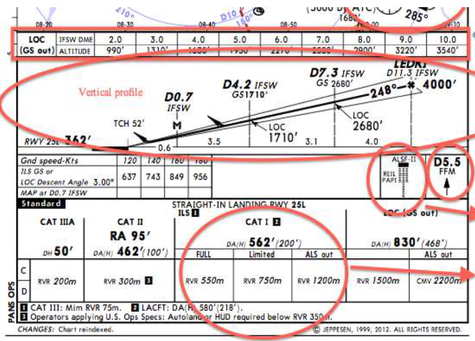
A.  A solid circle
B.  A dashed box with hatching
C.  A box with "R-" followed by a number
D.  A shaded area labeled "PROHIBITED"
E.  A box with diagonal lines inside labeled Training, Alert, Caution, Military Operations Areas
ans: E 

25. In the Enroute Chart Legend (Figure 14.17), what does MEA stand for?

A.  Maximum Enroute Altitude
B.  Mean Elevation Above sea level
C.  Minimum Enroute Altitude
D.  Magnetic East Azimuth
E.  Meteorological Elevation Assessment
ans: C

26. In the Enroute Chart Legend (Figure 14.17), what does GRID MORA refer to?

A.  Minimum Off-Route Altitude within a grid, providing obstacle clearance
B.  Magnetic Omni-Range Altitude
C.  Grid Minimum Obstacle Route Altitude
D.  Minimum altitude for radar coverage within the grid
E.  An altitude corrected for magnetic variation
ans: A

27. In the Enroute Chart Legend (Figure 14.18), what does a solid black triangle reporting point signify?
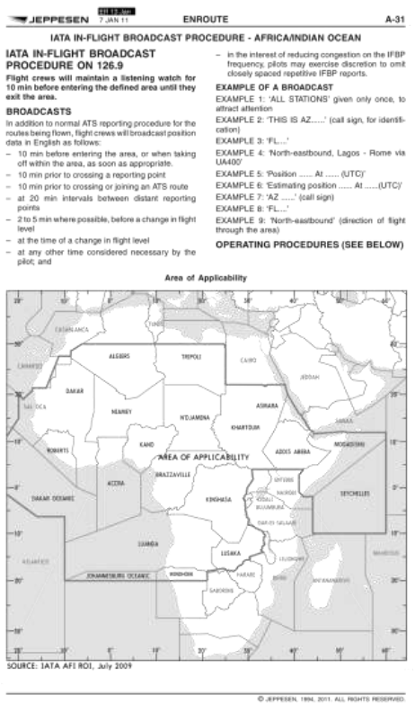
A.  Non-Compulsory Reporting Point
B.  Compulsory Reporting Point
C.  Low Altitude Reporting Point only
D.  Mileage Break/Turning Point
E.  Fly-over waypoint
ans: B

28. In the Enroute Chart Legend (Figure 14.18), what does an open (white) triangle reporting point signify?

A.  Compulsory Reporting Point
B.  Non-Compulsory Reporting Point
C.  High Altitude Reporting Point only
D.  VFR Reporting Point
E.  Fly-by waypoint
ans: B

29. In the Enroute Chart Legend (Figure 14.19), what does "CTR-12" indicate?
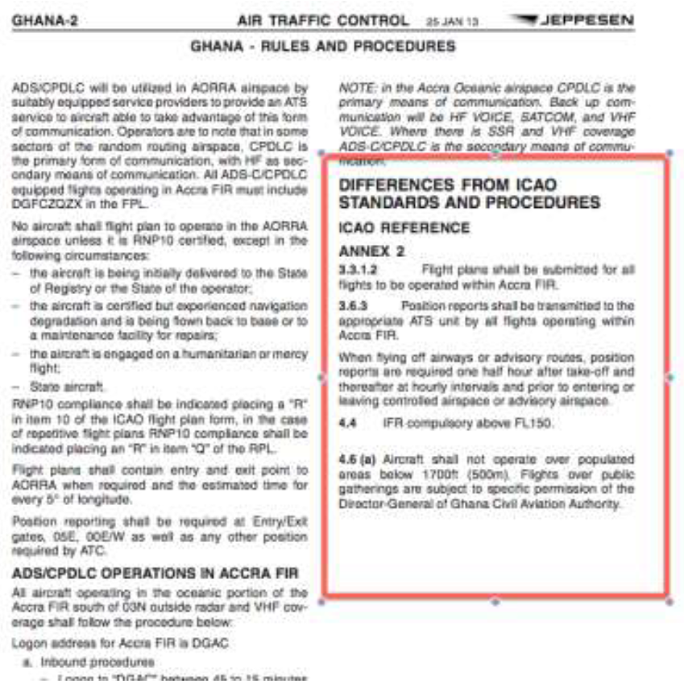
A.  Center frequency 112.0
B.  Control Zone 12
C.  Oceanic Transition Route 12
D.  Control Area boundary 12 NM wide
E.  Controller sector 12
ans: C

30. In the Enroute Chart Legend (Figure 14.19), what does the SHADOW BOX around a Navaid name indicate?

A.  Navaid is out of service
B.  Navaid is primary for the airway component
C.  Navaid has DME capability
D.  Navaid is for military use only
E.  Navaid is nearing replacement
ans: B

31. In the Enroute Chart Legend (Figure 14.20), what does the DME value "D16/21" signify in a holding pattern?
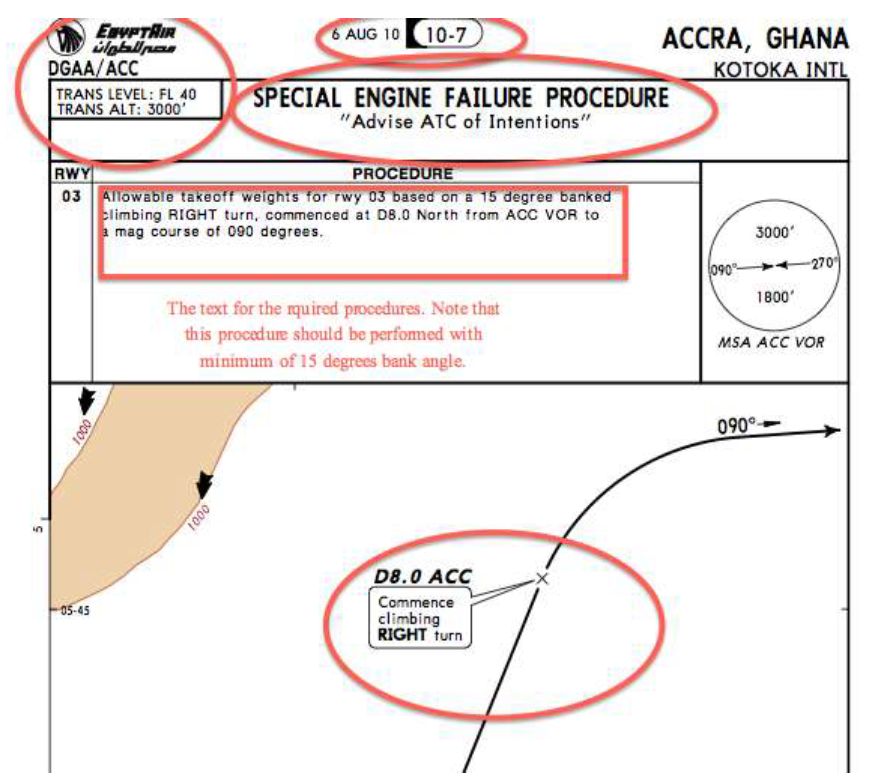
A.  Hold between 16 and 21 DME
B.  Inbound leg is 16 NM, outbound is 21 NM
C.  Hold inbound on the 16 NM arc, outbound on the 21 NM arc
D.  The holding fix is at 16 DME, the outbound turn ends at 21 DME
E.  DME figures defining the holding pattern fix location or leg length/turn points
ans: E 

32. On the STAR chart example (Figure 14.21), what does "Min Safe Altitude Sector-wise" typically refer to?
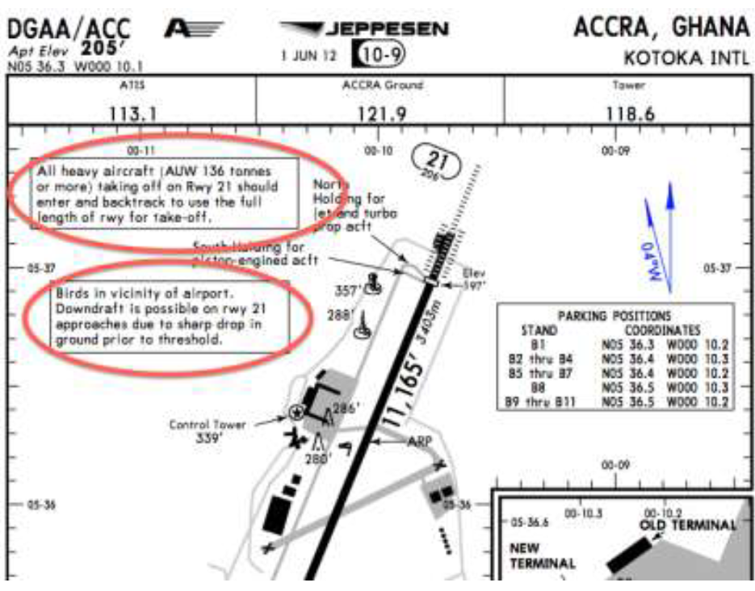
A.  Minimum altitude for radar vectors
B.  Minimum Sector Altitude (MSA) providing obstacle clearance within 25NM of a navaid
C.  Transition Altitude for the area
D.  Lowest altitude for VFR flight
E.  Minimum altitude to receive ATIS
ans: B

33. On the SID chart example (Figure 14.22), what information is typically found in the "INITIAL CLIMB/ROUTING" section?
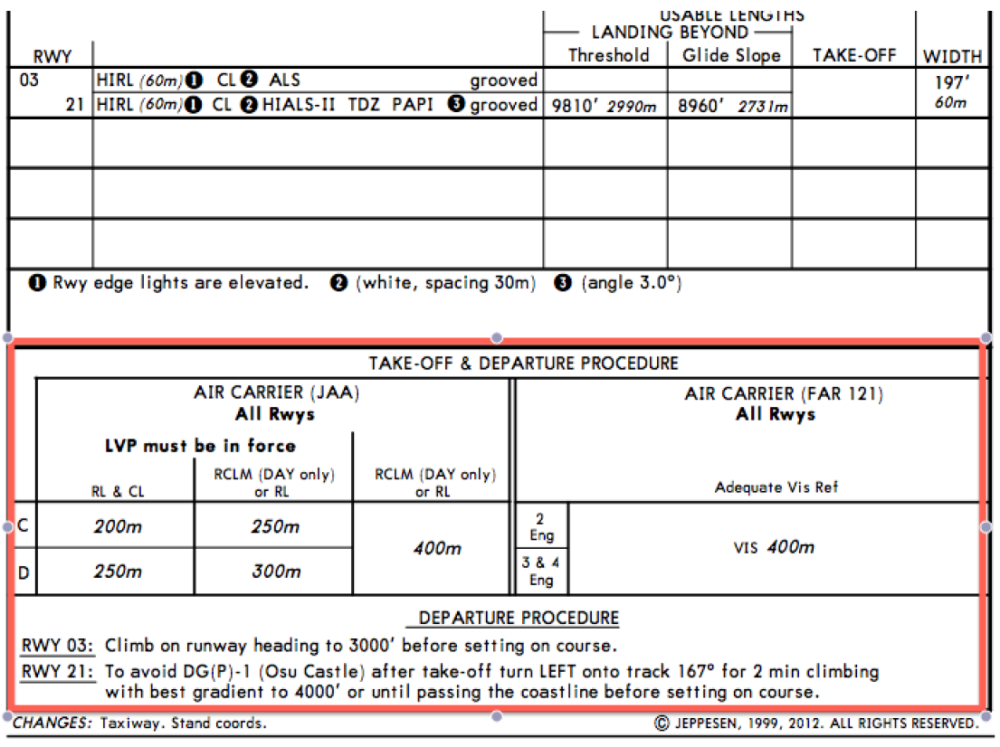
A.  Communication frequencies
B.  Takeoff minimums
C.  Step-by-step instructions for flying the departure route, including headings, altitudes, and fixes
D.  Lost communication procedures
E.  Noise abatement procedures
ans: C

34. In the Case Study section (Figure 14.4), what are pilots advised to do regarding communication failure procedures when flying in Egypt (HECA)?
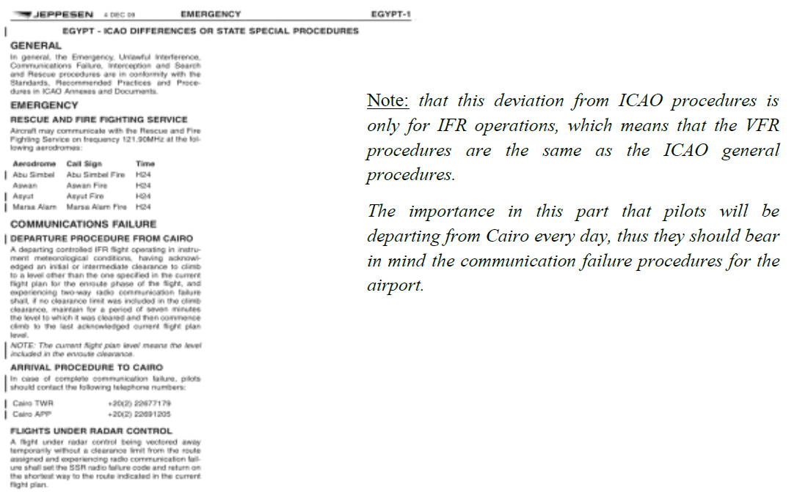
A.  Follow standard ICAO procedures only
B.  Follow the specific deviation procedures listed for Egypt (IFR operations)
C.  Return immediately to Cairo
D.  Contact Stockholm Radio for instructions
E.  Proceed VFR if possible
ans: B

35. In the HECA Noise Abatement Procedures chart (Figure 14.5), what is the thrust reduction altitude?
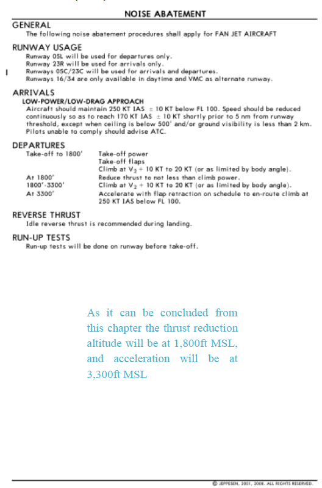
A.  800 ft MSL
B.  1500 ft MSL
C.  1800 ft MSL
D.  3000 ft MSL
E.  3300 ft MSL
ans: C

36. In the HECA Noise Abatement Procedures chart (Figure 14.5), what is the acceleration altitude?

A.  800 ft MSL
B.  1500 ft MSL
C.  1800 ft MSL
D.  3000 ft MSL
E.  3300 ft MSL
ans: E

37. In the Frankfurt Transponder Operation procedure (Figure 14.12), when should Mode S transponders be able to operate?
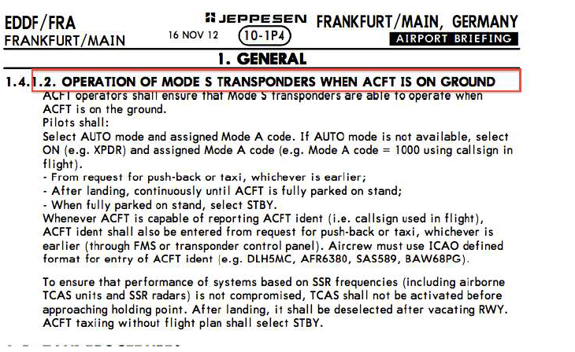
A.  Only after takeoff clearance
B.  Only when airborne
C.  While the aircraft is on the ground (e.g., before pushback, during taxi)
D.  Only above 10,000 feet
E.  Only when requested by ATC
ans: C

38. In the Frankfurt Communication Procedures (Figure 14.13), when changing frequency from LANGEN Radar to FRANKFURT Director, what should initial contact include?
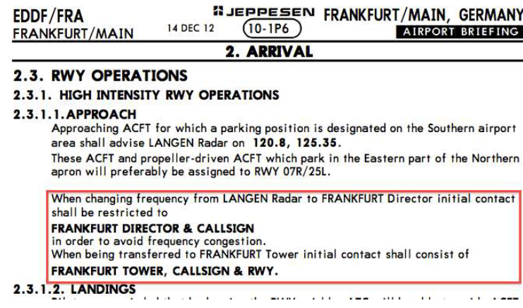
A.  Only call sign
B.  Call sign and current altitude
C.  Call sign and requested approach type
D.  Call sign only, unless advised otherwise by LANGEN Radar
E.  Should wait for Director to call first
ans: A 

39. Looking at the Frankfurt RNAV Transition chart (Figure 14.14), what does the box labelled "PSA 25S" represent?
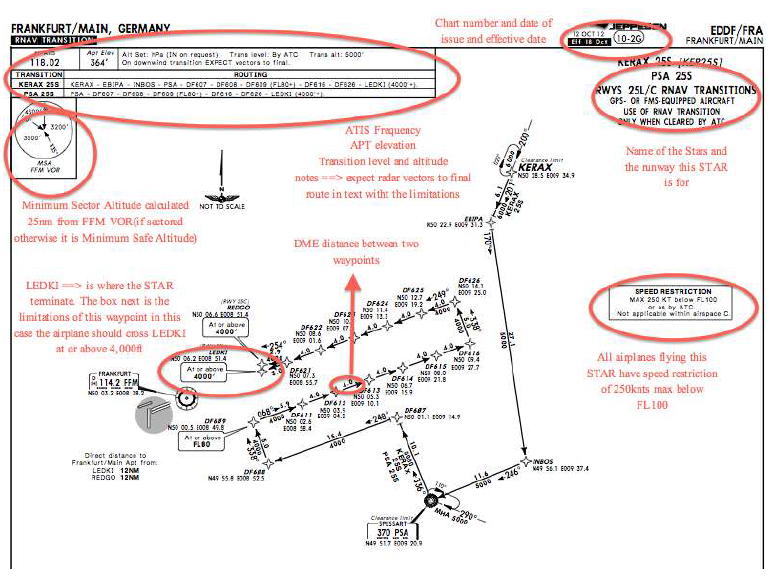
A.  A holding pattern
B.  A specific STAR route identifier linked to the PSA waypoint and runway 25 South (25L/R)
C.  A minimum sector altitude
D.  A frequency for approach control
E.  A speed restriction
ans: B

40. On the Frankfurt ILS Rwy 25L approach plate (Figure 14.15), what is the localizer frequency?
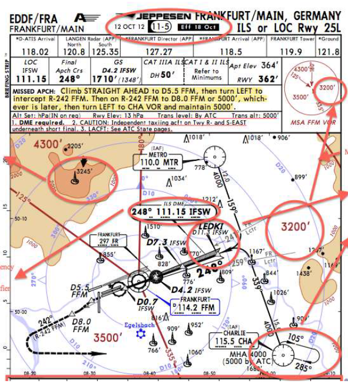
A.  118.90
B.  120.6
C.  125.35
D.  111.15
E.  119.9
ans: D 

41. On the Frankfurt ILS Rwy 25L profile view (Figure 14.16), what is the Decision Altitude (DA) for a CAT I approach?

A.  50'
B.  462' (100')
C.  562' (200')
D.  830' (468')
E.  Not specified
ans: C

42. On the Frankfurt ILS Rwy 25L profile view (Figure 14.16), what altitude should you be at when crossing the D8.0 IFW fix (Final Approach Fix)?

A.  4300'
B.  3500'
C.  3000'
D.  2680'
E.  830'
ans: C

### Chapter 15: OPERATIONS MANUAL

1.  What is a primary reason air carriers operate under a system of prioritized goals and operation management standards?
A.  To reduce the number of pilots needed
B.  To achieve safety and high customer service standards, avoiding haphazard management
C.  To meet the requirements of aircraft manufacturers only
D.  To simplify the aircraft maintenance process
E.  To lower ticket prices significantly
ans: B

2.  What is the purpose of standardization of operation within an airline like EgyptAir?
A.  To ensure all aircraft are painted the same color
B.  To allow any two-crew members to perform duties on a common basis
C.  To limit the number of routes the airline can fly
D.  To make all flights the exact same duration
E.  To reduce the need for an Operations Manual
ans: B

3.  What is the name of the manual containing EgyptAir's operation management standards?
A.  Aircraft Flight Manual (AFM)
B.  Maintenance Control Manual (MCM)
C.  Jeppesen Route Manual
D.  Operation Manual (OM)
E.  General Standard Operating Procedures (GSOP)
ans: D

4.  What does the Operations Manual describe?
A.  Detailed aircraft engine schematics
B.  Passenger booking procedures
C.  Duties and responsibilities for different jobs, especially in the operations department
D.  International treaty agreements
E.  Airport construction standards
ans: C

5.  The Operations Manual aims to coordinate major components for safe and efficient movement. Which is NOT listed as a major component?
A.  Aircraft
B.  Cockpit and cabin crews
C.  Airport retail shops
D.  Maintenance
E.  Support equipment
ans: C

6.  What is the stated objective of the Operations Manual (OM-A)?
A.  To teach detailed flight maneuvering techniques
B.  To provide guidelines for normal, abnormal procedures and overall flight operation methods
C.  To replace the need for Jeppesen charts
D.  To outline pilot salary structures
E.  To detail aircraft manufacturing processes
ans: B

7.  Chapter 1 of the OM-A (Organization and Responsibilities) describes:
A.  Flight Time Limitations
B.  Crew Health Precautions
C.  The administrative structure of the flight operations department
D.  Operating Procedures
E.  Quality Systems
ans: C

8.  Which topic is listed as an example under OM-A Chapter 1?
A.  Safety Management System
B.  Duties and Responsibilities of the Commander and First Officer
C.  Low Visibility Operations Prerequisite
D.  Flight Time Limitations
E.  Handling of Accidents
ans: B

9.  Chapter 2 of the OM-A (Operational Control and Supervision) ensures maintenance of:
A.  Aircraft paint quality
B.  In-flight meal standards
C.  High employee qualification and training standards
D.  Passenger loyalty programs
E.  Airport slot times
ans: C

10. Which topic is listed as an example under OM-A Chapter 2?
A.  Regulations for Wearing the Uniform
B.  Designation of Commander
C.  Safety Management System
D.  Meal Precautions
E.  Rules of the Air
ans: C

11. Chapter 3 of the OM-A deals with what system?
A.  Crew Composition
B.  Flight Time Limitations
C.  Quality System
D.  Operating Procedures
E.  Security
ans: C

12. Chapter 4 of the OM-A (Crew Composition) prescribes conditions for:
A.  Minimum flight crew requirements
B.  Maximum number of passengers
C.  Required rest periods
D.  Uniform standards
E.  Health precautions
ans: A

13. Which topic is discussed in OM-A Chapter 4?
A.  Recurrent Training and Checking
B.  Chain of Command for Flight Crews
C.  Rules and Definitions for ETOPS
D.  Procedures for Locking the Flight Deck Door
E.  Alcohol and other Intoxicating Liquor policies
ans: B

14. Chapter 5 of the OM-A (Qualification Requirements) contains descriptions of required:
A.  Aircraft fuel types
B.  Airport operating minima
C.  License ratings, qualifications, experience, training, checking, and recency
D.  Emergency equipment locations
E.  Navigation database update procedures
ans: C

15. Which item is an example topic from OM-A Chapter 5?
A.  Minimum Cabin Crew
B.  Line Check
C.  Navigation Bag Contents
D.  Flight crewmember's incapacitation
E.  Power of Authority
ans: B

16. Chapter 6 of the OM-A (Crew Health Precautions) emphasizes that crew health has a direct impact on:
A.  Fuel efficiency
B.  Passenger comfort
C.  Flight safety
D.  Aircraft maintenance costs
E.  Ticket prices
ans: C

17. Which topic is an example from OM-A Chapter 6?
A.  Handling of Accidents and Occurrences
B.  Use of Medication, Drugs and other Treatments
C.  License and Qualification Validity
D.  Low Visibility Operations
E.  Dangerous Goods regulations
ans: B

18. What is the primary aim of Flight Time Limitations (OM-A Chapter 7)?
A.  To maximize crew productivity
B.  To ensure pilots get enough simulator training
C.  The prevention of fatigue of flight crews
D.  To standardize crew meal times
E.  To limit the number of sectors flown per year
ans: C

19. Chapter 7 (Flight Time Limitations) ensures crew members are adequately rested by considering:
A.  Aircraft type and route length only
B.  Individual duty/rest periods, cycles of duty, and cumulative duty hours
C.  Passenger load factors
D.  Time zone changes only
E.  Weather conditions only
ans: B

20. Which topic is an example covered in OM-A Chapter 7?
A.  Authority of the Commander
B.  Recency of experience
C.  Extension of flying duty period by split duty
D.  Minimum flight crew requirements
E.  Procedures for Locking the Flight Deck Door
ans: C

21. Chapter 8 of the OM-A covers what broad topic?
A.  Crew Health Precautions
B.  Dangerous Goods
C.  Operating Procedures
D.  Rules of the Air
E.  Security
ans: C

22. The limits of usability of an aerodrome for takeoff are expressed in terms of:
A.  Decision Altitude/Height only
B.  Runway visual range and/or visibility, and if necessary cloud conditions
C.  Minimum Descent Altitude only
D.  Maximum crosswind component only
E.  Temperature and pressure altitude only
ans: B

23. Landing limits for a precision approach (e.g., ILS) are expressed in terms of visibility/RVR and what else?
A.  Minimum Descent Altitude/Height (MDA/MDH)
B.  Cloud base only
C.  Decision Altitude/Height (DA/DH)
D.  Minimum Sector Altitude (MSA)
E.  Takeoff minima
ans: C

24. Which sub-topic is found under OM-A Chapter 8 (Operating Procedures)?
A.  Quality System principles
B.  Crew Composition rules
C.  Flight Preparation Instructions
D.  Dangerous Goods acceptance
E.  Rules of the Air
ans: C

25. Which sub-topic is covered in OM-A Chapter 8?
A.  Crew Health Precautions examples
B.  Handling of Accidents and Occurrences
C.  Use of the Minimum Equipment List (MEL) and CDL
D.  Leasing arrangements
E.  Flight Time Limitations extensions
ans: C

26. Chapter 9 of the OM-A concerns:
A.  Security
B.  Rules of the Air
C.  Dangerous Goods and Weapons
D.  Handling of Accidents
E.  Leasing
ans: C

27. Transport of dangerous goods must be performed according to IATA regulations and/or:
A.  Company preference
B.  Pilot's discretion
C.  ICAO Technical Instructions
D.  Airport authority rules only
E.  Manufacturer recommendations
ans: C

28. Chapter 10 of the OM-A deals with:
A.  Dangerous Goods
B.  Security measures and related cases
C.  Handling of Accidents
D.  Rules of the Air
E.  Leasing agreements
ans: B

29. Which topic is an example under OM-A Chapter 10 (Security)?
A.  Procedures for Locking the Flight Deck Door
B.  Alcohol policies
C.  Flight Time Limitations
D.  Use of MEL/CDL
E.  Runway Braking Action Report
ans: A

30. Chapter 11 of the OM-A covers:
A.  Security
B.  Handling of Accidents and Occurrences
C.  Rules of the Air
D.  Leasing
E.  Quality Systems
ans: B

31. What is an objective described in OM-A Chapter 11 (Handling of Accidents)?
A.  Assigning blame for the accident
B.  Providing maximum help/medical aid to persons involved expeditiously
C.  Recovering costs from insurance companies
D.  Publishing accident details immediately
E.  Disciplining the crew involved
ans: B

32. Chapter 12 of the OM-A prescribes:
A.  Leasing contract details
B.  Security procedures
C.  Rules and procedures to be complied with during flight operations (Rules of the Air)
D.  Accident investigation protocols
E.  Dangerous goods handling
ans: C

33. Chapter 13 of the OM-A deals with:
A.  Rules of the Air
B.  Leasing arrangements
C.  Security protocols
D.  Accident handling
E.  Operating Procedures
ans: B

34. Chapter 14 of the OM-A introduces:
A.  Flight Time Limitations
B.  Crew Health Precautions
C.  General Standard Operating Procedures (GSOP)
D.  Quality Systems
E.  Dangerous Goods policies
ans: C

35. What is the basis for the crew Standard Operating Procedures (SOP) for EgyptAir, according to OM-A Chapter 14?
A.  Pilot preferences
B.  ICAO recommendations only
C.  Manufacturer’s procedures and checklists (FCOM)
D.  Competitor airline procedures
E.  Minimum regulatory requirements only
ans: C

36. Standard Operating Procedure (SOP) is defined as:
A.  The way individuals perform a procedure (Technique)
B.  Who does what and when, during normal, abnormal and emergency situations
C.  A list of minimum equipment (MEL)
D.  The flight time limitations rules
E.  The procedure for calculating takeoff performance
ans: B

37. What is the difference between a Procedure and a Technique, according to OM-A Chapter 14?
A.  Procedures are mandatory, Techniques are optional
B.  Procedures are for emergencies, Techniques for normal operations
C.  Procedures define the task, Techniques define how individuals perform the task
D.  Procedures are written, Techniques are verbal
E.  There is no difference
ans: C

38. What is the objective of the General Standard Operating Procedures (GSOP) described in OM-A Chapter 14?
A.  To replace the OM Part A entirely
B.  To provide flight crews with well-defined procedures for safe operation
C.  To detail maintenance requirements
D.  To specify crew uniform standards
E.  To list all possible emergency scenarios
ans: B

39. What concept is integral to the GSOP and involves skills like co-ordination, communication, awareness, planning, and decision-making?
A.  Aircraft Systems Knowledge (ASK)
B.  Crew Resource Management (CRM)
C.  Flight Data Monitoring (FDM)
D.  Quality Management System (QMS)
E.  Safety Management System (SMS)
ans: B

40. Which is NOT one of the four main parts listed within the GSOP section of OM-A Chapter 14?
A.  PART 1 GENERAL POLICIES
B.  PART 2 TASK SHARING
C.  PART 3 AIRCRAFT SYSTEMS DESCRIPTIONS
D.  PART 3 FLIGHT PHASES
E.  PART 4 STANDARD CALLOUTS
ans: C

41. In OM-A Chapter 1, what kind of information regarding personnel is emphasized for safety and efficiency?
A.  Their salary levels
B.  Their vacation schedules
C.  Full awareness of their duties and responsibilities
D.  Their home addresses
E.  Their preferred aircraft types
ans: C

42. OM-A Chapter 5 details qualification requirements including license ratings, experience, courses, training, checking, and what other crucial factor?
A.  Age limitations
B.  Uniform compliance
C.  Recency of experience
D.  Union membership status
E.  Medical history details
ans: C

### Chapter 16: AERONAUTICAL DECISION MAKING

1.  Aeronautical Decision Making (ADM) is best described as:
A.  A pilot's natural instinct developed only through flight hours.
B.  A systematic approach to the mental process used by pilots to determine the best course of action.
C.  The process of following checklists rigidly without deviation.
D.  A computer system that makes decisions for the pilot.
E.  The study of aircraft aerodynamics.
ans: B

2.  Approximately what percentage of aviation accidents are estimated to be related to human factors?
A.  10 percent
B.  25 percent
C.  50 percent
D.  80 percent
E.  99 percent
ans: D

3.  ADM is a systematic approach to risk assessment and what other critical factor?
A.  Fuel management
B.  Engine operation
C.  Stress management
D.  Weather forecasting
E.  Aircraft maintenance
ans: C

4.  Crew Resource Management (CRM) training focuses on the effective use of which available resources?
A.  Fuel and oil only
B.  Aircraft manuals and checklists only
C.  Human resources, hardware, and information
D.  Air Traffic Control only
E.  The autopilot system only
ans: C

5.  Which of the following is the first step listed for good decision-making?
A.  Using all resources
B.  Developing risk assessment skills
C.  Identifying personal attitudes hazardous to safe flight
D.  Learning behavior modification techniques
E.  Learning how to recognize and cope with stress
ans: C

6.  Which of the following is NOT one of the six steps for good decision-making mentioned?
A.  Identifying personal attitudes hazardous to safe flight
B.  Learning behavior modification techniques
C.  Memorizing all regulations perfectly
D.  Developing risk assessment skills
E.  Using all resources
ans: C

7.  What is defined as a real or perceived condition, event, or circumstance that a pilot encounters?
A.  Risk
B.  Stress
C.  Hazard
D.  Antidote
E.  Decision
ans: C

8.  Risk is defined as:
A.  The condition or event itself
B.  The pilot's assessment of the potential impact (consequence and likelihood) of a hazard
C.  An unavoidable part of flying
D.  Something only inexperienced pilots face
E.  A failure of the aircraft systems
ans: B

9.  The hazardous attitude characterized by the thought "Don't tell me what to do" is:
A.  Impulsivity
B.  Invulnerability
C.  Macho
D.  Anti-authority
E.  Resignation
ans: D

10. What is the antidote for the Anti-authority hazardous attitude?
A.  "Follow the rules. They are usually right."
B.  "Not so fast. Think first."
C.  "It could happen to me."
D.  "Taking chances is foolish."
E.  "I'm not helpless. I can make a difference."
ans: A

11. The hazardous attitude characterized by doing the first thing that comes to mind without thinking is:
A.  Anti-authority
B.  Impulsivity
C.  Invulnerability
D.  Macho
E.  Resignation
ans: B

12. What is the antidote for the Impulsivity hazardous attitude?
A.  "Follow the rules."
B.  "Not so fast. Think first."
C.  "It could happen to me."
D.  "Taking chances is foolish."
E.  "I can make a difference."
ans: B

13. Believing that "accidents happen to others, but not to me" represents which hazardous attitude?
A.  Anti-authority
B.  Impulsivity
C.  Invulnerability
D.  Macho
E.  Resignation
ans: C

14. What is the antidote for the Invulnerability hazardous attitude?
A.  "Follow the rules."
B.  "Not so fast. Think first."
C.  "It could happen to me."
D.  "Taking chances is foolish."
E.  "I'm not helpless."
ans: C

15. Constantly trying to prove oneself is better than others by taking risks aligns with which hazardous attitude?
A.  Anti-authority
B.  Impulsivity
C.  Invulnerability
D.  Macho
E.  Resignation
ans: D

16. What is the antidote for the Macho hazardous attitude?
A.  "Follow the rules."
B.  "Think first."
C.  "It could happen to me."
D.  "Taking chances is foolish."
E.  "I'm not helpless."
ans: D

17. Feeling like "What's the use? It doesn't matter what I do" represents which hazardous attitude?
A.  Anti-authority
B.  Impulsivity
C.  Invulnerability
D.  Macho
E.  Resignation
ans: E

18. What is the antidote for the Resignation hazardous attitude?
A.  "Follow the rules."
B.  "Not so fast. Think first."
C.  "It could happen to me."
D.  "Taking chances is foolish."
E.  "I'm not helpless. I can make a difference."
ans: E

19. The basic risk assessment matrix assesses which two items?
A.  Cost and Time
B.  Pilot skill and Aircraft type
C.  Likelihood of an event and Consequence of the event
D.  Altitude and Airspeed
E.  Weather and Terrain
ans: C

20. In risk assessment, rating an event as "Probable" means:
A.  The event is highly unlikely to occur
B.  The event is unlikely but possible
C.  The event will probably occur sometime
D.  The event will occur several times
E.  The event is impossible
ans: D

21. In risk assessment, rating the severity of an event as "Catastrophic" implies:
A.  Less than minor injury or system damage
B.  Minor injury or minor system damage
C.  Severe injury or major damage
D.  Fatalities or total loss
E.  No damage or injury
ans: D

22. Which action is listed as a way to mitigate the risk of encountering forecast CAT II conditions with a non-CAT II certified crew?
A.  Fly faster through the conditions
B.  Turn off the autopilot
C.  Wait for the weather to improve to CAT I conditions
D.  Ignore the forecast
E.  Use maximum landing flaps
ans: C

23. The IMSAFE checklist is used to determine:
A.  Aircraft airworthiness
B.  Weather suitability
C.  Pilot physical and mental readiness for flight
D.  Fuel requirements
E.  Navigation accuracy
ans: C

24. What does the 'S' in the IMSAFE checklist stand for?
A.  Speed
B.  Safety
C.  Stress
D.  Systems
E.  Sleep
ans: C

25. What does the 'F' in the IMSAFE checklist stand for?
A.  Fuel
B.  Flaps
C.  Fitness
D.  Fatigue
E.  Forecast
ans: D

26. The PAVE checklist divides risks into four categories. What does 'P' stand for?
A.  Pressure
B.  Performance
C.  Pilot-in-command (PIC)
D.  Procedures
E.  Passengers
ans: C

27. In the PAVE checklist, what does 'A' stand for?
A.  Altitude
B.  Airspace
C.  Attitude
D.  Aircraft
E.  Alternate airport
ans: D

28. In the PAVE checklist, what does 'V' stand for?
A.  Velocity
B.  Visibility
C.  Visual conditions
D.  VOR check
E.  enVironment (Weather, Terrain, Airport, etc.)
ans: E

29. In the PAVE checklist, what does 'E' stand for?
A.  Engine
B.  Emergency
C.  ETA
D.  External Pressures
E.  Experience
ans: D

30. Setting personal minimums, which might be higher than legal requirements, is a way to manage risks identified in which checklist?
A.  IMSAFE
B.  DECIDE
C.  PAVE
D.  Preflight Inspection Checklist
E.  Emergency Checklist
ans: C

31. Which step in the DECIDE model involves identifying the need to react or estimating the significance of a detected problem?
A.  Detect
B.  Estimate
C.  Choose
D.  Identify
E.  Evaluate
ans: B

32. The 'C' in the DECIDE model stands for:
A.  Control
B.  Communicate
C.  Calculate
D.  Choose a course of action
E.  Cancel the flight
ans: D

33. Which step in the DECIDE model involves performing the selected course of action?
A.  Detect
B.  Estimate
C.  Choose
D.  Do
E.  Evaluate
ans: D

34. Which step of the DECIDE model involves checking if the chosen course of action produced the desired result?
A.  Detect
B.  Estimate
C.  Identify
D.  Do
E.  Evaluate
ans: E

35. Automatic or naturalistic decision-making is typically used by experts in which type of situation?
A.  Routine flight planning
B.  Long cross-country flights with no issues
C.  Emergency situations requiring rapid response
D.  Reviewing aircraft logbooks
E.  Debriefing after a flight
ans: C

36. Which is listed as an operational pitfall that experienced pilots might fall into?
A.  Over-reliance on checklists
B.  Excessive communication with ATC
C.  Desire to complete flight as planned, please passengers, meet schedules
D.  Spending too much time on preflight
E.  Refusing to use automation
ans: C

37. What is a key aspect of stress management mentioned in the text?
A.  Ignoring stressful thoughts
B.  Always executing emergency procedures immediately upon hearing an alarm
C.  Stopping, thinking, and analyzing before jumping to conclusions
D.  Avoiding any situation that might cause stress
E.  Relying solely on medication
ans: C

38. Which of the following is considered an internal resource for a pilot?
A.  Air Traffic Control (ATC)
B.  Flight Service Stations (FSS)
C.  Checklists and aircraft knowledge
D.  Weather Briefing services
E.  NOTAMs
ans: C

39. Air Traffic Control (ATC) is considered which type of resource?
A.  Internal Resource
B.  External Resource
C.  Personal Resource
D.  Aircraft Resource
E.  Environmental Resource
ans: B

40. Situational awareness involves the accurate perception and understanding of factors within which five elements?
A.  Weather, Terrain, Fuel, Time, Regulations
B.  Engine, Hydraulics, Electrics, Pneumatics, Air Conditioning
C.  Flight, Pilot, Aircraft, Environment, Type of Operation
D.  Planning, Briefing, Execution, Monitoring, Debriefing
E.  Communication, Navigation, Surveillance, Automation, Manual Flying
ans: C

41. Fatigue, stress, and work overload are described as obstacles to maintaining:
A.  Aircraft airworthiness
B.  Engine performance
C.  Situational Awareness
D.  Passenger comfort
E.  Fuel efficiency
ans: C

42. Effective workload management involves planning, prioritizing, and what other key action?
A.  Delegating tasks when possible
B.  Ignoring non-essential tasks
C.  Sequencing tasks to avoid overload
D.  Increasing airspeed to finish quickly
E.  Turning off automation
ans: C

43. What is considered the single most important advance in aviation technologies, which also requires careful management?
A.  Jet engines
B.  Radio communication
C.  Automation
D.  GPS navigation
E.  Pressurization
ans: C

44. A potential downside of increased automation mentioned in the text is:
A.  Increased fuel consumption
B.  Slower cruising speeds
C.  Pilot complacency and erosion of basic flying skills
D.  Heavier aircraft weight
E.  More complex maintenance
ans: C

45. What action is recommended for pilots of automated aircraft to maintain proficiency?
A.  Always use the highest level of automation available
B.  Rely solely on the Flight Management System (FMS)
C.  Occasionally disengage automation and manually fly the aircraft
D.  Avoid using checklists
E.  Fly only in visual meteorological conditions (VMC)
ans: C

46. What are the three key flight management skills needed to fly advanced avionics safely?
A.  Speed, Altitude, Heading
B.  Lift, Weight, Thrust, Drag
C.  Detect, Estimate, Choose
D.  Information, Automation, and Risk management
E.  Plan, Brief, Execute
ans: D

47. A good strategy for managing the vast amount of information in advanced cockpits includes understanding the system conceptually and:
A.  Memorizing every possible screen and menu
B.  Ignoring information not immediately needed
C.  Stopping, looking, and reading before manipulating controls
D.  Relying solely on aural alerts
E.  Programming everything only once before flight
ans: C

48. Enhanced situational awareness tools like moving maps and terrain displays primarily aid safety but require pilots to avoid becoming:
A.  Over-reliant on ATC
B.  Too focused on fuel efficiency
C.  A "passenger in command" due to complacency
D.  Overly cautious during maneuvers
E.  Distracted by passenger requests
ans: C